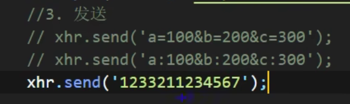
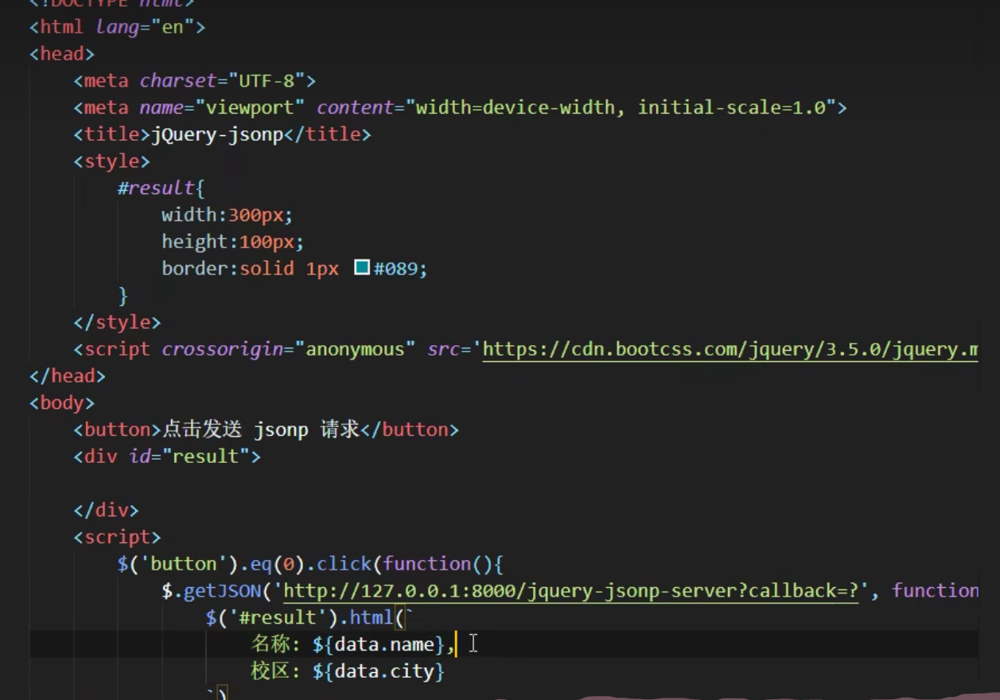

# AJAX

AJAX 全称为 Asynchronous JavaScript And XML，就是异步的 JS 和 XML。

通过 AJAX 可以在浏览器中向服务器发送异步请求，最大的优势：无刷新获取数据。

缺点：

1)没有浏览历史，不能回退
2)存在跨域问题(同源)
3) SEO 不友好

#### http请求报文

重点是格式与参数
**行**  POST    /s?ie=utf-8   HTTP/1.1

**头**  Host: atguigu.com

Cookie: name=guigu

Content-type: application/x-www-form-urlencoded

User-Agent: chrome 83

**空行**
**体**  username=admin&password=admin

响应报文

**行**   HTTP/1.1 209 0K

**头**   Content-Type: text/html;

charset=utf-8

Content-length: 2048

Content-encoding: gzip

**空行**

**体** 响应报文

request 是对请求报文的封装

response 是对响应报文的封装

下文服务端的代码是基于nodeJS的express框架的。

#### get请求

#### POST请求

设置请求体

####  get和post等设置请求头

#### 响应JSON数据

#### IE缓存问题

#### 请求超时与网络异常

#### 取消请求与取消重复发送请求

#### JQuery发送AJAX请求

#### axios发送AJAX请求 

#### 用fetch函数发送AJAX请求

#### 同源策略

同源策略(Same-Origin Policy)最早由 Netscape 公司提出，是浏览器的一种安全策略。

同源: 协议、域名、端口号 必须完全相同。

违背同源策略就是跨域。

#### 解决跨域

##### JSONP

JSONP(JSON with Padding)，是一个非官方的跨域解决方案，纯粹凭借程序员的聪明才智开发出来，只支持 get 请求。

JSONP 就是利用 script 标签的跨域能力来发送请求的。

实例

##### JQuery使用JSONP

##### CORS

CORS (Cross-Origin Resource Sharing) ，跨域资源共享。CORS 是官方的跨域解决方案，它的特点是不需要在客户端做任何特殊的操作，完全在服务器中进行处理，支持get 和 post 请求。跨域资源共享标准新增了一组 HTTP 首部字段，允许服务器声明哪些源站通过浏览器有权限访问哪些资源。

CORS 是通过设置一个响应头来告诉浏览器，该请求允许跨域，浏览器收到该响应以后就会对响应放行。

