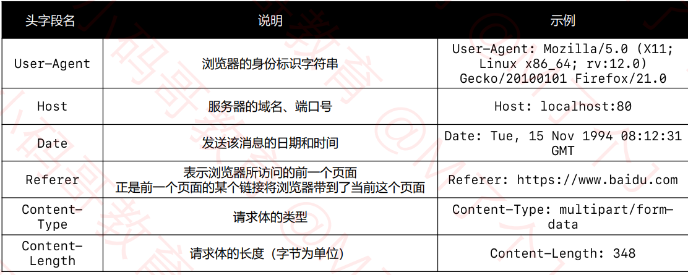
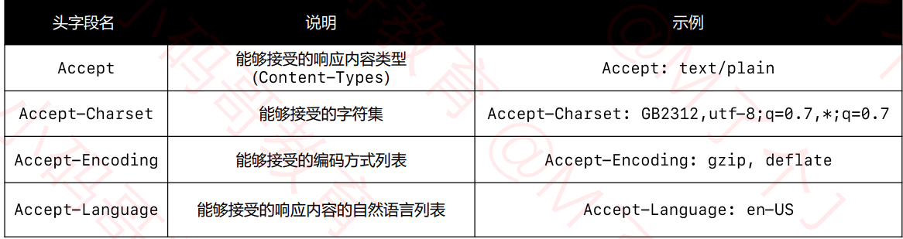
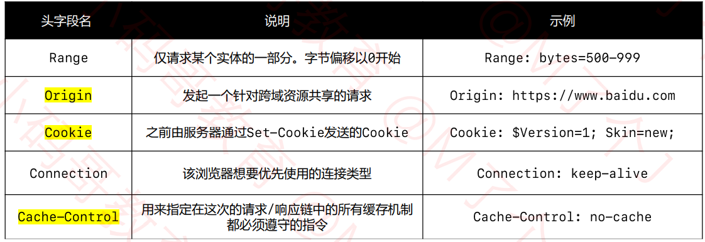
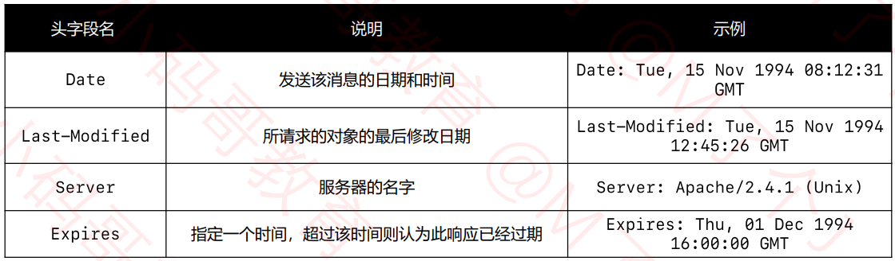
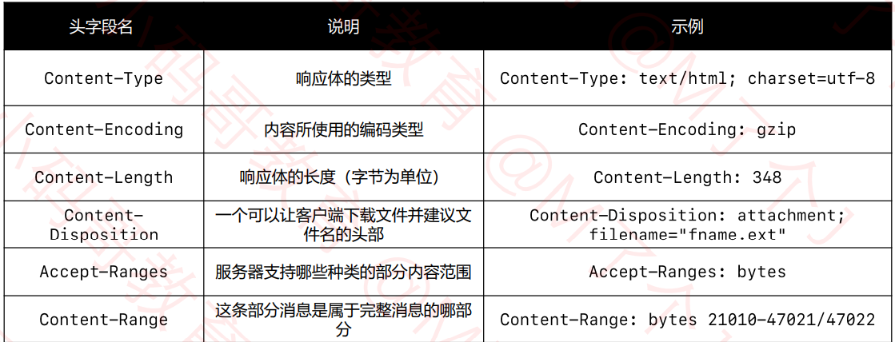
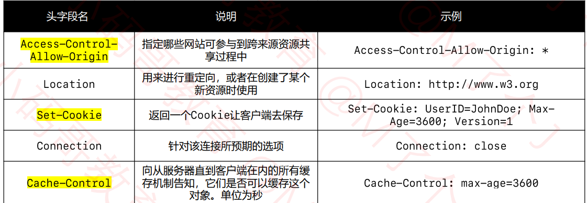

## 网络架构基础

#### 基础

##### c/c++跨平台原理

.c/.cpp，编译成不同平台的可执行文件(.pe/.elef/.mach-o)。系统可以执行这些文件。

##### java跨平台原理

.java，编译成.class文件（字节码文件，操作系统不能执行）。要在各个系统装上jvm（java虚拟机）。实现一次编译，到处运行。

##### 客户端vs服务器

服务器软件监听服务器端口

部署java项目，在同一服务器软件可部署不同项目，响应不同客户端的响应。

服务器软件：Tomcat （java）

##### 网络基础硬件

直连：交叉线

同轴电缆：半双工。 冲突域

集线器（hub）：半双工。冲突域

网桥：自学得到一侧的MAC地址，只有两口。隔绝冲突域

交换机：相当于多接口的网桥，全双工

以上连的设备都必须在同一个网段、都处于同一个广播域中

路由器：可以在不同网段之间转发数据，隔绝广播域 。

- 有多个网口表示多个网关
- 不同网关对应不同的MAC地址，ip地址与不同局域网通网段。

##### MAC地址

6字节，前三字节组织唯一标识符、后三字节网络接口标识符。

查询命令：ipconfig /all

广播地址：FF-FF-FF-FF-FF-FF 

ARP广播（同网段）获取MAC地址，记录MAC地址：arp缓存

arp命令：arp -a 、arp -a 主机地址、arp -a 主机地址 MAC地址。

RARP协议：将MAC地址转换为IP地址。

##### ip地址

ipv4：4个字节。划分为网络标识ID和主机ID

根据网络标识ID，有A、B、C、D、E五种网络类型。

子网掩码：用位与运算，能确定网络ID类型。

网段：192.168.1.0/24 （/24是子网掩码CIDR表示法）

广播：192.168.1.255/24

子网划分：

- 等长划分

  子网掩码向右挪一位，子网划分为原来的1/2。

  192.168.1.0/25、192.168.1.128/25

- 变长划分

  1/2的倍数进行划分

超网：合并多个小网段（子网掩码左移）

##### 路由

直连的路由器是知道的。非直连则需要静态路由、动态路由。

- 静态路由 

小规模，管理员添加

特定ip路由，子网掩码设为255.255.255.255

默认路由，网络设为0.0.0.0，子网掩码设为0.0.0.0

- 动态路由

  大规模
  
  RIP\OSPF路由选择协议自动获取路由信息

##### 数据包的传输过程

 源ip和目标ip一直没变，源MAC和目标MAC发生变化

##### 网络、互联网、因特网

ISP：因特网(Internet)服务提供商

服务器机房：不同供应商的机房

局域网（LAN）：范围几百米到十几公里的计算机网络

城域网（MAN）：可以覆盖一个城市

广域网（WAN）：覆盖一个国家，通常租用ISP线路

##### 常用接口

FastEthernet：快速以太网接口，一般用于局域网。

GibiatEthernet:千兆级别

Serial：串行接口

##### 上网方式：

- 电话线入户

ADSL拨号上网，非对称数字用户线路，提供上、下行不对称的传输宽带。

猫（Modem）：调制捷解调器，进行数字信号和模拟信号的转换。

- 光纤入户

光猫（PON），光调制解调器，进行数字信号和光信号的转换。

- 网线入户

家里不用准备光猫。

##### 公网IP、私网IP

- 公网IP：因特网上的路由器只有到达公网的路由表，没有到达私网的路由表。

  有因特网信息中心统一分配管理

- 私网IP：主要用于局域网。保留的私网网段

  A类：10.0.0.0/8

  B类：172.16.0.0/16—172.31.0.0/16

  C类：192.168.0.0/24—192.168.255.0/24

##### NAT

私网IP访问因特网需要进行NAT转换为公网IP

静态转换：手动配置NAT映射表

动态转换：定义外部地址池，动态随机转换

PAT：多对一转换，端口多路复用方式，通过端口号标识不同的数据流。

跨网段的ping中第一个包的丢失：第一次发送ICMP包时，路由器会丢掉重发ARP广播获取该IP的MAC地址，再通信。

#### 网络分层

OSI参考模型、TCP/IP协议模型、学习研究五层模型

应用层：报文、用户数据、传输层：段、网络层：包、数据链路层：帧、物理层：比特流

##### 物理层

定义了接口标准、线缆标准、传输速度、传输方式等。

数字信号（离散、短距离传输、抗干扰能力强）、模拟信号（连续、长距离传输、抗干扰能力差）

局域网通信模型只需要集线器交换机，数字信号传输。

广域网通信模型需要调制解调器或光电转换器，数字信号转模拟信号或光信号，再转数字信号。

- 信道

  信息传输的通道，一条传输介质上可以有多条信道。

  单工通信：单方向

  半双工通信：同一时间单项传输

  全双工通信：同一时间可以双向传输

##### 数据链路层

链路：从1个节点到相邻节点的一段物理线路，中间没有其他交换节点

数据链路：再一条链路上传输数据时，需要有对应的的通信协议来控制数据传输

不同类型的数据链路，所用的通信协议可能是不同的。

- 封装成帧

  帧的数据部分是网络层传递下来的数据包。

  MTU：最大传输单元，以太网的MTU为1500字节

- 透明传输

  数据部分出现SOH（帧开始符）、EOT（帧结束符），则进行转义。

- 差错检验

  FCS：将数据部分和数据链路层首部计算得出，用于检验数据是否错误

（广播信道）CSMA/CD协议：以太网中使用，集线器使用。

交换机组成的网络，虽然不用该协议，但依然传输的是以太网帧，所以也属于以太网。

检测以太网帧是否发生冲突至少要64字节。

Ethernet V2帧格式：首部：目标MAC+源MAC+网络类型、以太网帧：首部+数据+FCS

（点对点信道）PPP协议：点对点协议，帧不需要有MAC地址

网卡接收到一个帧会进行差错校验，通过后会将FCS扔掉。

抓包工具：Wireshock。

##### 网络层

数据包：首部、数据两部分组成

首部：固定部分20字节

- 首部

  版本号（4位），首部长度（4位），区分服务（8位），总长度（16位，最大值65535）

  由于帧太小，需要将ip数据包分成片，每个片都有自己的网络层首部。由此，出现了标识、标志和片偏移。

  标识（16位），同一个数据包的所有片的标识都是一样的。

  标志（3位），第一位保留、第二位：1代表不允许分片，0代表允许分片，第三位：1代表不是最后一片，0代表是最后一片。

  片偏移（13位），区别不同片的偏移量，乘以8为偏移量

  生存时间，TTL（8位）：，每个路由器转发之前都会将TTL减1，一旦发现为0，路由器返回错误报告。

  协议（8位），说明使用协议

  首部检验和（16位），用于检验首部数据是否遗失

  源IP地址（32位）、目标IP地址（32位）。

  ping ip -f 字节数：发送给孩子定数据包大小

  ping ip -i TTL 数：设置TTL，可以测试经过的每个路由器。

  pathping、tracert命令也可以跟踪数据包经过了路由器。

##### 传输层

Socket：一套网络编程API，利用它可以建立网络连接。一般都写在系统内核里。

TCP，传输控制协议

UDP，用户数据报协议

|              | TCP                         | UDP                  |
| ------------ | --------------------------- | -------------------- |
| 连接性       | 面向连接                    | 无连接               |
| 可靠性       | 可靠传输，不丢包            | 不可靠传输，可能丢包 |
| 首部占用空间 | 大                          | 小                   |
| 传输速率     | 慢                          | 快                   |
| 资源消耗     | 大                          | 小                   |
| 应用场景     | 浏览器、文件传输、邮件发送  | 音视频通话、直播     |
| 应用层协议   | HTTP、HTTPS、FTP、SMTP、DNS | DNS                  |

- ##### UDP

  首部有8个字节，源端口号、目标端口号、UDP长度、UDP校验和，都是16位

  netstat -an：查看被占用的端口，netstat -anb：查看被占用的端口、占用端口的程序

  校验和会在首部前加上伪首部进行校验，但不会传递给网络层

- ##### TCP

  固定部分20个字节。

  - 源端口（16位）、目标端口（16位）
  - 序号（32位），在建立连接后，代表这一次传给对方的TCP数据部分的第一个字节的编号。
  - 确认号（32位），在建立连接后，代表期望对方下一次传过来的TCP数据部分的第一个字节的编号，如ack=201
  - 数据偏移（4位），乘以4为首部长度。
  - 保留（6位）

  TCP的几个要点：可靠传输、流量控制、拥塞控制

  - 标志位（6位）

    URG，为1时，紧急指针字段生效，表明当前报文中有紧急数据，应优先尽快发送。

    ACK，为1时，确认号才有用

    PSH

    RST，为1时，表明连接中出现严重差错，必须释放连接，然后重新建立连接

    SYN，SYN=1、ACK=0时，表明这是建立一个连接的请求

    若对方同意建立连接，则回复SYN=1、ACK=1

    FIN，为1时，表明数据已经发送完毕，要求释放连接

  - 窗口（16位），有流量控制功能，用以告知对方下一次允许发送的数据大小。

  - 检验和

  - 紧急指针（16位），值代表长度，即数据的前多少字节为紧急数据。

  ##### 可靠传输

  停止等待ARQ协议，ARQ自动重传请求

  连续ARQ协议+滑动窗口协议

  选择性确认SACK，告诉发送方那些数据丢失，哪些数据已经提前收到。

  ##### 流量控制

  让发送方的发送速率不要太快，让接收方来得及接受处理

  通过确认报文中的窗口字段来控制发送方的发送速率

  特殊情况：接收方窗口满了，但之后有空了，但发送的新窗口字段中途丢失，发送方的接受的窗口一直为0，发送方设置定时器，一段时间后去询问接受方的最新窗口为多少。

  ##### 拥塞控制

  防止过多的数据注入到网络

  避免网络中的路由器或链路过载

  MSS：每个段最大的数据部分大小。

  rwnd：接受窗口

  cwnd：拥塞窗口

  swnd：发送窗口

  慢开始，一开始发的少，后面越发越多

  拥塞避免，

  ssthresh：慢开始阈值，cwnd达到阈值时，以线性方式增加。

  - 加法增大，拥塞窗口缓慢增大、以防止网络过早出现拥塞
  - 乘法减小，只要网络开始拥塞，把ssthresh减半，于此同时，执行慢开始算法。

  快重传，收到三个连续重复确认时，快速重发相应的数据。

  快恢复，当出现丢包拥塞时，执行完乘法减小后，cwnd设为ssthresh减半后的值。

  ##### 连接管理

  - 建立连接

    SYN=1，ACK=0

    客户端会发送序号的初始值 

    SYN=1，ACK=1

    服务器会发送序号的初始值

    SYN=0,ACK=1。

    3次握手

    客户端：CLOSED--->SYN-SENT--->ESTABLISHED

    服务端：LISTEN--->SYN-RCVD--->ESTABLISHED

    前两次握手的特点

    - SYN都为1

    - 头部字节都为32字节

      固定部分20，选项部分12。双方会交换一些信息，比如MSS、是否支持SACK、Window scale等
  
    为什么要有第三次握手？防止服务器一直等待，浪费资源。
  
    第三次握手失败了，怎么处理？
  
    server会重复发送，没有响应会发送RST包。
  
  - 释放连接，四次挥手
  
    FIN-WAIT-1：表示想主动关闭连接
  
    CLOSE-WAIT：表示等待关闭
  
    FIN-WAIT-2：只要对方发送ACK确认后，主动方将处于此状态，等待对方发送FIN报文。
  
    LAST-ACK：被动关闭一方在发送FIN报文后，最后等待对方的ACK报文
  
    TIME-WAIT:表示收到了对方的FIN报文，并发送了ACK报文，就等2MSL后即可进入CLOSED状态。
  
    为什么要四次挥手，TCP时全双工模式，主机1发出FIN报文的时候，表示主机1没有数据发送给主机2了，但可以接受主机2的数据。
    
    连接保活，每隔一段时间发送数据包，每个5s发一个包（心跳包）
    
    当服务器接受到客户端的FIN时，如果服务器后面没有数据要发送给客户端了，这时，服务器将第2、3次挥手合并，同时告诉客户端，已经知道了客户端没有数 据要发，服务端已经没有数据要发了。
    
    MSL，最大分段生存期
    
    TIME-WAIT时间设为2MSL，防止本次连接中产生的数据包误传到下一次连接中。
    
    长连接与短连接区分，看交互模式。短连接（单次交互）中客户端获取完数据后，立刻断开连接。长连接（实时交互）中客户端与服务端数据交互后，不会断开连接。
    

##### 应用层

###### DNS

方便人们记忆，得出的域名系统。

- 顶级域名，通用顶级域名、国家及地区顶级域名、新通用顶级域名
- 二级域名，顶级域名之下的域名。通用顶级域名下一般为注册人，国际及地区顶级域名下一般为注册类别。

DNS，可以基于TCP、UDP协议，为服务器的53端口。

客户端会优先访问最近的一台DNS服务器，所有的DNS服务器都记录了根域名服务器IP地址，上级DNS服务器记录了下一级的DNS服务器的IP地址。

相关命令

- ipconfig  /displaydns：查看DNS缓存记录
- ipconfig /flushdns：清空DNS缓存记录
- nslookup 域名

###### DHCP

静态IP地址、动态IP地址

DHCP：动态主机配置协议

基于UDP协议，客户端是68端口、服务器是67端口

DHCP服务器会从IP地址池，挑选一个IP地址，出租给终端一段时间，到期自动收回

分配IP地址的4个阶段

- DISCOVER：发现服务器

  发广播包

- OFFER：提供租约

  服务器返回可以租用的IP地址以及租用期限、子网掩码、网管、DNS等信息。

- REQUEST：选择IP地址

  客户端选择一个OFFER，发送广播包进行回应

- ACKNOWLEDGE：确认

  被选中的服务器发送ACK数据包给客户端

跨网段分配IP地址，需要DHCP中继代理

自动续约，会在租期不足时，申请续约

常用命令

- ipconfig /all 查看DHCP服务器信息

- ipconfig /release 释放租约
- ipconfig /renew 重新申请ip地址、申请续约

###### HTTP

超文本传输协议

HTML：超文本标记语言，用以编写网页。

HTTP的标准：RFC（Request For Commments）,请求意见稿

**报文格式**

简单版：

- 请求报文

  方法、空格、URI、空格、版本、CRLF（回车换行）

  首部字段名、冒号、空格、值、CRLF

  实体主体

- 响应报文

  版本、空格、状态码、空格、短语、CRLF

  首部字段名、冒号、空格、值、CRLF

  实体主体

GET请求没有请求体主体，向服务器传参需要在URI上写参数。

POST有请求体主体，向服务器发送参数可以放在主体里

ANBF：ABNF用作internet中通信协议的定义语言，最严谨的HTTP报文格式描述形式

**整体**：

HTTP-message = start-line

​								*(header-field CRLF)

​								CRLF

​								[message-body]

start-line：request-line、status-line

request-line = method SP request-target SP（空格的意思） HTTP-version CRLF（回车换行的意思）

 HTTP-version = HTTP-name "/" DIGIT "." DIGIT 

HTTP-name = %x48.54.54.50 ; HTTP 

status-line = HTTP-version SP status-code SP reason-phrase CRLF 

status-code = 3DIGIT 

reason-phrase = *( HTAB / SP / VCHAR / obs-text )

header-field= field-name ":" OWS field-value OWS

telnet:可以直接面向HTTP报文与服务器进行交互、可以清晰、直观地看到请求报文、响应报文的内容、可以检验请求报文格式的正确与否。

**请求方法**

- GET：读取操作，请求参数直接拼在URL的后面
- POST：添加、修改、删除的操作，
- HEAD：请求得到与GET请求相同的响应，但没有响应体
- OPTIONS：用于获取目的资源所支持的通信选项。比如服务器支持的请求方法。
- PUT：用于对已存在的资源进行整体覆盖
- PATCH：用于对资源进行部分修改
- DELETE：用于删除指定的资源
- TRACE：用于HTTP请求的测试与诊断

头部字段（Header-field）

请求头字段：

响应头字段：

状态码

- 信息响应：100-199
- 成功响应：200-299
- 重定向：300-399
- 客户端错误：400-499
- 服务器错误：500-599

常见的状态码

100 Continue，判断服务器是否愿意接收请求

200 OK

302 Found：请求的资源被暂时移动到了location的URL上

304 Not Modified,无需再次传输请求的内容，也就是说可以使用缓存的内容

400 Bad Request，由于语法无效，服务器无法理解该请求

401 Unauthorized，由于缺乏目标资源要求的身份验证凭证

403 Forbidden，服务器有能力处理该请求，但拒绝授权访问

404 Not Found ,服务器端无法找到所请求的资源

405 Method Not Allowed,服务器禁止使用当前HTTP方法的请求

406 Not Acceptable：服务器无法提供与Accept-Charse以及Accept-Language指定的值相匹配的响应

408 Request Timeout，服务器想要将没有使用的连接关闭

500 Internal Server Error：所请求的服务器遇到意外的情况并阻止器执行请求

501 Not Implemented：请求的方法不被服务器支持，因此无法被处理

502 Bad Gateway:

503 Service Unavailable:服务器未处于可以接受请求的状态（服务器停机、超载）

**form提交**

将客户端提交的数据发送给服务器端

action：请求的URI

method：请求方法（GET、POST）

enctype：POST请求时，请求的编码方式

- application/x-www-form-urlencoded(默认值)

  用&分隔参数，用=分隔键和值，字符用URL编码方式进行编码

- multipart/form-data

  文件上传必须使用这种编码方式

**跨域**

同源策略会影响跨域资源访问

同源策略：默认情况下，AJAX请求只能发送给同源的URL

同源指三个相同：协议、域名（IP）、端口

服务器返回相应的响应头（如Acess-Control-Allow-Origin）

浏览器根据返回的响应头来决定是否展示相应的数据。

**cookie与Session**

会话跟踪

cookie，在客户端（浏览器）存储一些数据

服务器可以返回Cookie交给客户端去存储

session，在服务器存储一些数据

可以将连续多次请求联系起来。

**缓存（Cache）**

通常会缓存的情况：GET请求+静态资源（HTML、CSS、JS、图片等）

响应头

- Expires：缓存的过期时间（GMT格式时间）【HHTP/1.0产物】

- Cache-Control：设置缓存策略

  no-storage：不缓存数据到本地

  public：允许用户、代理服务器缓存数据到本地

  private：只允许用户缓存数据到本地

  max-age：缓存的有效时间

  no-cache：每次需要发请求给服务器询问缓存是否有变化，再来决定如何使用缓存。

- Last-modified：资源的最后一次修改时间

- ETag：资源的唯一标识

请求头

- if-None-Match
- if-Modified-Since

Last-modified的缺陷

- 只能精确到秒级别，在一秒内修改了，客户端将无法获取最新的资源
- 某些资源被修改了，但是内容并没有发生办法。

###### 代理服务器

特点：本身不产生内容，处于中间位置转发上下游的请求和响应。（面向下游的客户端时是服务器、面向上游的服务器时是客户端）

- 正向代理：代理客户端

  隐藏客户端

  绕过防火墙

  Internet访问控制

  数据过滤

- 反向代理：代理服务器

  隐藏服务器身份

  安全防护

  负载均衡

抓包工具

Fiddler是在客户端启动了正向代理服务

Wireshark是通过底层驱动，拦截网卡上流过的数据

###### CDN

内容分发网络：利用最靠近每位用户的服务器，更快更可靠的将音乐、图片、视频等资源文件传递给用户

##### 网络安全

四种安全威胁：截获、中断、篡改、伪造

###### ARP欺骗

可以让攻击者获取局域网上的数据包甚至篡改数据包

可以让特定电脑之间无法正常通信

可以将送往终端的数据，送向攻击者

######  DoS、DDoS

DoS:使目标电脑的网络或系统资源耗尽，使服务暂时中断或停止，导致其正常用户无法访问

DDoS：分布式拒绝服务攻击

黑客使用网路上两个及以上被攻陷的电脑作为”僵尸“向特定目标发动DoS攻击

分为两大类：带宽消耗型：UDP洪水攻击、ICMP洪水攻击、资源消耗型：SYN洪水攻击、LAND攻击

SYN洪水攻击，发一系列SYN请求，然后让目标因收不到ACK而进行等待、消耗资源。

###### DNS劫持--应用层

篡改某个域名的解析结果，使得指向该域名的IP变成了另一个IP。

HTTP劫持：对HTTP数据包进行拦截处理，比如插入JS代码

###### HTTP协议存在的安全问题

HTTP协议采用明文传输，有隐患，可以对通信内容进行加密后在进行传输。

encrypt：加密

decrypt：解密

plaintext：明文

ciphertext：密文

**加密方式**

1、不可逆：单向散列函数（哈希函数）：通过散列函数，可以根据消息内容计算出散列值。

根据任意长度的消息，计算出固定长度的散列值，具备单向性。只能加密不能解密。

比如MD4、MD5（不安全），SHA-2，SHA-3

通过匹配原文件与现文件的散列值是否相同，可以防止篡改数据

应用：密码加密，数据库存的是密码加密后的散列值

2、可逆

对称加密、非对称加密。

加密算法+密钥

- 对称加密（对称密码）

加密和解密的密钥是相同的。

加密算法：DES、3DES、AES

解决密钥配送问题，可以采用非对称加密

- 非对称加密（公钥密码）

加密算法：RSA （openssl软件）

 接受者首先生成一对密钥：公钥和私钥，公钥发给发送者，接收到消息再用私钥解密。

- 混合密码系统

非对称加密：算法复杂、安全、加密解密速度慢

对称加密：简单、不安全、加密解密速度快

SSL/TLS运用了混合密码系统

会话密钥：为本次通信随机生成的临时密钥，采用对称加密密钥，用于加密消息，提高速度。

用公钥加密会话密钥，用会话密钥加密发送消息。

**数字签名**

确认消息的完整性、识别消息是否被篡改、防止消息发送人否认。

当明文传送消息时，为了验证消息是否被篡改、伪装、否认，则就要使用数字签名。就是将非对称加密相反使用。

发送方用私钥加密消息生成签名，接受方将明文和公钥解密后的消息进行对比，则是签名验证。

过程改进：发送者先将消息用单向散列函数进行加密，再用私钥加密散列值生成签名，接受方也是对比明文生成的散列值与公钥解密的散列值，就可以验证签名。

**证书**

解决公钥被中间人拦截篡改的问题。

通过第三方权威机构的数字签名解决。

公钥的合法性

- 公钥证书

  有个人信息、邮箱、此人的公钥、认证机构（CA）施加数字签名

###### HTTPS

也可叫HHTP over SSL/TLS，超文本传输安全协议。

默认端口443.

SSL/TLS：安全套接层/传输层安全协议，工作在应用层和传输层之间。

成本：证书的费用、加解密计算、降低了访问速度

通信过程

- TCP的三次握手
- TLS的连接
- HTTP的请求和响应

TLS1.2的连接

1）client hello

TLS版本、支持的加密组件（Cipher Suite）、一个随机数（client random）

2）sever hello

TLS版本、选择的加密组件、一个随机数(server random)

3）certificate

服务器的公钥证书

4）server key exchange

用以实现ECDHE算法的其中一个参数（server params）

5）server hello done

告知客户端：协商部分结束

6）client key exchange

用以实现ECDHE算法（密钥交换算法）的另一个参数（client params）

根据client params 与server params生成随机密钥串：pre-master secret

结合两个随机数与随机密钥串生成会话密钥

7）change cipher spec

告知服务器：之后的通信采用计算出来的会话密钥进行加密

8）finished

包含连接至今全部报文的整体校验值（摘要），加密后发送给服务器，用以判定握手协商是否成功。

9、10）

change cipher spec、finished

疑问：TLS没有用公钥加密临时会话密钥？

###### HTTP协议的升级

HTTP/1.1的不足

同一时间，一个连接只能对应一个请求。

只允许客户端主动发送请求

多一个会话的多次请求中，头信息会被重复传输

**SPDY**

基于TCP的应用层协议，强制要求使用SSL/TLS

**HHTP/2**

将文本打散，采用二进制格式

数据流：已建立的连接内的双向字节流，可以承载一条或多条消息。所有通信同一时间都在一个TCP连接上完成，此连接可以承载任意数量的双向数据流。

帧：HTTP/2通信的最小单位

这个帧和数据链路层的帧有啥区别？

相关特性

- 多路复用：并行交错地发送多个请求、并行交错地发送多个响应、使用一个连接并行发送多个请求和响应。交错传送：打乱数据包。

不必为绕过HHTP/1.1限制去做许多工作如精灵图片、合并CSS\JS\Base64图片、域名分片等工作。

- 优先级，允许每个数据流都有一个关联的权重和依赖关系。

- 头部压缩

  跟踪头部信息，二次发送发送新信息、压缩相同的信息

- 服务器推送

  服务器可以对一个客户端请求发送多个响应

相关问题

- 队头阻塞

  TCP的传输具有顺序性，丢包以后就要重传，导致阻塞

- 握手延迟

  RTT：往返时延

**HTTP/3**

基于UDP协议的QUIC协议实现。

QUIC来保证可靠传输

特性：

- 连接迁移

  TCP的4要素：源IP、源端口、目标IP、目标端口

  当4要素发生变化，原连接依然维持。

  QUIC以connection ID为标识一个连接。
  
- 向前纠错，可以从丢失的一个包中测算中丢失的包数据

##### 其他协议

###### ICMP

互联网控制消息协议。通常用于返回错误信息，比如TTL过期、目的不可达。

###### websocket

基于TCP的支持全双工通信的应用层协议。

客户端、服务器，任何一方都可以主动发送消息给对方。

与HTTP的关系

- 都是应用层协议
- 都是80、443端口
- websocket协议在应用层需要先建立连接，而HTTP不会。是一种有状态的协议

建立连接

借助HTTP协议来建立连接，请求头加入升级字段。

###### FTP

文件传输协议，基于TCP的应用层协议

URL格式：ftp://[user[:password]@]host[:port]/url-path

连接模式：主动（Active）和被动（Passive）

不管哪种连接模式都需要客户端和服务端建立2个连接

1、控制连接：用于传输状态信息（命令，cmd）

2、数据连接：用于传输文件和目录信息

###### 邮件相关协议

发送邮件使用的协议：SMTP协议（简单邮件传输协议）

收邮件使用的协议：POP协议（邮局协议）、IMAP协议（因特网信息访问协议）

POP协议与IMAP协议的区别

POP特点：客户端连接服务器时，将会从服务器下载所有邮件。客户端的操作不会跟服务器同步

IMAP特点：客户端连接服务器时，获取的是服务器上邮件的基本信息，并不会下载邮件。客户端的操作会跟服务器同步

###### IPv6

网际协议第6版

地址为128bit，每16bit一组，共8组。每组以冒号“：”隔开，每组以4位十六进制方式表示。

##### 其他介绍

###### WebService

web服务，一种跨编程语言和跨操作系统平台的远程调用技术标准。

事实上，已经完全可以用普通的web API取代（如HTTP+JSON）。

核心概念

SOAP：简单对象访问协议

SOAP=HTTP+XML

webservice使用SOAP协议来封装传递数据。

WSDL：web服务描述语言

###### RESTful

表现层状态转移，是一层互联网软件架构风格

符合REST的web服务又叫RESTful web服务

###### HTTPDNS

基于HHTP协议向DNS服务器发送域名解析请求。

###### VPN

虚拟私人网络，可以再公共网络上建立专用网络，进行加密通讯。

提高上网的安全性、保护公司内部资料、隐藏上网者的身份、突破地域的限制、突破网络封锁（GFW：Great Firewall of China）

VPN与代理不同

- VPN一般需要安装VPN客户端的软件，代理不需要。
- VPN默认对数据加密，代理默认不会对数据进行加密

VPN实现原理

使用了隧道协议，如PPTP、L2TP、IPsec、SSL VPN，一般工作在传输层或数据链路层

###### 网络爬虫

web crawler，模拟人类使用浏览器操作页面的行为，对页面进行相关操作

工具：Python的Scrapy框架

robots.txt是存在网站根目录下的文本文件，告诉爬虫哪些不能爬取，哪些可以爬取。这是约定俗成的。

###### 无线网络

路由器的无线AP将有线网络转成WIFI信号。

###### 流媒体

将一连串的多媒体数据压缩后，经过互联网分段发送数据，在互联网上即时传输影音以供观赏的一种技术。

常见协议：RTP、RTCP、RTSP、RTMP、HLS

###### 即时通信

IM（Instant Messaging）

常见协议：XMPP、MQTT、自定义协议

XMPP：可扩展消息与存在协议，使用XML格式进行传输，体积较大

MQTT：消息队列遥测传输，开销很小，以降低网络流量

