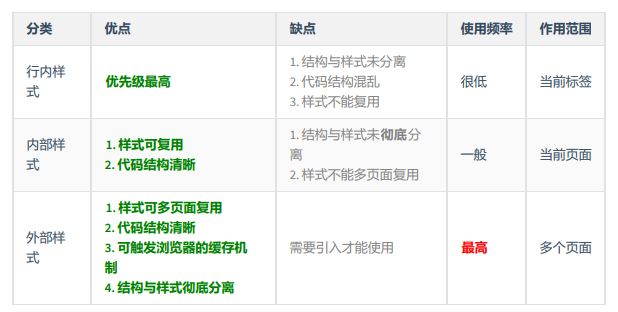

# CSS

#### 定义

CSS 指层叠样式表 (**C**ascading **S**tyle **S**heets)

样式：文字大小、背景颜色、元素宽高

层叠：一层一层写上去

表：列表

- 样式定义**如何显示** HTML 元素

- 样式通常存储在**样式表**中
- 把样式添加到 HTML 4.0 中，是为了**解决内容与表现分离的问题**
- **外部样式表**可以极大提高工作效率
- 外部样式表通常存储在 **CSS 文件**中
- 多个样式定义可**层叠**为一个

#### 用法

CSS 是在 HTML 4 开始使用的,是为了更好的渲染HTML元素而引入的.

CSS 可以通过以下方式添加到HTML中:

- 内联样式（行内样式）- 在HTML元素中使用"style" **属性**
- 内部样式 - 在HTML文档头部 <head> 区域使用<style> **元素** 来包含CSS
- 外部引用 - 使用外部 CSS **文件**

最好的方式是通过外部引用CSS文件.

#### 语法规范

CSS 规则由两个主要的部分构成：选择器，以及一条或多条声明


选择器通常是您需要改变样式的 HTML 元素。

每条声明由一个属性和一个值组成。

属性（property）是您希望设置的样式属性（style attribute）。每个属性有一个值。属性和值被冒号分开。


#### 基本选择器

通配选择器、元素选择器、类选择器、id选择器

通配选择器，作用：可以选中所有的 HTML 元素，语法：`* { }`

元素选择器，作用：为页面中 某种元素 统一设置样式。 语法：`标签名 { 属性名: 属性值; }`

类选择器，作用：根据元素的 class 值，来选中某些元素。用于描述一组元素的样式，class可以在多个元素中使用。

class 选择器在HTML中以class属性表示, 在 CSS 中，类选择器以一个点"."号显示

一个元素的 class 属性，能写多个值，要用空格隔开，例如：`class="speak big"`

id 选择器，作用: 根据元素的 id 属性值，来精准的选中某个元素。可以为标有特定 id 的 HTML 元素指定特定的样式。

HTML元素以id属性来设置id选择器,CSS 中 id 选择器以 "#" 来定义。一个元素可以同时拥有 id 和 class 属性。

#### CSS创建

插入样式表：外部样式表、内部样式表、内联样式

- 外部样式表

实现了结构与样式的完全分离，样式可以复用，结构清晰，可触发缓存机制，提高访问速度

每个页面使用 <link> 标签链接到样式表。 <link> 标签在（文档的）头部：

/* <head> <link rel="stylesheet" type="text/css" href="mystyle.css"> </head> */

- 内部样式表

当单个文档需要特殊的样式时，就应该使用内部样式表。你可以使用 <style> 标签在文档头部定义内部样式表

 <head>
<style>
hr {color:sienna;}
p {margin-left:20px;}
body {background-image:url("images/back40.gif");}
</style>
</head> 

- 内联样式

由于要将表现和内容混杂在一起，内联样式会损失掉样式表的许多优势。请慎用这种方法，例如当样式仅需要在一个元素上应用一次时。

要使用内联样式，你需要在相关的标签内使用样式（style）属性。Style 属性可以包含任何 CSS 属性。

`<p style="color:sienna;margin-left:20px">这是一个段落。</p>`

多重样式

多重样式优先级：样式表允许以多种方式规定样式信息。样式可以规定在单个的 HTML 元素中，在 HTML 页的头元素中，或在一个外部的 CSS 文件中。甚至可以在同一个 HTML 文档内部引用多个外部样式表。

一般情况下，优先级如下：

​     **（内联样式）Inline style > （内部样式）Internal style sheet  =（外部样式）External style sheet > 浏览器默认样式**

内部样式和外部样式，后写的覆盖先写的。



#### CSS背景

- background-color
- background-image

`body {background-image:url('paper.gif');}`

- background-repeat
- background-attachment
- background-position

#### CSS Text文本

文本对齐方式：h1 {text-align:center;}  center,right,justify

文本修饰：a {text-decoration:none;}  none,underline,linethrough,overline

文本转换：p.uppercase {text-transform:uppercase;}

文本缩进:p {text-indent:50px;}

| 属性                                                         | 描述                     |
| :----------------------------------------------------------- | :----------------------- |
| [color](https://www.runoob.com/cssref/pr-text-color.html)    | 设置文本颜色             |
| [direction](https://www.runoob.com/cssref/pr-text-direction.html) | 设置文本方向。           |
| [letter-spacing](https://www.runoob.com/cssref/pr-text-letter-spacing.html) | 设置字符间距             |
| [line-height](https://www.runoob.com/cssref/pr-dim-line-height.html) | 设置行高                 |
| [text-align](https://www.runoob.com/cssref/pr-text-text-align.html) | 对齐元素中的文本         |
| [text-decoration](https://www.runoob.com/cssref/pr-text-text-decoration.html) | 向文本添加修饰           |
| [text-indent](https://www.runoob.com/cssref/pr-text-text-indent.html) | 缩进元素中文本的首行     |
| [text-shadow](https://www.runoob.com/cssref/css3-pr-text-shadow.html) | 设置文本阴影             |
| [text-transform](https://www.runoob.com/cssref/pr-text-text-transform.html) | 控制元素中的字母         |
| [unicode-bidi](https://www.runoob.com/cssref/pr-text-unicode-bidi.html) | 设置或返回文本是否被重写 |
| [vertical-align](https://www.runoob.com/cssref/pr-pos-vertical-align.html) | 设置元素的垂直对齐       |
| [white-space](https://www.runoob.com/cssref/pr-text-white-space.html) | 设置元素中空白的处理方式 |
| [word-spacing](https://www.runoob.com/cssref/pr-text-word-spacing.html) | 设置字间距               |

#### CSS字体

| Property                                                     | 描述                                 |
| :----------------------------------------------------------- | :----------------------------------- |
| [font](https://www.runoob.com/cssref/pr-font-font.html)      | 在一个声明中设置所有的字体属性       |
| [font-family](https://www.runoob.com/cssref/pr-font-font-family.html) | 指定文本的字体系列                   |
| [font-size](https://www.runoob.com/cssref/pr-font-font-size.html) | 指定文本的字体大小                   |
| [font-style](https://www.runoob.com/cssref/pr-font-font-style.html) | 指定文本的字体样式                   |
| [font-variant](https://www.runoob.com/cssref/pr-font-font-variant.html) | 以小型大写字体或者正常字体显示文本。 |
| [font-weight](https://www.runoob.com/cssref/pr-font-weight.html) | 指定字体的粗细。                     |

#### CSS链接

链接样式

a:link {color:#000000;}      /* 未访问链接*/ *

*a:visited {color:#00FF00;}  /* 已访问链接 */ *

*a:hover {color:#FF00FF;}  /* 鼠标移动到链接上 */ *

*a:active {color:#0000FF;}  /* 鼠标点击时 */

文本修饰

a:link {text-decoration:none;} 

a:visited {text-decoration:none;} 

a:hover {text-decoration:underline;} 

a:active {text-decoration:underline;}

背景颜色

a:link {background-color:#B2FF99;} 

a:visited {background-color:#FFFF85;} 

a:hover {background-color:#FF704D;} 

a:active {background-color:#FF704D;}

#### CSS列表

| 属性                                                         | 描述                                               |
| :----------------------------------------------------------- | :------------------------------------------------- |
| [list-style](https://www.runoob.com/cssref/pr-list-style.html) | 简写属性。用于把所有用于列表的属性设置于一个声明中 |
| [list-style-image](https://www.runoob.com/cssref/pr-list-style-image.html) | 将图像设置为列表项标志。                           |
| [list-style-position](https://www.runoob.com/cssref/pr-list-style-position.html) | 设置列表中列表项标志的位置。                       |
| [list-style-type](https://www.runoob.com/cssref/pr-list-style-type.html) | 设置列表项标志的类型。                             |

#### CSS表格

表格边框
指定CSS表格边框，使用border属性。

折叠边框
border-collapse 属性设置表格的边框是否被折叠成一个单一的边框或隔开

表格宽度和高度
Width和height属性定义表格的宽度和高度。

表格文字对齐
表格中的文本对齐和垂直对齐属性。text-align属性设置水平对齐方式，向左，右，或中心。vertical-align垂直对齐属性设置垂直对齐

表格填充
如需控制边框和表格内容之间的间距，应使用td和th元素的填充属性，td{padding:15px;}

表格颜色
下面的例子指定边框的颜色，和th元素的文本和背景颜色：
`table, td, th
{
    border:1px solid green;
}
th
{
    background-color:green;
    color:white;
}`

#### CSS盒子模型

CSS盒模型本质上是一个盒子，封装周围的HTML元素，它包括：边距，边框，填充，和实际内容。盒模型允许我们在其它元素和周围元素边框之间的空间放置元素。


- **Margin(外边距)** - 清除边框外的区域，外边距是透明的。
- **Border(边框)** - 围绕在内边距和内容外的边框。
- **Padding(内边距)** - 清除内容周围的区域，内边距是透明的。
- **Content(内容)** - 盒子的内容，显示文本和图像

#### CSS border边框

- border-style 值:

none: 默认无边框

dotted: 定义一个点线边框

dashed: 定义一个虚线边框

solid: 定义实线边框

double: 定义两个边框。 两个边框的宽度和 border-width 的值相同

groove: 定义3D沟槽边框。效果取决于边框的颜色值

ridge: 定义3D脊边框。效果取决于边框的颜色值

inset:定义一个3D的嵌入边框。效果取决于边框的颜色值

outset: 定义一个3D突出边框。 效果取决于边框的颜色值

- border-width宽度，border-color颜色

#### CSS 轮廓（outline）

| 属性                                                         | 说明                           | 值                                                           | CSS  |
| :----------------------------------------------------------- | :----------------------------- | :----------------------------------------------------------- | :--- |
| [outline](https://www.runoob.com/cssref/pr-outline.html)     | 在一个声明中设置所有的轮廓属性 | *outline-color outline-style outline-width *inherit          | 2    |
| [outline-color](https://www.runoob.com/cssref/pr-outline-color.html) | 设置轮廓的颜色                 | *color-name hex-number rgb-number *invert inherit            | 2    |
| [outline-style](https://www.runoob.com/cssref/pr-outline-style.html) | 设置轮廓的样式                 | none dotted dashed solid double groove ridge inset outset inherit | 2    |
| [outline-width](https://www.runoob.com/cssref/pr-outline-width.html) | 设置轮廓的宽度                 | thin medium thick *length *inherit                           | 2    |

#### CSS margin(外边距)

| 属性                                                         | 描述                                       |
| :----------------------------------------------------------- | :----------------------------------------- |
| [margin](https://www.runoob.com/cssref/pr-margin.html)       | 简写属性。在一个声明中设置所有外边距属性。 |
| [margin-bottom](https://www.runoob.com/cssref/pr-margin-bottom.html) | 设置元素的下外边距。                       |
| [margin-left](https://www.runoob.com/cssref/pr-margin-left.html) | 设置元素的左外边距。                       |
| [margin-right](https://www.runoob.com/cssref/pr-margin-right.html) | 设置元素的右外边距。                       |
| [margin-top](https://www.runoob.com/cssref/pr-margin-top.html) | 设置元素的上外边距。                       |

#### CSS padding（填充）

| 属性                                                         | 说明                                       |
| :----------------------------------------------------------- | :----------------------------------------- |
| [padding](https://www.runoob.com/cssref/pr-padding.html)     | 使用简写属性设置在一个声明中的所有填充属性 |
| [padding-bottom](https://www.runoob.com/cssref/pr-padding-bottom.html) | 设置元素的底部填充                         |
| [padding-left](https://www.runoob.com/cssref/pr-padding-left.html) | 设置元素的左部填充                         |
| [padding-right](https://www.runoob.com/cssref/pr-padding-right.html) | 设置元素的右部填充                         |
| [padding-top](https://www.runoob.com/cssref/pr-padding-top.html) | 设置元素的顶部填充                         |

#### CSS分组和嵌套选择器

为了尽量减少代码，你可以使用分组选择器。每个选择器用逗号分隔。

h1,h2,p

 {    

color:green; 

}

嵌套选择器

它可能适用于选择器内部的选择器的样式。在下面的例子设置了四个样式：

- **p{ }**: 为所有 **p** 元素指定一个样式。
- **.marked{ }**: 为所有 **class="marked"** 的元素指定一个样式。
- **.marked p{ }**: 为所有 **class="marked"** 元素内的 **p** 元素指定一个样式。
- **p.marked{ }**: 为所有 **class="marked"** 的 **p** 元素指定一个样式。

#### CSS 尺寸 (Dimension)

CSS 尺寸 (Dimension) 属性允许你控制元素的高度和宽度。同样，它允许你增加行间距。

| 属性                                                         | 描述                 |
| :----------------------------------------------------------- | :------------------- |
| [height](https://www.runoob.com/cssref/pr-dim-height.html)   | 设置元素的高度。     |
| [line-height](https://www.runoob.com/cssref/pr-dim-line-height.html) | 设置行高。           |
| [max-height](https://www.runoob.com/cssref/pr-dim-max-height.html) | 设置元素的最大高度。 |
| [max-width](https://www.runoob.com/cssref/pr-dim-max-width.html) | 设置元素的最大宽度。 |
| [min-height](https://www.runoob.com/cssref/pr-dim-min-height.html) | 设置元素的最小高度。 |
| [min-width](https://www.runoob.com/cssref/pr-dim-min-width.html) | 设置元素的最小宽度。 |
| [width](https://www.runoob.com/cssref/pr-dim-width.html)     | 设置元素的宽度。     |

#### CSS Display(显示) 与 Visibility（可见性）

隐藏一个元素可以通过把display属性设置为"none"，或把visibility属性设置为"hidden"。但是请注意，这两种方法会产生不同的结果。

visibility:hidden可以隐藏某个元素，但隐藏的元素仍需占用与未隐藏之前一样的空间。也就是说，该元素虽然被隐藏了，但仍然会影响布局。

- display:block -- 显示为块级元素
- display:inline -- 显示为内联元素
- display:inline-block -- 显示为内联块元素，表现为同行显示并可修改宽高内外边距等属性

#### CSS Position(定位)

- [static](https://www.runoob.com/css/css-positioning.html#position-static)
- [relative](https://www.runoob.com/css/css-positioning.html#position-relative)
- [fixed](https://www.runoob.com/css/css-positioning.html#position-fixed)
- [absolute](https://www.runoob.com/css/css-positioning.html#position-absolute)
- [sticky](https://www.runoob.com/css/css-positioning.html#position-sticky)

#### CSS 布局 - Overflow

CSS overflow 属性用于控制内容溢出元素框时显示的方式。

| 值      | 描述                                                     |
| :------ | :------------------------------------------------------- |
| visible | 默认值。内容不会被修剪，会呈现在元素框之外。             |
| hidden  | 内容会被修剪，并且其余内容是不可见的。                   |
| scroll  | 内容会被修剪，但是浏览器会显示滚动条以便查看其余的内容。 |
| auto    | 如果内容被修剪，则浏览器会显示滚动条以便查看其余的内容。 |
| inherit | 规定应该从父元素继承 overflow 属性的值。                 |

#### CSS Float(浮动)

CSS 的 Float（浮动），会使元素向左或向右移动，其周围的元素也会重新排列。Float（浮动），往往是用于图像，但它在布局时一样非常有用。

| 属性                                                       | 描述                               | 值                           | CSS  |
| :--------------------------------------------------------- | :--------------------------------- | :--------------------------- | :--- |
| [clear](https://www.runoob.com/cssref/pr-class-clear.html) | 指定不允许元素周围有浮动元素。     | left right both none inherit | 1    |
| [float](https://www.runoob.com/cssref/pr-class-float.html) | 指定一个盒子（元素）是否可以浮动。 | left right none inherit      | 1    |

#### CSS 复合选择器

1、交集选择器， 作用:选中同时符合多个条件的元素，逻辑且


2、并集选择器，作用:选中多个选择器对应的元素，又称:分组选择器，逻辑为或

语法: 选择器1, 选择器2, 选择器3,... 选择器n {}

```
#peiqi,
.rich,
.beauty {
font-size: 40px;
background-color: blue ;
width: 200px;
}
```

父元素: 直接包裹某个元素的元素，就是该元素的父元素.

祖先元素:父亲的父亲一直往外找，都是祖先。

后代元素: 儿子的儿子......，一直往里找，都是后代。

兄弟元素: 具有相同父元素的元素，互为兄弟元素。

##### CSS 组合选择符

- 后代选择器(以空格   分隔)

  作用:选中指定元素中，符合要求的后代元素

- 子元素选择器(以大于 **>** 号分隔）

   选中指定元素中，符合要求的子元素(儿子元素）

- 相邻兄弟选择器（以加号 **+** 分隔）

  所谓相邻，就是紧挨着他的下一个兄弟元素。

- 普通兄弟选择器（以波浪号 **～** 分隔）

  选中指定元素后，符合条件的所有兄弟元素。 

#### CSS 属性 选择器

具有特定属性的HTML元素样式不仅仅是class和id。

下面的例子是把包含标题（title）的所有元素变为蓝色：

实例：[title] {    color:blue; }

下面的实例改变了标题title='runoob'元素的边框样式:

实例：[title=runoob] {    border:5px solid green; }

##### CSS 属性选择器 ~=, |=, ^=, $=, *= 的区别

**先上总结:**

**"value 是完整单词"** 类型的比较符号: **~=**, **|=**

**"拼接字符串**" 类型的比较符号: ***=**, **^=**, **$=**

**1.attribute 属性中包含 value:**　

[attribute~=value] 属性中包含独立的单词为 value，例如：

```
[title~=flower]  -->  
```

[attribute*=value] 属性中做字符串拆分，只要能拆出来 value 这个词就行，例如：

```
[title*=flower]   -->  
```

**2.attribute 属性以 value 开头:**

[attribute|=value] 属性中必须是完整且唯一的单词，或者以 **-** 分隔开：，例如：

```
[lang|=en]     -->  <p lang="en">  <p lang="en-us">
```

[attribute^=value] 属性的前几个字母是 value 就可以，例如：

```
[lang^=en]    -->  <p lang="ennn">
```

**3.attribute 属性以 value 结尾:**

```
[attribute$=value] 属性的后几个字母是 value 就可以，例如：
a[src$=".pdf"]
```

#### CSS 伪类(Pseudo-classes)

CSS伪类是用来添加一些选择器的特殊效果。

伪类的语法：

selector:pseudo-class {property:value;}

CSS类也可以使用伪类：

selector.class:pseudo-class {property:value;}

#### CSS 伪元素

伪元素的语法：

```
selector:pseudo-element {property:value;}
```

CSS类也可以使用伪元素：

```
selector.class:pseudo-element {property:value;}
```

| 选择器                                                       | 示例           | 示例说明                                        |
| :----------------------------------------------------------- | :------------- | :---------------------------------------------- |
| [:link](https://www.runoob.com/cssref/sel-link.html)         | a:link         | 选择所有未访问链接                              |
| [:visited](https://www.runoob.com/cssref/sel-visited.html)   | a:visited      | 选择所有访问过的链接                            |
| [:active](https://www.runoob.com/cssref/sel-active.html)     | a:active       | 选择正在活动链接                                |
| [:hover](https://www.runoob.com/cssref/sel-hover.html)       | a:hover        | 把鼠标放在链接上的状态                          |
| [:focus](https://www.runoob.com/cssref/sel-focus.html)       | input:focus    | 选择元素输入后具有焦点                          |
| [:first-letter](https://www.runoob.com/cssref/sel-firstletter.html) | p:first-letter | 选择每个<p> 元素的第一个字母                    |
| [:first-line](https://www.runoob.com/cssref/sel-firstline.html) | p:first-line   | 选择每个<p> 元素的第一行                        |
| [:first-child](https://www.runoob.com/cssref/sel-firstchild.html) | p:first-child  | 选择器匹配属于任意元素的第一个子元素的 <p> 元素 |
| [:before](https://www.runoob.com/cssref/sel-before.html)     | p:before       | 在每个<p>元素之前插入内容                       |
| [:after](https://www.runoob.com/cssref/sel-after.html)       | p:after        | 在每个<p>元素之后插入内容                       |
| [:lang(*language*)](https://www.runoob.com/cssref/sel-lang.html) | p:lang(it)     | 为<p>元素的lang属性选择一个开始值               |

#### CSS 导航栏

导航栏=链接列表

作为标准的 HTML 基础一个导航栏是必须的。在我们的例子中我们将建立一个标准的 HTML 列表导航栏。导航条基本上是一个链接列表，所以使用 <ul> 和 <li>元素非常有意义

垂直导航栏和水平导航栏

#### CSS 下拉菜单

基本下拉菜单

当鼠标移动到指定元素上时，会出现下拉菜单。

`.dropdown` 类使用 `position:relative`, 这将设置下拉菜单的内容放置在下拉按钮 (使用 `position:absolute`) 的右下角位置。

`.dropdown-content` 类中是实际的下拉菜单。默认是隐藏的，在鼠标移动到指定元素后会显示。 

`:hover` 选择器用于在用户将鼠标移动到下拉按钮上时显示下拉菜单。

#### CSS 提示工具(Tooltip)

**HTML** 使用容器元素 (like <div>) 并添加 **"tooltip"** 类。在鼠标移动到 <div> 上时显示提示信息。

提示文本放在内联元素上(如 <span>) 并使用**class="tooltiptext"**。

**CSS)****tooltip** 类使用 **position:relative**, 提示文本需要设置定位值 **position:absolute**。 **注意:** 接下来的实例会显示更多的定位效果。

**tooltiptext** 类用于实际的提示文本。模式是隐藏的，在鼠标移动到元素显示 。设置了一些宽度、背景色、字体色等样式。

CSS3 **border-radius** 属性用于为提示框添加圆角。

**:hover** 选择器用于在鼠标移动到到指定元素 <div> 上时显示的提示

#### CSS 图片廊、图像透明

CSS3中属性的透明度是 **opacity**。

img {  opacity:0.4;  filter:alpha(opacity=40); /*  IE8 及其更早版本 */ } *

*img:hover {  opacity:1.0;  filter:alpha(opacity=100); /* IE8 及其更早版本 */ }

#### CSS图像拼合技术

图像拼合就是单个图像的集合。

有许多图像的网页可能需要很长的时间来加载和生成多个服务器的请求。

使用图像拼合会降低服务器的请求数量，并节省带宽。

#### CSS 媒体类型

媒体类型允许你指定文件将如何在不同媒体呈现。该文件可以以不同的方式显示在屏幕上，在纸张上，或听觉浏览器等等。 

@media 规则

@media 规则允许在相同样式表为不同媒体设置不同的样式。

| 媒体类型   | 描述                                                   |
| :--------- | :----------------------------------------------------- |
| all        | 用于所有的媒体设备。                                   |
| aural      | 用于语音和音频合成器。                                 |
| braille    | 用于盲人用点字法触觉回馈设备。                         |
| embossed   | 用于分页的盲人用点字法打印机。                         |
| handheld   | 用于小的手持的设备。                                   |
| print      | 用于打印机。                                           |
| projection | 用于方案展示，比如幻灯片。                             |
| screen     | 用于电脑显示器。                                       |
| tty        | 用于使用固定密度字母栅格的媒体，比如电传打字机和终端。 |
| tv         | 用于电视机类型的设备。                                 |

#### CSS 表单

- 使用 width 属性来设置输入框的宽度：

CSS 实例：input {  width: 100%; }

- 使用 **padding** 属性可以在输入框中添加内边距。

CSS 实例：input[type=text] {  width: 100%;  padding: 12px 20px;  margin: 8px 0;  box-sizing: border-box; }

- 使用 border 属性可以修改 input 边框的大小或颜色，使用 border-radius 属性可以给 input 添加圆角：

CSS 实例：input[type=text] {
  border: 2px solid red;
  border-radius: 4px;
}

- 使用 `:focus` 选择器可以设置输入框在获取焦点时的样式

  CSS 实例：input[type=text]:focus {  background-color: lightblue; }

#### 计数器


| 属性                                                         | 描述                                                |
| :----------------------------------------------------------- | :-------------------------------------------------- |
| [content](https://www.runoob.com/cssref/pr-gen-content.html) | 使用 ::before 和 ::after 伪元素来插入自动生成的内容 |
| [counter-increment](https://www.runoob.com/cssref/pr-gen-counter-increment.html) | 递增一个或多个值                                    |
| [counter-reset](https://www.runoob.com/cssref/pr-gen-counter-reset.html) | 创建或重置一个或多个计数器                          |

#### CSS网页布局

网页布局有很多种方式，一般分为以下几个部分：**头部区域、菜单导航区域、内容区域、底部区域**。


#### CSS !important 规则

CSS 中的 !important 规则用于增加样式的权重。

**!important** 与优先级无关，但它与最终的结果直接相关，使用一个 !important 规则时，此声明将覆盖任何其他声明。

使用 !important 是一个坏习惯，应该尽量避免，因为这破坏了样式表中的固有的级联规则 使得调试找 bug 变得更加困难了。

- **一定**要优先考虑使用样式规则的优先级来解决问题而不是 `!important`
- **只有**在需要覆盖全站或外部 CSS 的特定页面中使用 `!important`
- **永远不要**在你的插件中使用 `!important`
- **永远不要**在全站范围的 CSS 代码中使用 `!important`