### Django/DjangoRestFramework

 1、API接口：应用程序编程接口，提供给用户操作数据的入口。

2、RPC规范：远程服务调用。

- 服务端提供唯一的访问入口地址，所有操作都理解为动作。通过请求体参数指定调用的接口名称和接口所需参数。

- 数据格式：protopuf、json、xml

3、restful:资源状态转换（表征性状态转移）。

- 把所有数据及资源看做资源，都是对资源的操作。必须把资源的名称写在URL上。


4、JSON:javascript Object Notation,JS对象表示法

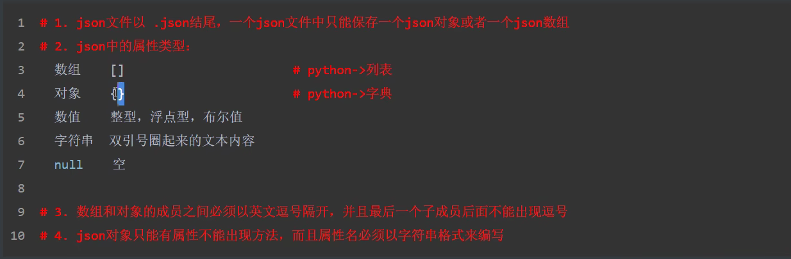

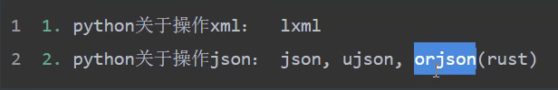

5、序列化

把数据转换格式，常见的：json/pickle/base63/struct

序列化与反序列化

将前端的数据存进数据库前等为反序列化，将数据库数据转换成前端可接受的数据格式为序列化。


针对模型创建一个序列化类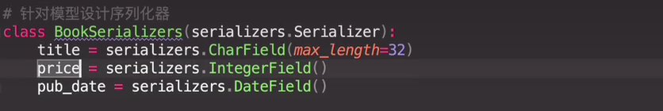

再进行序列化

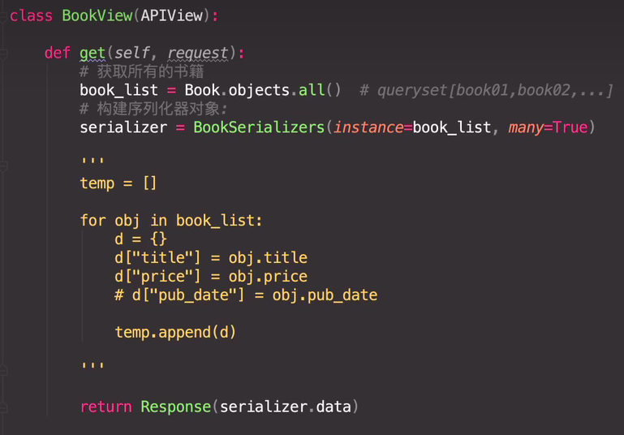

反序列化，需要校验数据是否合规。

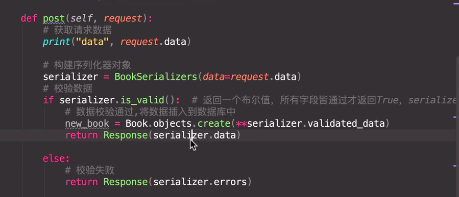

为避免分发机制字段重复，于是需要新建一个视图类

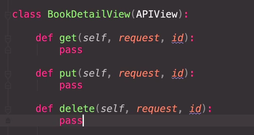

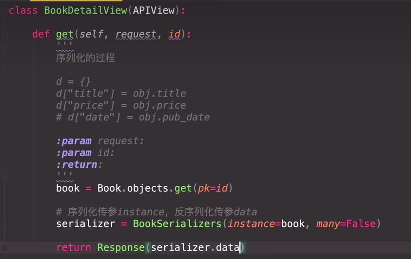

put

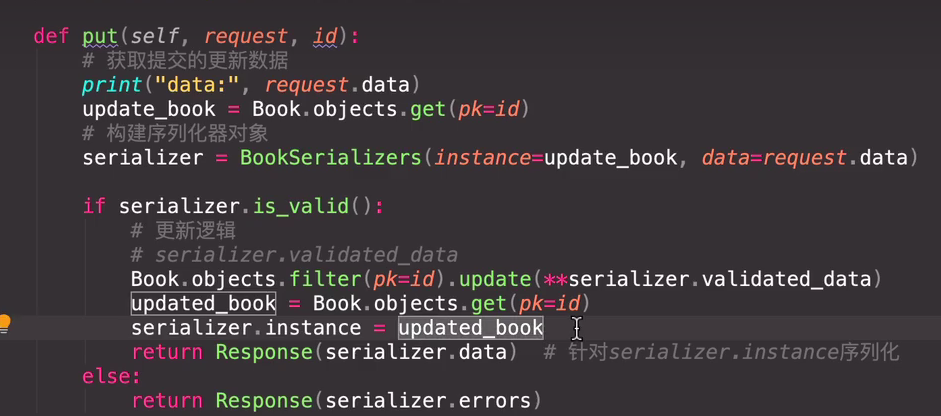


6、drf的目的 

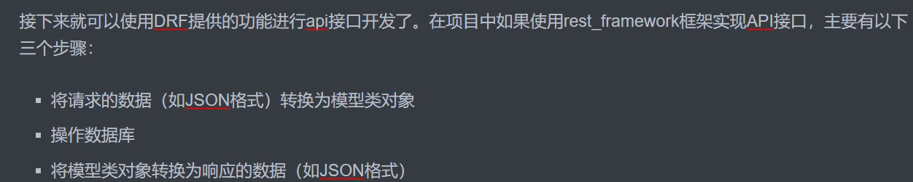

7、FBV（函数型视图）、CBV（类视图）

8、反射：将传入的字符串变成函数调用。

```python
func = getattr(self, func_str)
func()
setattr(self, method, func)
```

实例化：self=cls (**initkwargs)

属性方法：@property，不用括号调用

9、视图

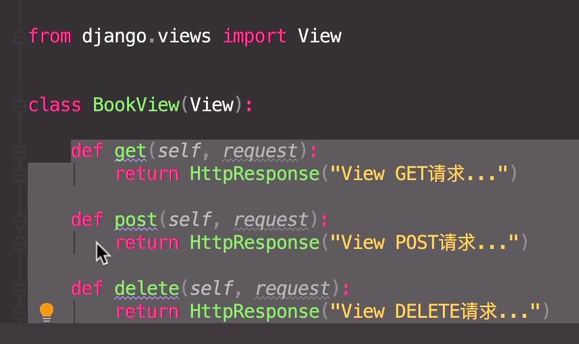

10、genericAPIView

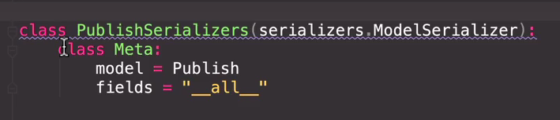

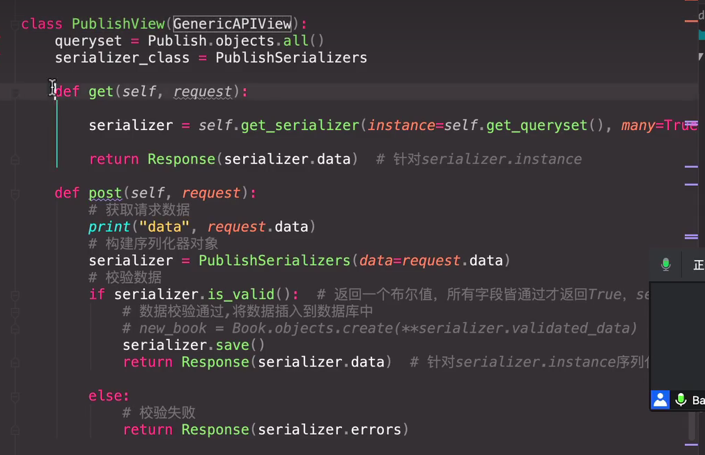

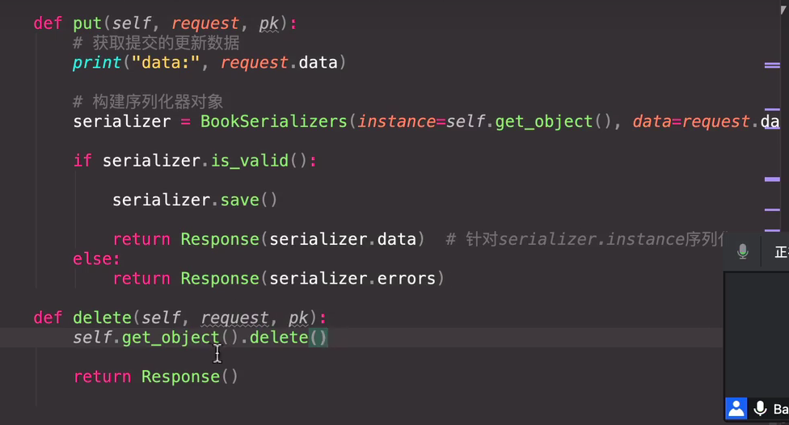

11、mixin混合类

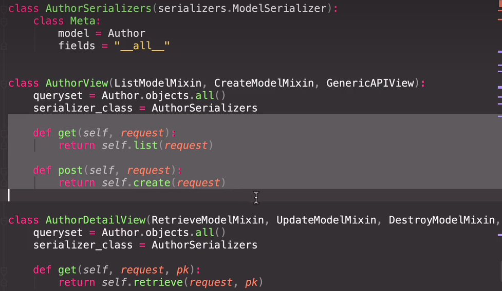


再封装一下

from restframework import listcreateAPIView

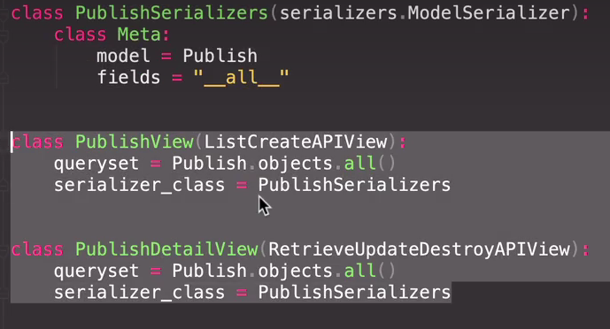

12、ViewSet

重新构建了分发机制


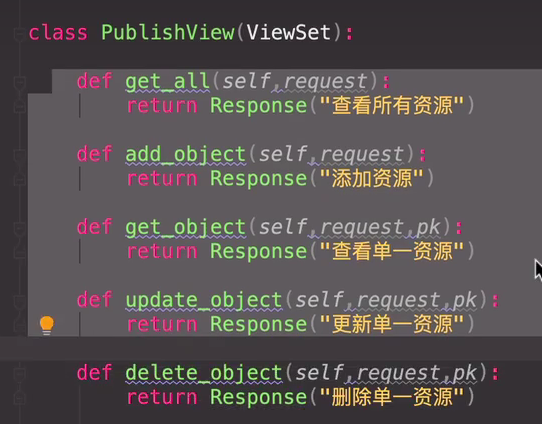

13、ModelViewSet

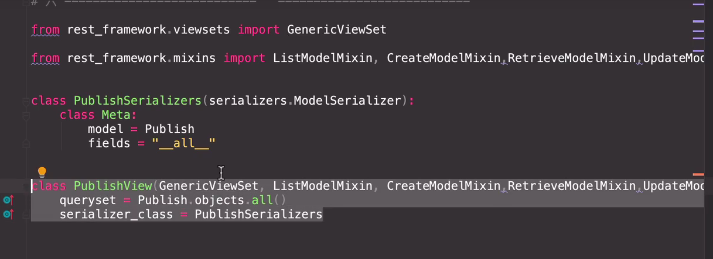


两张图片功能相同。

14、path组件

之前

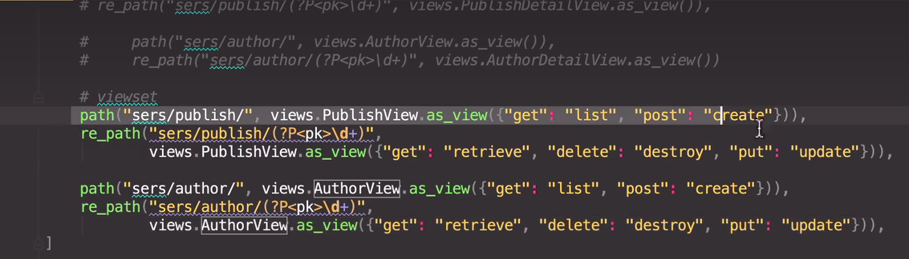

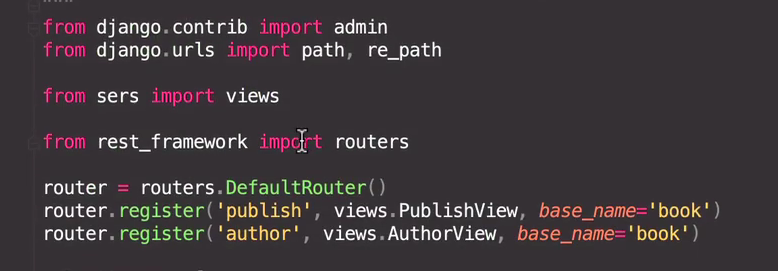

