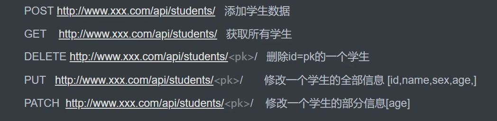
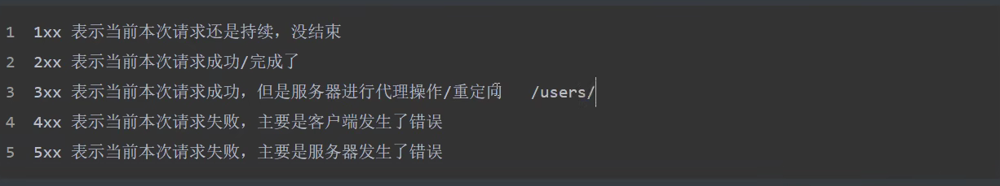
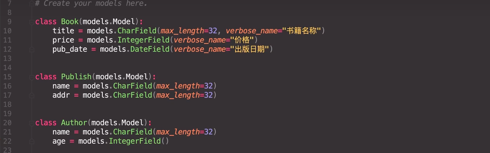
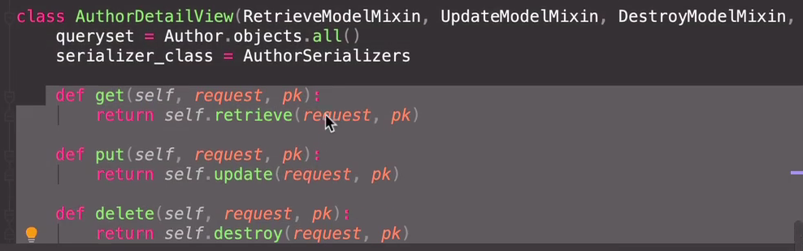
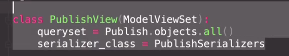

## Django

 `INSTALLED_APPS` 默认包括了以下 Django 的自带应用：

`django.contrib.admin` -- 管理员站点， 你很快就会使用它。
`django.contrib.auth` -- 认证授权系统。
`django.contrib.contenttypes` -- 内容类型框架。
`django.contrib.sessions` -- 会话框架。
`django.contrib.messages` -- 消息框架。
`django.contrib.staticfiles` -- 管理静态文件的框架。

```powershell
python manage.py migrate
# migrate 命令查看 INSTALLED_APPS 配置，并根据 mysite/settings.py 文件中的数据库配置和随应用提供的数据库迁移文件
```

我们需要在配置类 INSTALLED_APPS 中添加设置。因为 比如`PollsConfig 类`写在文件 `polls/apps.py` 中，所以它的点式路径是 `'polls.apps.PollsConfig'`。

```powershell
python manage.py makemigrations polls
```

通过运行 `makemigrations` 命令，Django 会检测你对模型文件的修改（在这种情况下，你已经取得了新的），并且把修改的部分储存为一次 *迁移*。

再次运行`python manage.py migrate`命令，在数据库里创建新定义的模型的数据表.

迁移是非常强大的功能，它能让你在开发过程中持续的改变数据库结构而不需要重新删除和创建表 - 它专注于使数据库平滑升级而不会丢失数据。我们会在后面的教程中更加深入的学习这部分内容，现在，你只需要记住，改变模型需要这三步：

- 编辑 `models.py` 文件，改变模型。
- 运行 `python manage.py makemigrations `为模型的改变生成迁移文件。
- 运行 `python manage.py migrate `来应用数据库迁移。

### 视图

每个视图必须要做的只有两件事：返回一个包含被请求页面内容的 HttpResponse 对象，或者抛出一个异常，比如 Http404 。至于你还想干些什么，随便你。

你的视图可以从数据库里读取记录，可以使用一个模板引擎（比如 Django 自带的，或者其他第三方的），可以生成一个 PDF 文件，可以输出一个 XML，创建一个 ZIP 文件，你可以做任何你想做的事，使用任何你想用的 Python 库。

Django 只要求返回的是一个 HttpResponse ，或者抛出一个异常。

### 静态文件

除了服务端生成的 HTML 以外，网络应用通常需要一些额外的文件——比如图片，脚本和样式表——来帮助渲染网络页面。在 Django 中，我们把这些文件统称为“静态文件”。

在大项目——特别是由好几个应用组成的大项目——中，处理不同应用所需要的静态文件的工作就显得有点麻烦了。这就是 `django.contrib.staticfiles` 存在的意义：它将各个应用的静态文件（和一些你指明的目录里的文件）统一收集起来，这样一来，在生产环境中，这些文件就会集中在一个便于分发的地方。

## DjangoRestFramework

 1、API接口：应用程序编程接口，提供给用户操作数据的入口。

2、RPC规范：远程服务调用。

- 服务端提供唯一的访问入口地址，所有操作都理解为动作。通过请求体参数指定调用的接口名称和接口所需参数。

- 数据格式：protopuf、json、xml

3、restful:资源状态转换（表征性状态转移）。

- 把所有数据及资源看做资源，都是对资源的操作。必须把资源的名称写在URL上。






4、JSON:javascript Object Notation,JS对象表示法


5、序列化

把数据转换格式，常见的：json/pickle/base63/struct

序列化与反序列化

将前端的数据存进数据库前等为反序列化，将数据库数据转换成前端可接受的数据格式为序列化。



针对模型创建一个序列化类

创建create方法使上传数据使用`.save()`方法完成存入数据到数据库


更新update方法使更新数据使用`.save()`方法更改数据库的某条数据


再进行序列化


反序列化，需要校验数据是否合规。


为避免分发机制字段重复，于是需要新建一个视图类


put


6、drf的目的 

核心思想：大量缩减编写API接口的代码。


7、FBV（函数型视图）、CBV（类视图）

函数型视图是定义函数接受请求体，然后根据请求体方法来确定具体执行内容。

View的类视图逻辑


APIView的类视图逻辑

继承了View，它重写了dispatch方法


构建新的request对象为了解决请求体数据问题


8、反射：将传入的字符串变成函数调用。

```python
func = getattr(self, func_str)
func()
setattr(self, method, func)
```

实例化：类对象的实例化，self=cls ()

属性方法：@property，不用括号调用，serializers.data等就是属性方法

9、视图


10、genericAPIView


11、mixin混合类




再封装一下

`from restframework import listcreateAPIView`


12、ViewSet

重新构建了分发机制


13、ModelViewSet




两张图片功能相同。

14、path组件

之前


