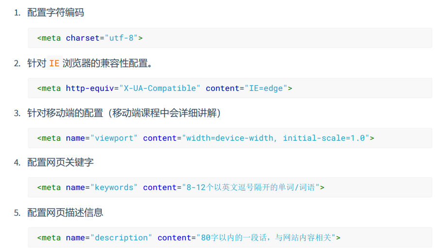
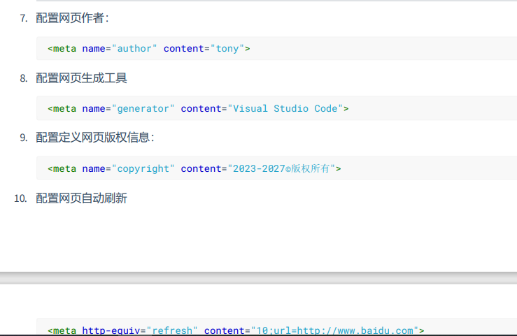
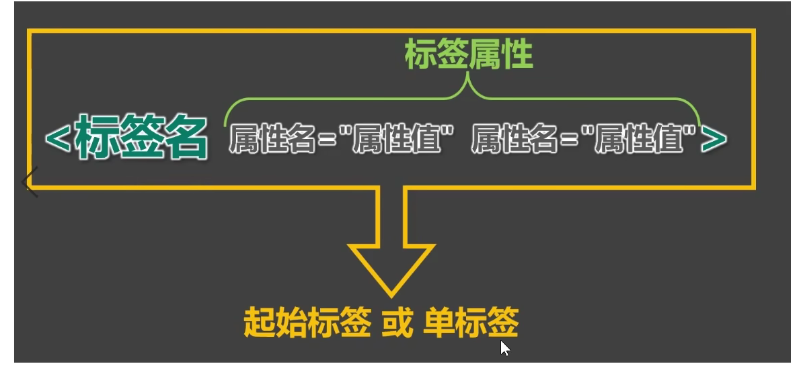
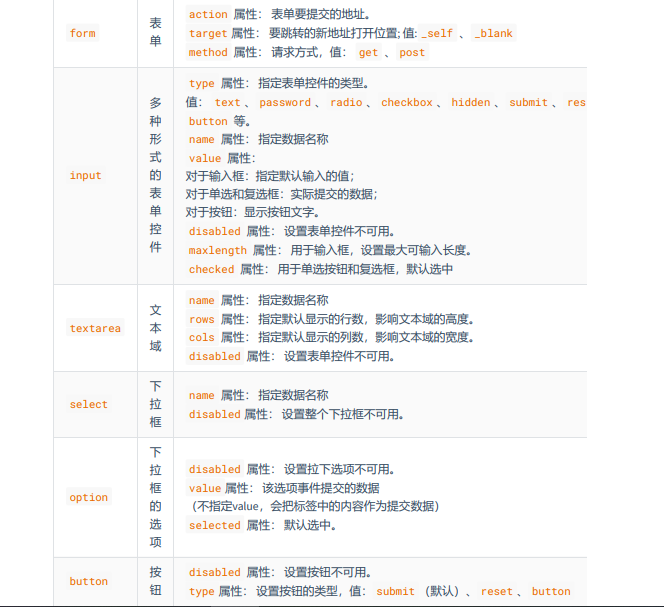

## HTML学习笔记

超文本标记语言（HyperText Markup Language），是一种用于创建网页的标准标记语言。

HTML 是用来描述网页的一种语言。

- HTML 指的是超文本标记语言: **H**yper**T**ext **M**arkup **L**anguage
- HTML 不是一种编程语言，而是一种**标记**语言
- 标记语言是一套**标记标签** (markup tag)
- HTML 使用标记标签来**描述**网页
- HTML 文档包含了HTML **标签**及**文本**内容
- HTML文档也叫做 **web 页面**

**<!DOCTYPE html>**，它是 HTML5 标准网页声明，全称为 Document Type HyperText Mark-up Language，是一条标示语言。支持 HTML5 标准的主流浏览器都认识这个声明。表示网页采用 HTML5，**<!DOCTYPE html>** 声明位于文档中的最前面的位置，处于 <html> 标签之前。此标签可告知浏览器文档使用哪种 HTML 或 XHTML 规范。


### head头部

元数据`<meta>`元素（页面基本信息），指定文档的字符编码，添加作者及描述(name,content)，其他类型的元数据（许多公司的专有创作元数据协议，property,content）





`<link>`元素，rel指定文档样式，href包含了路径。

### 标签



HTML 标记标签通常被称为 HTML 标签 (HTML tag)。

- HTML 标签是由*尖括号*包围的关键词，比如 <html>
- HTML 标签通常是*成对出现*的，比如 `<b> 和 </b>`
- 标签对中的第一个标签是*开始标签*，第二个标签是*结束标签*
- 开始和结束标签也被称为*开放标签*和*闭合标签*

语义化标签：标签默认效果不重要，语义最重要

- 代码可读性强
- 有利于SEO（搜索引擎优化）
- 方便设备解析（幕阅读器、盲人阅读器）

文本标签

| 标签名 | 标签语义         |
| ------ | ---------------- |
| em     | 要着重阅读的内容 |
| strong | 十分重要的内容   |
| span   | 没有语义         |

排版标签：h1-h6、p、div

`<html></html>`定义html文件

`<body></body>` 定义文档主体

`<h1></h1>` 标题标签

`<p></p>`段落标签

`<a href="">`链接标签、href是属性

``图片标签、名称与尺寸属性

`<br/>`换行标签，/是结束标签可不写

`<hr>`水平线标签，进行分割，是语义标签

`<pre></pre>`按原文显示

`<!-- 这是一个注释 -->`注释写法

| 标签         | 描述                               |
| :----------- | :--------------------------------- |
| `<b>`        | 定义粗体文本                       |
| `<em>`       | 定义着重文字，强调                 |
| `<i>`        | 定义斜体字                         |
| `<small>`    | 定义小号字                         |
| `<strong>`   | 定义加重语气，强烈的重要性         |
| `<sub>`      | 定义下标字                         |
| `<sup>`      | 定义上标字                         |
| `<ins>`      | 定义插入字                         |
| `<del>`      | 定义删除字                         |
| `<code>`     | 定义计算机代码                     |
| `<var>`      | 定义变量                           |
| `<pre>`      | 定义预格式文本                     |
| `<abbr>`     | 定义缩写，最好配上title属性        |
| `<bdo>`      | 定义文字方向                       |
| `<table>`    | 定义表格                           |
| `<th>`       | 定义表格的表头                     |
| `<tr>`       | 定义表格的行                       |
| `<td>`       | 定义表格的单元                     |
| `<div>`      | 定义了文档区域，块级               |
| `<span>`     | 用来组合文档中的行内元素，内联元素 |
| `<script>`   | 定义了客户端脚本                   |
| `<noscript>` | 定义了不支持脚本浏览器输出的文本   |

语义元素与表象元素，表象元素应尽量少使用。

### 组成部分

####     元素

- HTML 元素以**开始标签**起始
- HTML 元素以**结束标签**终止
- **元素的内容**是开始标签与结束标签之间的内容
- 某些 HTML 元素具有**空内容（empty content）**
- 空元素**在开始标签中进行关闭**（以开始标签的结束而结束）
- 大多数 HTML 元素可拥有**属性**

块级元素与行内元素

- 块级元素能写行内元素、块级元素，几乎什么都能写

- 行内元素能写行内元素不能写块级元素
- p标签中不能块级元素

####    属性

- HTML 元素可以设置**属性**
- 属性可以在元素中添加**附加信息**
- 属性一般描述于**开始标签**
- 属性总是以名称/值对的形式出现，**比如：name="value"**。

| 属性  | 描述                                                         |
| :---- | :----------------------------------------------------------- |
| class | 为html元素定义一个或多个类名（classname）(类名从样式文件引入) |
| id    | 定义元素的唯一id                                             |
| style | 规定元素的行内样式（inline style）                           |
| title | 描述了元素的额外信息 (作为工具条使用)                        |

#### 标题与段落

在 HTML 文档中，标题很重要。标题（Heading）是通过 <h1> - <h6> 标签进行定义的。<h1> 定义最大的标题。 <h6> 定义最小的标题。

搜索引擎使用标题为您的网页的结构和内容编制索引。因为用户可以通过标题来快速浏览您的网页，所以用标题来呈现文档结构是很重要的。应该将 h1 用作主标题（最重要的），其后是 h2（次重要的），再其次是 h3，以此类推。

HTML 可以将文档分割为若干段落。段落是通过 <p> 标签定义的。

都是语义化标签、块级元素。

####   链接

HTML 使用超级链接与网络上的另一个文档相连。几乎可以在所有的网页中找到链接。点击链接可以从一张页面跳转到另一张页面。

`<a href="url">链接文本</a>` *链接文本"* 不必一定是文本。图片或其他 HTML 元素都可以成为链接

target 属性，定义被链接的文档在何处显示 `<a href="http://www.runoob.com/" target="_blank">访问菜鸟教程!</a>`在空白处显示。

`<a>`标签是行内元素，但是其内容能包含块级元素。

锚点，可以用name属性也可以id属性。

id 属性，可用于创建在一个HTML文档书签标记。书签是不以任何特殊的方式显示，在HTML文档中是不显示的，所以对于读者来说是隐藏的。

在HTML文档中插入ID:

`<a id="tips">有用的提示部分</a>`

在HTML文档中创建一个链接到"有用的提示部分(id="tips"）"：

`<a href="#tips">访问有用的提示部分</a>`

或者，从另一个页面创建一个链接到"有用的提示部分(id="tips"）"：

`<a href="https://www.runoob.com/html/html-links.html#tips">访问有用的提示部分</a>`

```html
<a rel="noopener noreferrer">意思是不会打开其他的网站，因为恶意病毒可能会修改你的浏览器空白页地址。
```

 title属性旨在包含关于链接的补充信息。

当你链接到要下载的资源而不是在浏览器中打开时，你可以使用 `download` 属性来提供一个默认的保存文件名。

####   头部

```html
<title> 标签定义了不同文档的标题。

<title> 在 HTML/XHTML 文档中是必须的。

<title> 元素:
    - 定义了浏览器工具栏的标题
    - 当网页添加到收藏夹时，显示在收藏夹中的标题
    - 显示在搜索引擎结果页面的标题
<base> 标签描述了基本的链接地址/链接目标，该标签作为HTML文档中所有的链接标签的默认链接
<link> 标签定义了文档与外部资源之间的关系，通常用于链接到样式表。
<style>定义了HTML文档的样式文件引用地址；在<style> 元素中你也可以直接添加样式来渲染 HTML 文档
<meta> 描述了一些基本的元数据，描述HTML文档的描述，关键词，作者，字符集等。
<script>标签用于加载脚本文件，如： JavaScript。
```

####   图像

```html

```

src源属性：图像的url地址

Alt属性用来为图像定义一串预备的可替换的文本。

height（高度） 与 width（宽度）属性用于设置图像的高度与宽度。

| map  | 定义图像地图               |
| ---- | -------------------------- |
| area | 定义图像地图中的可点击区域 |

```
<map name="planetmap">
  <area shape="rect" coords="0,0,82,126" alt="Sun" href="sun.htm">
  <area shape="circle" coords="90,58,3" alt="Mercury" href="mercur.htm">
  <area shape="circle" coords="124,58,8" alt="Venus" href="venus.htm">
</map>
```

该段代码中的shape指的是点击区域的形状，coords指的应该是链接区域在图片中的坐标（像素为单位）。

1、矩形：(左上角顶点坐标为(x1,y1)，右下角顶点坐标为(x2,y2))

```
<area shape="rect" coords="x1,y1,x2,y2" href=url>
```

2、圆形：(圆心坐标为(X1,y1)，半径为r)

```
<area shape="circle" coords="x1,y1,r" href=url>
```

3、多边形：(各顶点坐标依次为(x1,y1)、(x2,y2)、(x3,y3) ......)

```
<area shape="poly" coords="x1,y1,x2,y2 ......" href=url>
```

#### 表格

表格由 **<table>** 标签来定义。每个表格均有若干行（由 **<tr>** 标签定义），每行被分割为若干单元格（由 **<td>** 标签定义）。字母 td 指表格数据（table data），即数据单元格的内容。

一般包含`<caption> <thead> <tbody> <tfoot>`四个组成部分。

数据单元格可以包含文本、图片、列表、段落、表单、水平线、表格等等。

表格三要素 **table、tr、td** 缺一不可。

`<table>` 标签常用属性：


```
border="1"   表格边框的宽度、不能控制单元格的边框
bordercolor="#fff"   表格边框的颜色
cellspacing="5"   单元格之间的间距
width="500"   表格的总宽度
height="100"   表格的总高度（代表高度至少是100）
align="right"   表格整体对齐方式    (参数有  left、center、right)
bgcolor="#fff"   表格整体的背景色
```

`<tr>` 标签的常用属性:

```
bgcolor="#fff"    行的颜色
align="right"    行内文字的水平对齐方式    (参数有left、center、right)
valign="top"     行内文字的垂直对齐方式    (参数有top、middle、bottom)
height="50"
```

`<td>、<th>`标签的常用属性:

```html
width="500"    单元格的宽度，设置后对当前一列的单元格都有影响
height="100"   单元格的高度，设置后对当前一行的单元格都有影响
bgcolor="fff"  单元格的背景色
align="right"  单元格文字的水平对齐方式    (参数left、center、right)
rowspan="3"    合并垂直水平方向的单元格
colspan="3"    合并水平方向单元格
valign="top"   单元格文字的垂直对齐方式    (参数middle、bottom、top) 
```

####   列表

ul是unordered lists的缩写 (无序列表)

li是list item的缩写 （列表项目）

ol是ordered lists的缩写（有序列表）

dl是definition lists的英文缩写 (自定义列表)

dt是definition term的缩写 (自定义列表组)

dd是definition description的缩写（自定义列表描述）

nl是navigation lists的英文缩写 （导航列表）

tr是table row的缩写 （表格中的一行）

th是table header cell的缩写 （表格中的表头）

td是table data cell的缩写 （表格中的一个单元格）

无序列表

```html
<ul>
<li>Coffee</li>
<li>Milk</li>
</ul>
```

有序列表

```html
<ol>
<li>Coffee</li>
<li>Milk</li>
</ol>
```

自定义列表

```html
<dl>
<dt>Coffee</dt>
<dd>- black hot drink</dd>
<dt>Milk</dt>
<dd>- white cold drink</dd>
</dl>
```

#### 区块

大多数 HTML 元素被定义为**块级元素**或**内联元素**。

块级元素在浏览器显示时，通常会以新行来开始（和结束）。实例: <h1>, <p>, <ul>, <table>

内联元素在显示时通常不会以新行开始。实例: <b>, <td>, <a>, 

| 标签   | 描述                                        |
| :----- | :------------------------------------------ |
| <div>  | 定义了文档的区域，块级 (block-level)        |
| <spqn> | 用来组合文档中的行内元素， 内联元素(inline) |

HTML <div> 元素是块级元素，它可用于组合其他 HTML 元素的容器。

<div> 元素没有特定的含义。除此之外，由于它属于块级元素，浏览器会在其前后显示折行。

如果与 CSS 一同使用，<div> 元素可用于对大的内容块设置样式属性。

HTML <span> 元素是内联元素，可用作文本的容器

<span> 元素也没有特定的含义。

当与 CSS 一同使用时，<span> 元素可用于为部分文本设置样式属性。

#### 布局

大多数网站会把内容安排到多个列中（就像杂志或报纸那样）。

大多数网站可以使用 <div> 或者 <table> 元素来创建多列。CSS 用于对元素进行定位，或者为页面创建背景以及色彩丰富的外观。

####   表单

HTML 表单用于收集用户的输入信息。也可以称网页中的交互区

HTML 表单表示文档中的一个区域，此区域包含交互控件，将用户收集到的信息发送到 Web 服务器。

标签`<form>input元素</form>`，重要的属性：`action`（表单提交地址）、`target`、`method`（提交方式）

输入元素(type属性)：文本域（text）、密码字段(password)、单选按钮(radio)、复选框(checkbox)、提交按钮(submmit)、隐藏域(hiden)、重置按钮(reset)

表单中的单选、复选按钮等基本要设置以下几个属性：value、name、checked

-  value：提交数据到服务器的值（后台程序PHP使用）
-  name：为控件命名，以备后台程序 ASP、PHP 使用
-  checked：当设置 checked="checked" 时，该选项被默认选中

按钮（button）属性type(submit提交，reset重置，button普通按钮)

| 标签       | 描述                                                         |
| :--------- | :----------------------------------------------------------- |
| <form>     | 定义供用户输入的表单                                         |
| <input>    | 定义输入域，属性type、name、value、maxlength、disabled(禁用) |
| <textarea> | 定义文本域 (一个多行的输入控件)，cols、rows                  |
| <label>    | label 标签可与input元素表单控件相关联，关联之后点击文字，与之对应的表单控件就会获取焦点。<br/>两种与 label 关联方式如下：<br/>1. 让 label 标签的 for 属性的值等于表单控件的 id 。<br/>2. 把表单控件套在 label 标签的里面。 |
| <fieldset> | 定义了一组相关的表单元素，并使用外框包含起来                 |
| <legend>   | 定义了 <fieldset> 元素的标题                                 |
| <select>   | 定义了下拉选项列表                                           |
| <optgroup> | 定义选项组                                                   |
| <option>   | 定义下拉列表中的选项，属性value、selceted                    |
| <button>   | 定义一个点击按钮                                             |
| <datalist> | 指定一个预先定义的输入控件选项列表                           |
| <keygen>   | 定义了表单的密钥对生成器字段                                 |
| <output>   | 定义一个计算结果                                             |



####   框架

通过使用框架，你可以在同一个浏览器窗口中嵌入一个页面，也可嵌入图片。

`<iframe src='url'></iframe>`，用height、width来定义iframe标签的高度与宽度，frameborder定义边框宽度，name框架名字与target属性配合使用。

使用 iframe 来显示目标链接页面，`<iframe src="demo_iframe.htm" name="iframe_a"></iframe>`

` <p><a href="https://www.runoob.com" target="iframe_a" rel="noopener">RUNOOB.COM</a></p>`

####   脚本

JavaScript 使 HTML 页面具有更强的动态和交互性。

`<script> 标签用于定义客户端脚本，比如 JavaScript。`

`<script> 元素既可包含脚本语句，也可通过 src 属性指向外部脚本文件。`


JavaScript 最常用于图片操作、表单验证以及内容动态更新。

####   字符实体

&*entity_name*;或&#*entity_number*;   替换预留字符或键盘上没有的字符.

| 显示结果 | 描述        | 实体名称            | 实体编号  |
| :------- | :---------- | :------------------ | :-------- |
|          | 空格        | `&nbsp;`            | `&#160;`  |
| <        | 小于号      | `&lt;`              | `&#60;`   |
| >        | 大于号      | `&gt;`              | `&#62;`   |
| &        | 和号        | `&amp;`             | `&#38;`   |
| "        | 引号        | `&quot;`            | `&#34;`   |
| '        | 撇号        | `&apos;` (IE不支持) | `&#39;`   |
| ￠       | 分          | `&cent;`            | `&#162;`  |
| £        | 镑          | `&pound;`           | `&#163;`  |
| ¥        | 人民币/日元 | `&yen;`             | `&#165;`  |
| €        | 欧元        | `&euro;`            | `&#8364;` |
| §        | 小节        | `&sect;`            | `&#167;`  |
| ©        | 版权        | `&copy;`            | `&#169;`  |
| ®        | 注册商标    | `&reg;`             | `&#174;`  |
| ™        | 商标        | `&trade;`           | `&#8482;` |
| ×        | 乘号        | `&times;`           | `&#215;`  |
| ÷        | 除号        | `&divide;`          | `&#247;`  |

#### URL

统一资源定位器(Uniform Resource Locators)

一个统一资源定位器(URL) 用于定位万维网上的文档。

语法规则：scheme://host.domain:port/path/filename

#### 全局属性

什么标签都能写的属性就叫全局属性

| 属性名 | 含义                       |
| ------ | -------------------------- |
| id     | 给标签的唯一标识，不能重复 |
| class  | 类选择器                   |
| style  | 设置CSS样式                |
| dir    | 内容的方向，值：ltr、rtl   |
| tiltle | 给标签设置文字属性         |
| lang   | 给标签指定语言             |

### 补充知识点

1、***.html** 文件跟 ***.jpg** 文件(f盘)在不同目录下：

```html

```

2、***.html** 文件跟 ***.jpg** 图片在相同目录下：

```html

```

3、***.html** 文件跟 ***.jpg** 图片在不同目录下：

a、图片 ***.jpg** 在 **image** 文件夹中，*.html 跟 **image** 在同一目录下：

```html

```

b、图片 ***.jpg** 在 **image** 文件夹中，***.html** 在 **connage** 文件夹中，**image** 跟 **connage** 在同一目录下：

```html

```

4、如果图片来源于网络，那么写绝对路径：

```html

```

5、src与href的区别：src 用于替换当前元素；href 用于在当前文档和引用资源之间建立联系。前者是引入，后者是引用。

6、1到6号标题与1到6号字体逆序对应，比如1号字体对应6号标题，2号字体对应5号标题。

```html
<h1>这是1号标题</h1>
<font size="6">这是6号字体文本</font>
```

7、内容中的单词之间的空格用%20代替

### HTML5