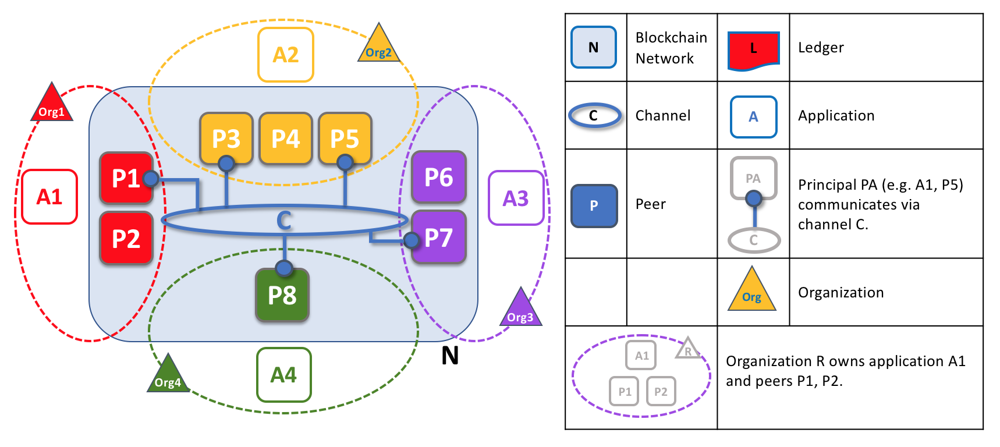
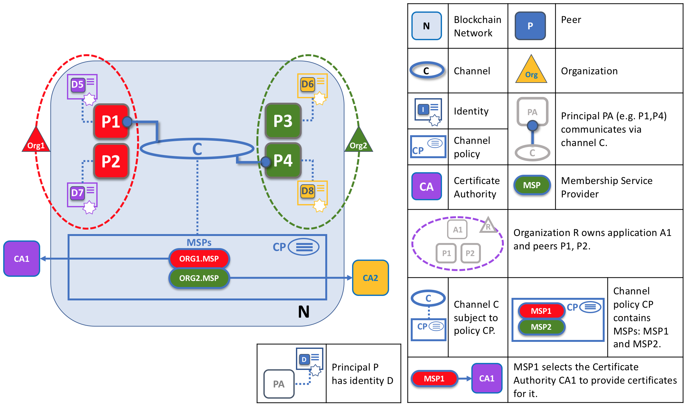

# Hyperledger Fabric

## 一、前言

### 1、背景

随着比特币、以太坊和其他一些衍生技术的普及，越来越多的人想要将**区块链基础技术、分布式账本和分布式应用平台**用到*企业*业务中。

对于企业应用，我们需要考虑以下要求：

1、参与者必须是已认证的或者可识别的
2、网络需要获得许可
3、高交易吞吐量性能
4、交易确认低延迟
5、与商业交易有关的交易和数据的隐私和机密性

### 2、Hyperledger Fabric 基础介绍

Linux 基金会于2015年创建了 Hyperledger（超级账本）项目，以推进跨行业的区块链技术。它不是用来宣布一个区块链标准，而是鼓励通过社区流程开发区块链技术的协作方法，其中包括鼓励开放式开发、和随着时间的推移采用关键标准的知识产权。

Hyperledger Fabric 是一个开源的企业级许可分布式账本技术（Distributed Ledger Technology，DLT）平台，专为在企业环境中使用而设计。差异化设计特性的结合使 Fabric 成为当今交易处理和交易确认延迟方面**性能较好的平台**之一，并且它实现了交易的**隐私和保密**以及智能合约（Fabric 称之为“链码”）。

它具有以下特征：1）高度模块化和可配置架构、2）支持通用编程语言编写智能合约、3）许可网络，参与者并不是完全不信任的、4）支持可插拔共识协议、5）可以利用不需要原生加密货币的共识协议来激励昂贵的挖矿或推动智能合约执行。

### 3、关键概念

3.1 智能合约

区块链使用 **智能合约** 来提供对账本的受控访问。智能合约不仅是在网络中封装和简化信息的关键机制，它还可以被编写成自动执行参与者的特定交易的合约。

区块链好处（超级账本方认为）

即使可见性和信任的需求很明确，但在如今信息和流程共享的方法支离破碎，不可能构建一个跨业务网络的记录系统。利用共享账本协调其业务网络的能力，区块链网络可以减少与处理私人信息相关的时间、成本和风险，同时提高信任和可见性。

3.2 Hyperledger Fabric模型

资产：可以涵盖有形（房地产和硬件）和无形资产（合同和知识产权）。资产在 Hyperledger Fabric 中被表示为键值对的集合，状态更改记录为 Channel 账本上的交易。资产可以用二进制或 JSON 表示。

链码：链码是定义单项或多项资产，和能修改资产的交易指令的软件；换句话说，它是业务逻辑。

状态转换是参与者提交链码调用（“交易”）的结果。

账本由区块链（“链”）组成，用于存储区块中不可更改并有序的的记录，以及维护当前 Fabirc 状态的状态数据库。每个通道有一个账本。每个节点为其所属的每个通道维护一个账本的副本。

隐私：通道保持广泛的网络上的交易的私密性，而集合则保持通道上的组织子集之间数据的私密性。

3.3 区块链网络

 Hyperledger Fabric 是如何让组织间以区块链网络的形式进行合作。

区块链网络是一个为应用程序提供账本及智能合约（chaincode）服务的技术基础设施。

创建网络：通道配置CC1已由组织R1、R2和R0同意，并包含在称为“配置块”的块中，该块通常由`configtxgen`工具根据`configtx.yaml`文件创建。此配置块包含可以连接组件并在通道上交互的组织的记录，以及定义如何做出决策和达到特定结果的结构的**策略**。

节点加入通道：节点是网络的基本元素，因为它们拥有账本和链码(包含智能合约)，而且是在通道上进行交易的组织连接到另一个通道(另一个是应用程序)的物理节点之一。

安装、批准和提交链码：包含智能合约的结构称为链码(chaincode)，安装在相关的peer节点上，由相关节点的组织批准，并在通道上提交。通过这种方式，您可以考虑将链码**物理托管**在peer节点上，但**逻辑托管**在通道上。

在通道上使用应用程序：提交智能合约后，客户端应用程序可以通过Fabric Gateway服务(网关)调用链码上的事务。

加入多个通道：首先需要创建新的通道配置，其次，将组件加入到新通道。

将组织添加到现有的通道中：决定新组织的权限和角色。更新通道，包括相关的链码，以反映这些决策。组织将其peer节点(以及潜在的排序节点)加入通道，并开始参与交易。

3.4 身份

区块链网络中的不同参与者包括 Peer 节点、排序节点、客户端应用程序、管理员等，**确定了对资源的确切权限以及对参与者在区块链网络中拥有的信息的访问权限。**

要使身份可以被验证，它必须来自可信任的权威机构。成员服务提供者（Membership Service Provider，MSP）是 Fabirc 中可以信任的权威机构。具体地说，一个 MSP 是定义管理该组织有效身份规则的组件。Fabric 中默认的 MSP 实现使用 X.509 证书作为身份，采用传统的公钥基础结构。

Hyperledger Fabric 网络的成员需要从可信赖的 **成员服务提供者（MSP）** 注册，MSP 将可验证的身份转变为区块链网络的成员。

1）PKI

公钥基础结构（PKI）是一组互联网技术，可在网络中提供安全通信。

数字证书是包含与证书持有者相关的属性的文档。最常见的证书类型是符合 X.509标准的证书，它允许在其结构中编码一些用于身份识别的信息。

PKI 有四个关键要素：数字证书、公钥和私钥、证书授权中心、证书撤销列表

Fabric 提供了一个内置的 CA 组件，允许在你的区块链网络中创建 CA。此组件称为 **Fabric CA** ，是一个私有根 CA 提供者，能够管理具有 X.509 证书形式的 Fabric 参与者的数字身份。由于 Fabric CA 是针对 Fabric 的根 CA 需求的自定义 CA，因此它本身无法为浏览器中的常规或自动使用提供 SSL 证书。

2）根 CA，中间 CA 和信任链

CA 有两种形式：**根 CA**和**中间 CA** 。因为根 CA（Symantec，Geotrust等）必须**安全地**向互联网用户**颁发**数亿个证书，所以将这个过程分散到所谓的*中间 CA 中*是很有用的。这些中间 CA 具有由根 CA 或其他中间 CA 颁发的证书，允许为链中的任何 CA 颁发的任何证书建立“信任链”。

*只要每个中间 CA 的证书的颁发 CA 是根 CA 本身或具有对根 CA 的信任链，就在根 CA 和一组中间 CA 之间建立信任链。*

中间 CA 在跨多个组织颁发证书时提供了巨大的灵活性，这在许可的区块链系统（如Fabric）中非常有用。例如，你将看到不同的组织可能使用不同的根 CA，或者使用具有不同中间 CA 的相同根 CA，这取决于网络的需求。

3.5 成员服务提供者 (MSP)

MSP是一个可让身份被信任和被网络中其他参与者公认的，而不需要暴露成员的私钥的机制。

要在Fabric网络上进行交易，成员需要这样做：

拥有一个由网络信任的CA颁发的身份。
成为一个被网络成员认可和认可的 组织 的成员。MSP将身份与组织的成员资格联系在一起。成员资格是通过将成员的公钥(也称为证书、签名证书或签证)添加到组织的MSP来实现的。
将MSP添加到网络上的一个联盟 或者通道。
确保MSP包括在网络中的策略 定义。

MSP要求的实现是一组文件夹添加到网络的配置，和用于内部地(组织决定它的管理员是谁)和外部地(通过允许其他组织验证对象是否有权做他们正在试图做的事情)定义一个组织。

MSP通过列出其成员的身份，或通过确定哪些是为其成员授权颁发有效身份的ca，来识别和确定接受来自这些根ca和中间ca所定义的信任域的成员。MSP通过标识参与者在节点或通道上拥有的特定特权，将身份转换为**角色**。

1) MSP 域

在区块链网络中，MSP 出现在两个位置：

- 在参与者节点本地（**本地 MSP**）
- 在通道配置中（**通道 MSP**）

本地MSP：**本地MSP是为客户端和节点(peer节点和排序节点)定义的**。

通道MSP：**通道MSP在通道层面上定义了管理权和参与权**。

3.6 策略

从根本上来说，策略是一组规则，用来定义如何做出决策和实现特定结果。

Fabric 策略表示成员如何同意或者拒绝网络、通道或者智能合约的变更。策略在网络最初配置的时候由联盟成员一致同意，但是在网络演化的过程中可以进行修改。

3.7 peer节点

区块链网络主要由 *Peer 节点*（或者简单称之为 *Peer*）组成。Peer 是网络的基本元素，因为他们存储了账本和智能合约。

Peer 节点是账本及链码的*宿主*，应用程序及管理员如果想要访问这些资源，他们必须要和 Peer 节点进行交互。

1）应用程序和 Peer 节点

*Peer 节点和排序节点，确保了账本在每个 Peer 节点上都具有最新的账本。在这个例子中，应用程序 A 连接到了 P1 并且调用了链码 S1 来查询或者更新账本 L1。P1 调用了链码 S1 来生成提案响应，这个响应包含了查询结果或者账本更新的提案。应用程序 A 接收到了提案的响应，对于查询来说，流程到这里就结束了。对于更新来说，应用程序 A 会从所有的响应中创建一笔交易，它会把这笔交易发送给排序节点 O1 进行排序。O1 会搜集网络中的交易并打包到区块中，然后将这些区块分发到所有 Peer 节点上，包括 P1。P1 在把交易提交到账本 L1 之前对交易进行验证。当 L1 被更新之后，P1 会生成一个事件，该事件会被 A 接收到，来标识这个过程结束了。*

2）peer 节点和通道

这些组件通常是 Peer 节点、排序节点和应用程序，并且通过加入通道的方式，表明他们同意在那个通道中通过互相合作来共享以及管理完全一致的账本副本。

我们可以看到通道和 Peer 节点是以不同的方式存在的，将通道理解为由物理的 Peer 节点的组成的逻辑结构更合适一些。*理解这一点很重要，因为 Peer 节点提供了对通道访问和管理的控制*。

3）peer节点和组织

区块链网络是由多个组织来管理的，而不是单个组织。对于如何构建这种类型的分布式网络，Peer 节点是核心，因为他们是由这些组织所有，也是这些组织同这个网络的连接点。

4）peer节点和身份

*当 Peer 节点连接到一个通道的时候，它的数字证书会通过通道 MSP 来识别它的所属组织。在这个例子中，P1 和 P2 具有由 CA1 颁发的身份信息。通道 C 通过在它的通道配置中的策略来决定来自 CA1 的身份信息应该使用 ORG1.MSP 被关联到 Org1。类似的，P3 和 P4 由 ORG2.MSP 识别为 Org2 的一部分。*

当 Peer 节点使用通道连接到一个区块链网络的时候，*在通道配置中的策略会使用 Peer 节点的身份信息来确定它的权利。\*关于身份信息和组织的映射是由\*成员服务提供者*（MSP）来提供的，它决定了一个 Peer 节点如何在指定的组织中分配到特定的角色以及得到访问区块链资源的相关权限。更多的是，一个 Peer 节点只能被一个组织所有，因此也就只能被关联到一个单独的 MSP。

5）peer节点和排序节点