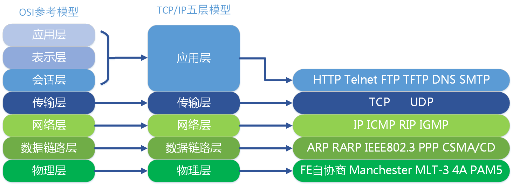

##                           网络协议

协议：一组规则，要求使用协议的双方，必须严格遵守协议的内容。

#### `TCP/IP`协议

`TCP/IP `是因特网的通信协议。`TCP/IP` 通信协议是对计算机必须遵守的规则的描述，只有遵守这些规则，计算机之间才能进行通信。它在万维网出现前就存在了，因此`http`协议也是根据它来与web连接传输数据的。

`TCP/IP`协议传输的四层（或五层）：应用层，传输层，：Internet（网络层），数据链路层，（五层则加一个物理层）

网络分层模型：`OSI`七层模型结构（物、数、网、传、会、表、应）、`TCP/IP`四层模型（数、网、传、应）

### 层与协议

**1、物理层**：孤立的计算机之间必须完成组网。功能：主要是基于电器特性发送高低电压(电信号)，高电压对应数字1，低电压对应数字0。

**2、数据链路层**：单纯的电信号0和1没有任何意义，必须规定电信号多少位一组，每组什么意思。功能：定义了电信号的分组方式。

分组方式统一标准：**以太网协议`ethernet`**，其规定一组电信号构成一个数据包，叫做“帧”。每一数据帧分成报头head和数据data。

mac地址：head中包含的源和目标地址由来，`ethernet`规定接入`internet`的设备都必须具备网卡，发送端和接收端的地址便是指网卡的地址。每一块网卡都有世界上唯一的mac地址。

广播：同一网络的两台主机可以根据**`ARP`协议**获取另一台主机的mac地址，进行通信。

**3、网络层**：世界大网络是由一个个彼此隔离的局域网组成，以太网包只能在局域网内发送，一个局域网是一个广播域。以太网的广播包只能在一个广播域内发送，跨广播域通信只能通过路由转发。

网络层功能：引入一套新的地址用来区分不同的广播域／子网，这套地址即网络地址。

**`ip`协议**：就是规定网络地址的协议，它定义的地址称之为**`ip`地址**，广泛采用的`v4`版本即`ipv4`，它规定网络地址由32位2进制表示。

`IP`协议的主要作用:一个是为每一台计算机分配`IP`地址；另一个是确定哪些地址在同一个子网络。

子网掩码，就是表示子网络特征的一个参数。知道子网掩码，我们就能判断，任意两个`IP`地址是否处在同一个子网络。

`ip`地址：`ip`地址分两个部分，网络部分：标识子网。主机部分：标识主机。 

**`ARP`协议**：其功能：广播的方式发送数据包，获取目标主机的mac地址。

在以太网环境，为了正确地向目的主机传送报文，必须把目的主机的32位`IP`地址转换成为目的主机48位以太网的地址（MAC地址）。这就需要在互联层有一个服务或功能将`IP`地址转换为相应的物理地址（MAC地址），这个服务或者功能就是`ARP`协议。

**`ICMP`协议**：当传送`IP`数据包发生错误－－比如主机不可达，路由不可达等等，`ICMP`协议将会把错误信息封包，然后传送回给主机。给主机一个处理错误的机会。

`ICMP`(网络控制报文)协议一般用于检测网络是否通畅，基于`ICMP`协议的工具主要有`Ping和traceroute`。

**4、传输层**：网络层的`ip`帮我们区分子网，以太网层的mac帮我们找到主机，再通过端口来标识主机上的应用程序。端口即应用程序与网卡关联的编号。

传输层功能：建立端口到端口的通信，补充：端口范围0-65535，0-1023为系统占用端口。传输层有两种协议，`TCP和UDP`。

**TCP协议**：可靠传输，TCP数据包没有长度限制。只要不得到确认，就重新发送数据报，直到得到对方的确认为止。`tcp`的三次握手和四次挥手。

**`UDP`协议**：不可靠传输，”报头”部分一共只有8个字节，总长度不超过65,535字节，正好放进一个`IP`数据包。

**5、应用层**：功能：规定应用程序的数据格式。

TCP协议可以为各种各样的程序传递数据，比如Email、WWW、FTP等等。那么，必须有不同协议规定电子邮件、网页、FTP数据的格式，这些应用程序协议就构成了”应用层”。

**HTTP超文本传输协议**:无连接、媒体独立、无状态。

