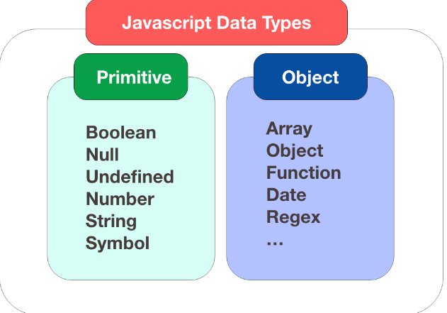
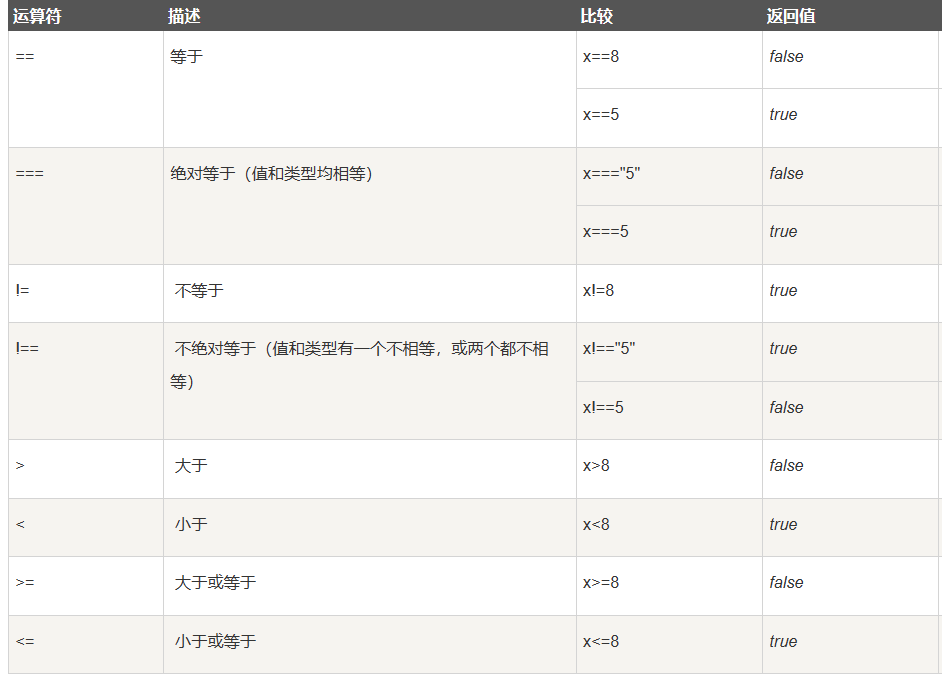

## JavaScript

#### 导语

为什么学习JavaScript？

1. **HTML** 定义了网页的内容
2. **CSS** 描述了网页的布局
3. **JavaScript** 控制了网页的行为

JavaScript 是**脚本语言**

- JavaScript 是一种轻量级的编程语言。

- JavaScript 是可插入 HTML 页面的编程代码。

- JavaScript 插入 HTML 页面后，可由所有的现代浏览器执行。

JavaScript 作用：

- 直接写入HTML输出流
- 对事件的反应
- 改变HTML内容
- 改变HTML图像
- 改变HTML样式
- 验证输入

#### JavaScript用法

1、HTML 中的脚本必须位于` <script> 与 </script>` 标签之间。脚本可被放置在 HTML 页面的 <body> 和 <head> 部分中。

2、`<script>`标签

如需在 HTML 页面中插入 JavaScript，请使用 `<script>` 标签。

`<script> 和 </script> 会告诉 JavaScript 在何处开始和结束。`

`<script> 和 </script> 之间的代码行包含了 JavaScript:`

3、JavaScript 函数和事件

通常，我们需要在某个事件发生时执行代码，比如当用户点击按钮时。

如果我们把 JavaScript 代码放入函数中，就可以在事件发生时调用该函数。

脚本可位于 HTML 的 <body> 或 <head> 部分中，或者同时存在于两个部分中。通常的做法是把函数放入 <head> 部分中，或者放在页面底部。这样就可以把它们安置到同一处位置，不会干扰页面的内容。

#### JavaScript 输出

JavaScript 可以通过不同的方式来输出数据：

- 使用 **window.alert()** 弹出警告框。
- 使用 **document.write()** 方法将内容写到 HTML 文档中。
- 使用 **innerHTML** 写入到 HTML 元素。
- 使用 **console.log()** 写入到浏览器的控制台。

#### JavaScript 语法

JavaScript 是一个程序语言。语法规则定义了语言结构。JavaScript 是一个脚本语言。它是一个轻量级，但功能强大的编程语言。

##### JavaScript 字面量

在编程语言中，一般固定值称为字面量，如 3.14。

数字字面量、字符串字面量、表达式字面量、数组、对象（object）、函数字面量。

##### JavaScript 变量

在编程语言中，变量用于存储数据值。

JavaScript 使用关键字 **var** 来定义变量， 使用等号来为变量赋值。

如果重新声明 JavaScript 变量，该变量的值不会丢失：var carname="Volvo";
var carname;

JS中的let变量:

```
let var1 [= value1] [, var2 [= value2]] [, ..., varN [= valueN]];
```

let允许你声明一个作用域被限制在块级中的变量、语句或者表达式。在Function中局部变量推荐使用let变量，避免变量名冲突。

let 声明的变量只在其声明的块或子块中可用，这一点，与var相似。二者之间最主要的区别在于var声明的变量的作用域是整个封闭函数。

##### JavaScript 操作符

JavaScript使用 **算术运算符** 来计算值: '= - + * / == != < >'

##### JavaScript 语句

在 HTML 中，JavaScript 语句用于向浏览器发出命令。

语句是用分号分隔：

x = 5 + 6;
y = x * 10;

##### JavaScript 关键字

JavaScript 关键字用于标识要执行的操作。

和其他任何编程语言一样，JavaScript 保留了一些关键字为自己所用。

##### JavaScript 注释

双斜杠 **//** 后的内容将会被浏览器忽略：// 我不会执行

多行注释以 **/\*** 开始，以 ***/** 结尾。

##### JavaScript 数据类型

**值类型(基本类型)**：字符串（String）、数字(Number)、布尔(Boolean)、空（Null）、未定义（Undefined）、Symbol。

**引用数据类型（对象类型）**：对象(Object)、数组(Array)、函数(Function)，还有两个特殊的对象：正则（RegExp）和日期（Date）。



```javascript
var length = 16;                  // Number 通过数字字面量赋值
var points = x * 10;               // Number 通过表达式字面量赋值
var lastName = "Johnson";             // String 通过字符串字面量赋值
var cars = ["Saab", "Volvo", "BMW"];       // Array 通过数组字面量赋值
var person = {firstName:"John", lastName:"Doe"}; // Object 通过对象字面量赋值
```

###### JavaScript数组

下面的代码创建名为 cars 的数组，

var cars=new Array();
cars[0]="Saab";
cars[1]="Volvo";
cars[2]="BMW";

或var cars=new Array("Saab","Volvo","BMW");

###### JavaScript 对象

对象由花括号分隔。在括号内部，对象的属性以名称和值对的形式 (name : value) 来定义。属性由逗号分隔： var person={firstname:"John", lastname:"Doe", id:5566};

两种寻址方式

name=person.lastname;
name=person["lastname"];

###### Undefined 和 Null

Undefined 这个值表示变量不含有值。

可以通过将变量的值设置为 null 来清空变量。

##### JavaScript 函数

JavaScript 语句可以写在函数内，函数可以重复引用：

**引用一个函数** = 调用函数(执行函数内的语句)。

```javascript
function myFunction(a, b) {
  return a * b;                // 返回 a 乘以 b 的结果
}
```

向未声明的 JavaScript 变量分配值

如果您把值赋给尚未声明的变量，该变量将被自动作为 window 的一个属性。

这条语句：carname="Volvo"; 将声明 window 的一个属性 carname。

非严格模式下给未声明变量赋值创建的全局变量，是全局对象的可配置属性，可以删除。

```javascript
var var1 = 1; // 不可配置全局属性
var2 = 2; // 没有使用 var 声明，可配置全局属性

console.log(this.var1); // 1
console.log(window.var1); // 1
console.log(window.var2); // 2

delete var1; // false 无法删除
console.log(var1); //1

delete var2; 
console.log(delete var2); // true
console.log(var2); // 已经删除 报错变量未定义
```

函数内使用 var 声明的变量只能在函数内访问，如果不使用 var 则是全局变量。

使用 var 关键字声明的变量不具备块级作用域的特性，它在 {} 外依然能被访问到。

let 声明的变量只在 let 命令所在的代码块 **{}** 内有效，在 **{}** 之外不能访问。

使用 **var** 关键字声明的全局作用域变量属于 window 对象.

使用 **let** 关键字声明的全局作用域变量不属于 window 对象.

`const`定义常量与使用`let` 定义的变量相似：

- 二者都是块级作用域
- 都不能和它所在作用域内的其他变量或函数拥有相同的名称

两者还有以下两点区别：

- `const`声明的常量必须初始化，而`let`声明的变量不用
- const 定义常量的值不能通过再赋值修改，也不能再次声明。而 let 定义的变量值可以修改

const 的本质: const 定义的变量并非常量，并非不可变，它定义了一个常量引用一个值。使用 const 定义的对象或者数组，其实是可变的，可以使用Object.freeze()方法来 **冻结变量**。

ES6 新增箭头函数，定义函数时更加简洁、易读。

```javascript
// 使用箭头函数定义函数时可以省略 function 关键字
const Test = (...params) => {
  //
}

// 该函数只有一个参数时可以简写成：
const Test = param => {
  return param;
}
```


###### 注意事项

JavaScript 对大小写是敏感的。JavaScript 使用 Unicode 字符集。Unicode 覆盖了所有的字符，包含标点等字符

**三种变量命名规则：**

var **firstName**='king';//小驼峰

var **FirstName**='queen';//大驼峰

var **first_name**='maizi';//下划线法

**对代码行进行折行**

您可以在文本字符串中使用反斜杠对代码行进行换行。下面的例子会正确地显示：实例:document.write("你好 \

 世界!");

#### JavaScript 对象

JavaScript 对象是拥有属性和方法的数据。

在 JavaScript中，几乎所有的事物都是对象。

键值对通常写法为 **name : value** (键与值以冒号分割)。键值对在 JavaScript 对象通常称为 **对象属性**。

对象方法，对象的方法定义了一个函数，并作为对象的属性存储。`name = person.fullName();`

```javascript
//创建对象方法
methodName : function() {
    // 代码 
}
objectName.methodName()
objectName.methodName //会返回函数的定义
```

#### JavaScript 作用域

变量在函数内声明，变量为局部变量，具有局部作用域。

局部变量：只能在函数内部访问。

变量在函数外定义，即为全局变量。

全局变量有 **全局作用域**: 网页中所有脚本和函数均可使用。 

如果变量在函数内没有声明（没有使用 var 关键字），该变量为全局变量。

JavaScript 变量生命周期在它声明时初始化。局部变量在函数执行完毕后销毁。全局变量在页面关闭后销毁。

在 HTML 中, 全局变量是 window 对象，所以window 对象可以调用函数内的局部变量。

没有声明就使用的变量，默认为全局变量，不论这个变量在哪被使用。

在 ES6 中，提供了 **let** 关键字和 **const** 关键字。

let 的声明方式与 var 相同，用 let 来代替 var 来声明变量，就可以把变量限制在当前代码块中。

使用 const 声明的是常量，其值一旦被设定便不可被更改。

#### JavaScript 事件

HTML 事件是发生在 HTML 元素上的事情。HTML 事件可以是浏览器行为，也可以是用户行为。

以下是 HTML 事件的实例：

- HTML 页面完成加载
- HTML input 字段改变时
- HTML 按钮被点击

在事件触发时 JavaScript 可以执行一些代码。

HTML 元素中可以添加事件属性，使用 JavaScript 代码来添加 HTML 元素。

| 事件        | 描述                                 |
| :---------- | :----------------------------------- |
| onchange    | HTML 元素改变                        |
| onclick     | 用户点击 HTML 元素                   |
| onmouseover | 鼠标指针移动到指定的元素上时发生     |
| onmouseout  | 用户从一个 HTML 元素上移开鼠标时发生 |
| onkeydown   | 用户按下键盘按键                     |
| onload      | 浏览器已完成页面的加载               |

#### JavaScript 字符串

可以使用内置属性 **length** 来计算字符串的长度：

 反斜杠是一个**转义字符**。 转义字符将特殊字符转换为字符串字符：

转义字符 (\) 可以用于转义撇号，换行，引号，等其他特殊字符。

下表中列举了在字符串中可以使用转义字符转义的特殊字符：

| 代码 | 输出        |
| :--- | :---------- |
| \'   | 单引号      |
| \"   | 双引号      |
| \\   | 反斜杠      |
| \n   | 换行        |
| \r   | 回车        |
| \t   | tab(制表符) |
| \b   | 退格符      |
| \f   | 换页符      |

字符串方法

| 方法                | 描述                                                         |
| :------------------ | :----------------------------------------------------------- |
| charAt()            | 返回指定索引位置的字符                                       |
| charCodeAt()        | 返回指定索引位置字符的 Unicode 值                            |
| concat()            | 连接两个或多个字符串，返回连接后的字符串                     |
| fromCharCode()      | 将 Unicode 转换为字符串                                      |
| indexOf()           | 返回字符串中检索指定字符第一次出现的位置                     |
| lastIndexOf()       | 返回字符串中检索指定字符最后一次出现的位置                   |
| localeCompare()     | 用本地特定的顺序来比较两个字符串                             |
| match()             | 找到一个或多个正则表达式的匹配                               |
| replace()           | 替换与正则表达式匹配的子串                                   |
| search()            | 检索与正则表达式相匹配的值                                   |
| slice()             | 提取字符串的片断，并在新的字符串中返回被提取的部分           |
| split()             | 把字符串分割为子字符串数组                                   |
| substr()            | 从起始索引号提取字符串中指定数目的字符                       |
| substring()         | 提取字符串中两个指定的索引号之间的字符                       |
| toLocaleLowerCase() | 根据主机的语言环境把字符串转换为小写，只有几种语言（如土耳其语）具有地方特有的大小写映射 |
| toLocaleUpperCase() | 根据主机的语言环境把字符串转换为大写，只有几种语言（如土耳其语）具有地方特有的大小写映射 |
| toLowerCase()       | 把字符串转换为小写                                           |
| toString()          | 返回字符串对象值                                             |
| toUpperCase()       | 把字符串转换为大写                                           |
| trim()              | 移除字符串首尾空白                                           |
| valueOf()           | 返回某个字符串对象的原始值                                   |

#### JavaScript 运算符

1、字符串一个很能强大的数据类型；在执行加 **+** 时,将被加的对象统一处理为字符串。

2、bool 类型在与数字类型进行相加时，视为 0 或者 1 处理。

3、null 类型与数字类型进行累加时，视为 0 处理。

4、bool 类型与 null 类型进行累加时，视为其与整数类型累加处理。

5、undefined 除了与字符串进行累加时有效（undefined 视为字符串"undefined"处理），其他情况皆返回 NaN。

6、求模 **%** 运算，运算结果只取决于第一个数字的正负。

```
-12 % -8 = -4; 
12 % -8 =  4;
-12 % 8 = -4;
```

##### JavaScript 比较和逻辑运算符

比较运算符



逻辑运算符

| 运算符 | 描述 |
| :----- | :--- |
| &&     | and  |
| \|\|   | or   |
| !      | not  |

其他数据类型转换为布尔类型的规则: **null、undefined、0、NaN、空字符串**转换为**false**，其他转化为 **true**。

**1、逻辑与 &&**

返回的不是单纯的 true 还是 false，而是具体的值；

若是第一个值转换布尔值为 true，就返回第二个值；反之，返回第一个值。

换句话说：哪个值是错的就返回哪个值，如果都是对的，返回最后一个值。

**2、逻辑或 ||**

同 && 类似，返回的不是单纯的 true 和 false，而是具体的值。

这个是从头开始，遇到能转换成 true 的值，就返回那个值，如果没有 true 的就返回最后一个值。


条件运算符：*variablename*=(*condition*)?*value1*:*value2* 

#### JavaScript 条件语句

- **if 语句** - 只有当指定条件为 true 时，使用该语句来执行代码
- **if...else 语句** - 当条件为 true 时执行代码，当条件为 false 时执行其他代码
- **if...else if....else 语句**- 使用该语句来选择多个代码块之一来执行
- **switch 语句** - 使用该语句来选择多个代码块之一来执行

##### JavaScript switch 语句

```javascript
switch(n) {    
    case 1:        
        执行代码块 1        
        break;   
    case 2:        
        执行代码块 2        
        break;    
    default:        
        与 case 1 和 case 2 不同时执行的代码 
}
```

#### JavaScript  循环

JavaScript 支持不同类型的循环：

- **for** - 循环代码块一定的次数
- **for/in** - 循环遍历对象的属性
- **while** - 当指定的条件为 true 时循环指定的代码块
- **do/while** - 同样当指定的条件为 true 时循环指定的代码块

##### For 循环

for 循环是您在希望创建循环时常会用到的工具。

下面是 for 循环的语法：

for (*语句 1*; *语句 2*; *语句 3*)
{
  *被执行的代码块*
}

**语句 1** （代码块）开始前执行

**语句 2** 定义运行循环（代码块）的条件

**语句 3** 在循环（代码块）已被执行之后执行

实例:` for (var i=0; i<5; i++) {     ` 

` x=x + "该数字为 " + i + "<br>"; }`

##### For/In 循环

JavaScript for/in 语句循环遍历对象的属性：

实例
var person={fname:"Bill",lname:"Gates",age:56}; 

for (x in person)  // x 为属性名
{
    txt=txt + person[x];
}

##### JavaScript while 循环

只要指定条件为 true，循环就可以一直执行代码块。

do/while 循环

do/while 循环是 while 循环的变体。该循环会在检查条件是否为真之前执行一次代码块，然后如果条件为真的话，就会重复这个循环。

语法

`do
{
  *需要执行的代码
*}
while (*条件*);`

-  **for** : 比较适合遍历数组,字符串等等。
-  **for in** : 比较适合遍历对象，遍历对象时使用这个再合适不过了。
-  **while** : while 的话，与 for 的使用场景差不多。唯一不同的是，遍历的条件必须满足。
-  **do while** : 至少执行一边的循环，遍历数组和字符串也是很方便。

continue 语句（带有或不带标签引用）只能用在循环中。

break 语句（不带标签引用），只能用在循环或 switch 中。

通过标签引用，break 语句可用于跳出任何 JavaScript 代码块.

#### JavaScript 类型转换

- NaN 的数据类型是 number
- 数组(Array)的数据类型是 object
- 日期(Date)的数据类型为 object
- null 的数据类型是 object
- 未定义变量的数据类型为 undefined

转换为新变量或其他数据类型

- 通过使用 JavaScript 函数
- 通过 JavaScript 自身自动转换

将其他转换成字符串：String()  

转换为数字类型：Number()

#### JavaScript 正则表达式

正则表达式是由一个字符序列形成的搜索模式。

当你在文本中搜索数据时，你可以用搜索模式来描述你要查询的内容。

正则表达式可以是一个简单的字符，或一个更复杂的模式。

正则表达式可用于所有文本搜索和文本替换的操作。

语法：

```javascript
/正则表达式主体/修饰符(可选)
```

**search()** 方法用于检索字符串中指定的子字符串，或检索与正则表达式相匹配的子字符串，并返回子串的起始位置。`var str = "Visit Runoob!";  var n = str.search(/Runoob/i);`

**replace()** 方法用于在字符串中用一些字符串替换另一些字符串，或替换一个与正则表达式匹配的子串。`var str = document.getElementById("demo").innerHTML;  var txt = str.replace(/microsoft/i,"Runoob");`

##### 正则表达式修饰符

**修饰符** 可以在全局搜索中不区分大小写:

| 修饰符 | 描述                                                     |
| :----- | :------------------------------------------------------- |
| i      | 执行对大小写不敏感的匹配。                               |
| g      | 执行全局匹配（查找所有匹配而非在找到第一个匹配后停止）。 |
| m      | 执行多行匹配。                                           |

#### JavaScript 错误

**try** 语句测试代码块的错误。

**catch** 语句处理错误。

**throw** 语句创建自定义错误。

**finally** 语句在 try 和 catch 语句之后，无论是否有触发异常，该语句都会执行。

```javascript
//try 语句允许我们定义在执行时进行错误测试的代码块。
//catch 语句允许我们定义当 try 代码块发生错误时，所执行的代码块。
//JavaScript 语句 try 和 catch 是成对出现的。
try {
    ...    //异常的抛出
} catch(e) {
    ...    //异常的捕获与处理
} finally {
    ...    //结束处理
}
/* throw 语句允许我们创建自定义错误。
正确的技术术语是：创建或抛出异常（exception）。
如果把 throw 与 try 和 catch 一起使用，那么您能够控制程序流，并生成自定义的错误消息。*/
throw exception

```

#### JavaScript 调试

在调试窗口中，你可以设置 JavaScript 代码的断点。

在每个断点上，都会停止执行 JavaScript 代码，以便于我们检查 JavaScript 变量的值。

在检查完毕后，可以重新执行代码（如播放按钮）。

**debugger** 关键字用于停止执行 JavaScript，并调用调试函数。

这个关键字与在调试工具中设置断点的效果是一样的。

如果没有调试可用，debugger 语句将无法工作。

#### JavaScript 声明提升

声明提升：函数声明和变量声明总是会被解释器悄悄地被"提升"到方法体的最顶部。

JavaScript 只有声明的变量会提升，初始化的不会

函数优先，虽然函数声明和变量声明都会被提升，但是函数会首先被提升，然后才是变量。

##### JavaScript 严格模式(use strict)

"use strict" 指令在 JavaScript 1.8.5 (ECMAScript5) 中新增。它不是一条语句，但是是一个字面量表达式，在 JavaScript 旧版本中会被忽略。

"use strict" 的目的是指定代码在严格条件下执行。严格模式下你不能使用未声明的变量。

为什么使用严格模式:

- 消除Javascript语法的一些不合理、不严谨之处，减少一些怪异行为;

- 消除代码运行的一些不安全之处，保证代码运行的安全；
- 提高编译器效率，增加运行速度；
- 为未来新版本的Javascript做好铺垫。

严格模式的限制

不允许使用未声明的变量：

不允许删除变量或对象。

不允许删除函数。

不允许变量重名:

不允许使用八进制:

不允许使用转义字符:

不允许对只读属性赋值:

不允许对一个使用getter方法读取的属性进行赋值

为了向将来Javascript的新版本过渡，严格模式新增了一些保留关键字：

- implements
- interface
- let
- package
- private
- protected
- public
- static
- yield

**switch 语句会使用恒等计算符(===)进行比较**

JavaScript 中的所有数据都是以 64 位**浮点型数据(float)** 来存储。

所有的编程语言，包括 JavaScript，对浮点型数据的精确度都很难确定：

```javascript
var x = 0.1;
var y = 0.2;
var z = x + y      // z 的结果为 0.30000000000000004
if (z == 0.3)      // 返回 false
var z = (x * 10 + y * 10) / 10;       // z 的结果为 0.3
//字符串断行需要使用反斜杠(\)

```

#### JavaScript 表单

HTML 表单验证可以通过 JavaScript 来完成。

以下实例代码用于判断表单字段(fname)值是否存在， 如果不存在，就弹出信息，阻止表单提交：

```javascript
function validateForm() {   
    var x = document.forms["myForm"]["fname"].value;    
    if (x == null || x == "") {        
        alert("需要输入名字。");        
        return false;    
    } 
}
```

HTML 表单验证也可以通过浏览器来自动完成。

如果表单字段 (fname) 的值为空, **required** 属性会阻止表单提交：

```javascript
<form action="demo_form.php" method="post">  
    <input type="text" name="fname" required="required">  
        <input type="submit" value="提交"> 
</form>
```

数据验证用于确保用户输入的数据是有效的。

典型的数据验证有：

- 必需字段是否有输入?
- 用户是否输入了合法的数据?
- 在数字字段是否输入了文本?

大多数情况下，数据验证用于确保用户正确输入数据。

数据验证可以使用不同方法来定义，并通过多种方式来调用。

**服务端数据验证**是在数据提交到服务器上后再验证。

**客户端数据验证**是在数据发送到服务器前，在浏览器上完成验证。

<strong>约束验证 HTML 输入属性</strong>>

| 属性     | 描述                     |
| :------- | :----------------------- |
| disabled | 规定输入的元素不可用     |
| max      | 规定输入元素的最大值     |
| min      | 规定输入元素的最小值     |
| pattern  | 规定输入元素值的模式     |
| required | 规定输入元素字段是必需的 |
| type     | 规定输入元素的类型       |

##### JavaScript 表单验证

JavaScript 可用来在数据被送往服务器前对 HTML 表单中的这些输入数据进行验证。

表单数据经常需要使用 JavaScript 来验证其正确性：

- 验证表单数据是否为空？
- 验证输入是否是一个正确的email地址？
- 验证日期是否输入正确？
- 验证表单输入内容是否为数字型？

#### JavaScript 验证 API

约束验证 DOM 方法

| Property            | Description                                                  |
| :------------------ | :----------------------------------------------------------- |
| checkValidity()     | 如果 input 元素中的数据是合法的返回 true，否则返回 false。   |
| setCustomValidity() | 设置 input 元素的 validationMessage 属性，用于自定义错误提示信息的方法。使用 setCustomValidity 设置了自定义提示后，validity.customError 就会变成 true，checkValidity 总是会返回 false。  如果要重新判断需要取消自定义提示，方式如下：`setCustomValidity('')  setCustomValidity(null)  setCustomValidity(undefined)` |

约束验证 DOM 属性

| 属性              | 描述                                  |
| :---------------- | :------------------------------------ |
| validity          | 布尔属性值，返回 input 输入值是否合法 |
| validationMessage | 浏览器错误提示信息                    |
| willValidate      | 指定 input 是否需要验证               |

------

Validity 属性

input 元素的 **validity 属性**包含一系列关于 validity 数据属性:

| 属性            | 描述                                                       |
| :-------------- | :--------------------------------------------------------- |
| customError     | 设置为 true, 如果设置了自定义的 validity 信息。            |
| patternMismatch | 设置为 true, 如果元素的值不匹配它的模式属性。              |
| rangeOverflow   | 设置为 true, 如果元素的值大于设置的最大值。                |
| rangeUnderflow  | 设置为 true, 如果元素的值小于它的最小值。                  |
| stepMismatch    | 设置为 true, 如果元素的值不是按照规定的 step 属性设置。    |
| tooLong         | 设置为 true, 如果元素的值超过了 maxLength 属性设置的长度。 |
| typeMismatch    | 设置为 true, 如果元素的值不是预期相匹配的类型。            |
| valueMissing    | 设置为 true，如果元素 (required 属性) 没有值。             |
| valid           | 设置为 true，如果元素的值是合法的。                        |

```javascript
function myFunction() {
  var x = document.getElementById("nu");
  x.setCustomValidity("");//使用前先取消自定义，否则下次点击checkValidity总返false
  if (x.checkValidity() == false) {
    x.setCustomValidity("错误");
    document.getElementById("demo").innerHTML = x.validationMessage;
  }
  else {
    x.setCustomValidity("正确");
    document.getElementById("demo").innerHTML = x.validationMessage;
  }
}
```

#### JavaScript this 关键字

面向对象语言中 this 表示当前对象的一个引用。

但在 JavaScript 中 this 不是固定不变的，它会随着执行环境的改变而改变。

- 在方法中，this 表示该方法所属的对象。

- 如果单独使用，this 表示全局对象。

  在浏览器中，window 就是该全局对象为 [**object Window**]:

- 在函数中，this 表示全局对象。

- 在函数中，在严格模式下，this 是未定义的(undefined)。

- 在事件中，this 表示接收事件的元素。

  在 HTML 事件句柄中，this 指向了接收事件的 HTML 元素

- 类似 call() 和 apply() 方法可以将 this 引用到任何对象。

  apply 和 call 允许切换函数执行的上下文环境（context），即 this 绑定的对象，可以将 this 引用到任何对象

显式函数绑定

在 JavaScript 中函数也是对象，对象则有方法，apply 和 call 就是函数对象的方法。这两个方法异常强大，他们允许切换函数执行的上下文环境（context），即 this 绑定的对象。

#### JavaScript JSON

JSON 是用于存储和传输数据的格式。

JSON 通常用于服务端向网页传递数据 。

- JSON 英文全称 **J**ava**S**cript **O**bject **N**otation
- JSON 是一种轻量级的数据交换格式。
- JSON是独立的语言（JSON 使用 JavaScript 语法，但是 JSON 格式仅仅是一个文本。
  文本可以被任何编程语言读取及作为数据格式传递。）
- JSON 易于理解。

##### JSON 语法规则

- 数据为 键/值 对。
- 数据由逗号分隔。
- 大括号保存对象
- 方括号保存数组

键/值对包括字段名称（在双引号中），后面一个冒号，然后是值： "name":"Runoob"

##### JSON 字符串转换为 JavaScript 对象

首先，创建 JavaScript 字符串，字符串为 JSON 格式的数据：

```javascript
var text = '{ "sites" : [' + 
    '{ "name":"Runoob" , "url":"www.runoob.com" },' + 
    '{ "name":"Google" , "url":"www.google.com" },' + 
    '{ "name":"Taobao" , "url":"www.taobao.com" } ]}';
```

然后，使用 JavaScript 内置函数 JSON.parse() 将字符串转换为 JavaScript 对象:

`var obj = JSON.parse(text);`

最后，在你的页面中使用新的 JavaScript 对象：`document.getElementById("demo").innerHTML = obj.sites[1].name + " " + obj.sites[1].url;`

JSON 是 JS 对象的字符串表示法。它使用文本表示一个 JS 对象的信息，（JSON）本质是一个字符串。

JSON.parse() 就是**字符串**转 **js 对象**， JSON.stringify()就是 **js 对象**转**字符串**，它们前提是要 json 格式才有意义。

#### javascript:void(0) 含义

void()仅仅是代表不返回任何值，但是括号内的表达式还是要运行

#### JavaScript 异步编程

我们学习的传统单线程编程中，程序的运行是同步的（同步不意味着所有步骤同时运行，而是指步骤在一个控制流序列中按顺序执行）。而异步的概念则是不保证同步的概念，也就是说，一个异步过程的执行将不再与原有的序列有顺序关系。

简单来理解就是：同步按你的代码顺序执行，异步不按照代码顺序执行，异步的执行效率更高.

JavaScript 中的异步操作函数往往通过回调函数来实现异步任务的结果处理

回调函数就是一个函数，它是在我们启动一个异步任务的时候就告诉它：等你完成了这个任务之后要干什么。这样一来主线程几乎不用关心异步任务的状态了，他自己会善始善终。

```javascript
function print() {
    document.getElementById("demo").innerHTML="RUNOOB!";
}
setTimeout(print, 3000);

setTimeout(function () {
    document.getElementById("demo1").innerHTML="RUNOOB-1!";
}, 3000);
document.getElementById("demo2").innerHTML="RUNOOB-2!";
```

##### 异步 AJAX

除了 setTimeout 函数以外，异步回调广泛应用于 AJAX 编程.

XMLHttpRequest 常常用于请求来自远程服务器上的 XML 或 JSON 数据.

##### JavaScript Promise

当需要多次顺序执行异步操作的时候，如果想通过异步方法先后检测用户名和密码，需要先异步检测用户名，然后再异步检测密码的情况下就很适合 Promise。

构造 Promise

现在我们新建一个 Promise 对象：

```
new Promise(function (resolve, reject) {
    // 要做的事情...
});
```

Promise 构造函数返回一个 Promise 对象，该对象具有以下几个方法：

- then：用于处理 Promise 成功状态的回调函数。
- catch：用于处理 Promise 失败状态的回调函数。
- finally：无论 Promise 是成功还是失败，都会执行的回调函数。

```javascript
new Promise(function (resolve, reject) {
    setTimeout(function () {
        console.log("First");
        resolve();
    }, 1000);
}).then(function () {
    return new Promise(function (resolve, reject) {
        setTimeout(function () {
            console.log("Second");
            resolve();
        }, 4000);
    });
}).then(function () {
    setTimeout(function () {
        console.log("Third");
    }, 3000);
});

new Promise(function (resolve, reject) {
    console.log(1111);
    resolve(2222);
}).then(function (value) {
    console.log(value);
    return 3333;
}).then(function (value) {
    console.log(value);
    throw "An error";
}).catch(function (err) {
    console.log(err);
});

//简化异步函数代码繁琐度，这种返回值为一个 Promise 对象的函数称作 Promise 函数，它常常用于开发基于异步操作的库。
function print(delay, message) {
    return new Promise(function (resolve, reject) {
        setTimeout(function () {
            console.log(message);
            resolve();
        }, delay);
    });
}
print(1000, "First").then(function () {
    return print(4000, "Second");
}).then(function () {
    print(3000, "Third");
});
```

#### JavaScript 代码规范

代码规范通常包括以下几个方面:

- 变量和函数的命名规则
- 空格，缩进，注释的使用规则。

##### 规范

变量名推荐使用驼峰法来命名(**camelCase**)

通常运算符 ( = + - * / ) 前后需要添加空格

通常使用 4 个空格符号来缩进代码块

简单语句的通用规则:

- 一条语句通常以分号作为结束符。

复杂语句的通用规则:

- 将左花括号放在第一行的结尾。
- 左花括号前添加一空格。
- 将右花括号独立放在一行。
- 不要以分号结束一个复杂的声明。

对象定义的规则:

- 将左花括号与类名放在同一行。
- 冒号与属性值间有个空格。
- 字符串使用双引号，数字不需要。
- 最后一个属性-值对后面不要添加逗号。
- 将右花括号独立放在一行，并以分号作为结束符号。

为了便于阅读每行字符建议小于数 80 个。如果一个 JavaScript 语句超过了 80 个字符，建议在 运算符或者逗号后换行。

一般很多代码语言的命名规则都是类似的，例如:

- 变量和函数为小驼峰法标识, 即除第一个单词之外，其他单词首字母大写（ **lowerCamelCase**）
- 全局变量为大写 (**UPPERCASE** )
- 常量 (如 PI) 为大写 (**UPPERCASE** )

HTML 载入外部 JavaScript 文件，`<script src="myscript.js">`

使用小写文件名.