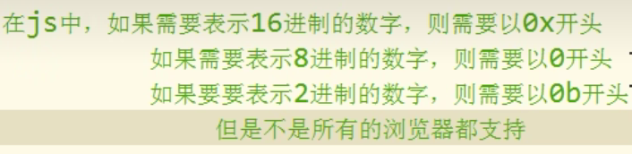

# JavaScript

### 导语

为什么学习JavaScript？

1. **HTML** 定义了网页的内容
2. **CSS** 描述了网页的布局
3. **JavaScript** 控制了网页的行为

JavaScript 是**脚本语言**

- JavaScript 是一种轻量级的编程语言。

- JavaScript 是可插入 HTML 页面的编程代码。

- JavaScript 插入 HTML 页面后，可由所有的现代浏览器执行。

JavaScript 作用：

- 直接写入HTML输出流
- 对事件的反应
- 改变HTML内容
- 改变HTML图像
- 改变HTML样式
- 验证输入

JS的实现主要由这三部分组成：ECMAScript、DOM、BOM

### JavaScript用法

1、HTML 中的脚本必须位于` <script> 与 </script>` 标签之间。脚本可被放置在 HTML 页面的 <body> 和 <head> 部分中。

2、`<script>`标签

如需在 HTML 页面中插入 JavaScript，请使用 `<script>` 标签。

`<script> 和 </script> 会告诉 JavaScript 在何处开始和结束。`

`<script> 和 </script> 之间的代码行包含了 JavaScript`

`<script type="text/javascript" src="url"></script>`一旦script标签引入外部文件，就不能再编写代码了。

3、JavaScript 函数和事件

通常，我们需要在某个事件发生时执行代码，比如当用户点击按钮时。

如果我们把 JavaScript 代码放入函数中，就可以在事件发生时调用该函数。

脚本可位于 HTML 的 <body> 或 <head> 部分中，或者同时存在于两个部分中。通常的做法是把函数放入 <head> 部分中，或者放在页面底部。这样就可以把它们安置到同一处位置，不会干扰页面的内容。

### JavaScript 输出

JavaScript 可以通过不同的方式来输出数据：

- 使用 **window.alert()** 弹出警告框。
- 使用 **document.write()** 方法将内容写到 HTML 文档中。
- 使用 **innerHTML** 写入到 HTML 元素。
- 使用 **console.log()** 写入到浏览器的控制台。

### JavaScript 基础语法概略

JavaScript 是一个程序语言。语法规则定义了语言结构。JavaScript 是一个脚本语言。它是一个轻量级，但功能强大的编程语言。

#### JavaScript 字面量

在编程语言中，一般固定值称为字面量，如 3.14。

数字字面量、字符串字面量、表达式字面量、数组、对象（object）、函数字面量。

#### JavaScript 变量

在编程语言中，变量用于存储数据值。

JavaScript 使用关键字 **var** 来定义变量， 使用等号来为变量赋值。

如果重新声明 JavaScript 变量，该变量的值不会丢失：var carname="Volvo";
var carname;

JS中的let变量:

```
let var1 [= value1] [, var2 [= value2]] [, ..., varN [= valueN]];
```

let允许你声明一个作用域被限制在块级中的变量、语句或者表达式。在Function中局部变量推荐使用let变量，避免变量名冲突。

let 声明的变量只在其声明的块或子块中可用，这一点，与var相似。二者之间最主要的区别在于var声明的变量的作用域是整个封闭函数。

#### JavaScript 操作符与标识符

JavaScript使用 **算术运算符** 来计算值: '= - + * / == != < >'

在JS中所有的可以由我们自主命名的都可以称为标识符，如变量名、函数名、属性名都属于标识符。

规则：

- 标识符可以含有字母、数字、_、$
- 不能以数字开始
- 不能是ES中的关键字和保留字
- 一般采用驼峰命名法

JS底层保存标识符时实际上采用的Unicode编码，理论上所有uincode编码的内容都能当标识符。

#### JavaScript 语句

在 HTML 中，JavaScript 语句用于向浏览器发出命令。

语句是用分号分隔：

x = 5 + 6;
y = x * 10;

#### JavaScript 关键字

JavaScript 关键字用于标识要执行的操作。

和其他任何编程语言一样，JavaScript 保留了一些关键字为自己所用。

#### JavaScript 注释

双斜杠 **//** 后的内容将会被浏览器忽略：// 我不会执行

多行注释以 **/\*** 开始，以 ***/** 结尾。

#### JavaScript 数据类型

**值类型(基本类型)**：字符串（String）、数字(Number)、布尔(Boolean)、空（Null）、未定义（Undefined）、Symbol。以上这五种类型属于基本数据类型，以后我们看到的值只要不是上边的5种，全都是对象。

**引用数据类型（对象类型）**：对象(Object)、数组(Array)、函数(Function)，还有两个特殊的对象：正则（RegExp）和日期（Date）。


```javascript
var length = 16;                  // Number 通过数字字面量赋值
var points = x * 10;               // Number 通过表达式字面量赋值
/* 数字的最大值
number.MAX_VALUE
infinty,数字 正无穷
NaN， 特殊的数字表示NOT A Number */

var lastName = "Johnson";             // String 通过字符串字面量赋值
var cars = ["Saab", "Volvo", "BMW"];       // Array 通过数组字面量赋值
var person = {firstName:"John", lastName:"Doe"}; // Object 通过对象字面量赋值
//对象初始化，new在开辟了堆内存，所以为引用。
var obj = new Object()
/*JS中的变量都是保存到栈内存中的，基本数据类型的值直接在栈内存中存储，值与值之间是独立存在，修改一个变量不会影响其他的变量
对象是保存到堆内存中的，每创建一个新的对象，就会在堆内存中开辟出一个新的空间，而变量保存的是对象的内存地址(对象的引用)，如果两个变量保存的是同一个对象引用当一个通过一个变量修改属性时，另一个也会受到影响 */
typeof cars //检查一个变量的类型
```



对象的分类:
1.内建对象，由ES标准中定义的对象，在任何的ES的实现中都可以使用比如: Math string Number Boolean Function Object

2.宿主对象，由JS的运行环境提供的对象，目前来讲主要指由浏览器提供的对象比如 BOM DOM

3.自定义对象，由开发人员自己创建的对象

##### JavaScript数组

下面的代码创建名为 cars 的数组，

var cars=new Array();
cars[0]="Saab";
cars[1]="Volvo";
cars[2]="BMW";

或var cars=new Array("Saab","Volvo","BMW");

使用字面量来创建数组，语法:[]

`let cars = [1,23,3];`

1、获取数组的长度
可以使用length属性来获取数组的长度(元素的个数)

语法: `数组.length`
*对于连续的数组，使用length可以获取到数组的长度(元素的个数)* 

对于非连续的数组，使用length会获取到数组的最大的索引+1
`console.log(cars.length);`

修改length

如果修改的length大于原长度，则多出部分会空出来
如果修改的length小于原长度，则多出的元素会被删除

向数组的最后一个位置添加元素

语法: 数组[数组.length] = 值;

2、push(）

该方法可以向数组的末尾添加一个或多个元素，并返回数组的新的长度

可以将要添加的元素作为方法的参数传递，这样这些元素将会自动添加到数组的末尾

该方法会将数组新的长度作为返回值返回。

`var result = arr.push("唐僧”，"蜘蛛精”,"白骨精”,"玉免精");`

3、 forEach()方法需要一个函数作为参数

- 像这种函数，由我们创建但是不由我们调用的，我们称为回调函数
- 数组中有几个元素函数就会执行几次，每次执行时，浏览器会将遍历到的元素，以实参的形式传递进来，我们可以来定义形参，来读取这些内容
- 浏览器会在回调函数中传递三个参数:
第一个参数，就是当前正在遍历的元素
第二个参数，就是当前正在遍历的元素的索引
第三个参数，就是正在遍历的数组

4、pop()

`result = arr.pop();`

该方法可以删除数组的最后一个元素，并将被删除的元素作为返回值返回。

5、unshift() 

`arr.unshift("牛魔王","二郎神");`

- 向数组开头添加一个或多个元素，并返回新的数组长度
- 向前边插入元素以后，其他的元素索引会依次调整

shift()

- 可以删除数组的第一个元素，并将被删除的元素作为返回值返回

6、slice()
- 可以用来从数组提取指定元素
- 该方法不会改变元素数组，而是将截取到的元素封装到一个新数组中返回
- 参数:
1、截取开始的位置的索引，包含开始索引
2、截取结束的位置的索引，不包含结束索引

`var result = arr.slice(1,2);`

splice()

- 可以用来删除数组中的指定元素

参数：

第一个，表示开始位置的索引

第二个，表示删除的数量

第三个及以后，可以传递一些新元素，这些元素将会自动插入到开始位置索引前边

7、concat()

可以连接两个或多个数组，并将新数组返回，不会对原数组产生影响

arr.concat(arr1,'沙和尚')

8、join()

可以将一个数组转换成一个字符串，也不会对原数组产生影响

在join（）中可以指定一个字符串作为参数，其将成为数组中元素的连接符

9、reverse()

反转数组，会直接修改原数组

10、sort()

对数组中的元素进行排序，也会影响原数组

默认按照Unicode编码排序

##### Undefined 和 Null

Undefined 这个值表示变量不含有值。

可以通过将变量的值设置为 null 来清空变量。

#### JavaScript 函数

JavaScript 语句可以写在函数内，函数可以重复引用：

**引用一个函数** = 调用函数(执行函数内的语句)。

```javascript
function myFunction(a, b) {
  return a * b;                // 返回 a 乘以 b 的结果
}
//使用函数表达式 来创建一个函数
var 函数名 = function(形参1,形参2...形参N){
	语句...
};
//如果return语句后不跟任何值就相当于返回一个undefined，如果函数中不写return，则也会返回undefined
```

调用函数时解析器不会检查实参的类型，调用函数时，解析器也不会检查实参的数量，多余实参不会被赋值。

实参可以是任意的数据类型，也可以是一个对象，函数。

当我们的参数过多时，可以将参数封装到一个对象中，然后通过对象传递。

return返回也可以是任何数据类型。

立即执行函数（回调函数）
函数定义完，立即被调用，这种函数叫做立即执行函数。往往只执行一次。

```javascript
(function(a,b) {
	return a+b;
})(1,2)
```

ES6 新增箭头函数，定义函数时更加简洁、易读。

```javascript
// 使用箭头函数定义函数时可以省略 function 关键字
const Test = (...params) => {
  //
}

// 该函数只有一个参数时可以简写成：
const Test = param => {
  return param;
}
```

解析器在调用函数每次都会向函数内部传递进一个隐含的参数这个隐含的参数就是this，this指向的是一个对象，这个对象我们称为函数执行的 上下文对象，根据函数的调用方式的不同，this会指向不同的对象。

1、以函数的形式调用时，this永远都是window

2、以方法的形式调用时，this就是调用方法的那个对象

3、当以构造函数的形式调用时，this就是新创建的那个对象

在调用函数时，浏览器每次都会传递进两个隐含的参数

1.函数的上下文对象 this

2.封装实参的对象 arguments

​	 arguments是一个类数组对象，它也可以通过索引来操作数据，也可以获取长度在调用函数时，我们所传递的实参都会在arguments	 中保存arguments.length可以用来获取实参的长度

​	 它里边有一个属性叫做callee,这个属性对应一个函数对象，就是当前正在指向的函数的对象

##### 函数的方法

1、call()和apply()

这两个方法都是函数对象的方法，需要通过函数对象来调用

当对函数调用call()和apply()都会调用函数执行

在调用call()和apply()可以将一个对象指定为第一个参数，此时这个对象将会成为函数执行时的this

call()方法可以将实参在对象之后依次传递

apply()方法需要将实参封装到一个数组中统一传递

#### 注意事项

JavaScript 对大小写是敏感的。JavaScript 使用 Unicode 字符集。Unicode 覆盖了所有的字符，包含标点等字符

**三种变量命名规则：**

var **firstName**='king';//小驼峰

var **FirstName**='queen';//大驼峰

var **first_name**='maizi';//下划线法

**对代码行进行折行**

您可以在文本字符串中使用反斜杠对代码行进行换行。下面的例子会正确地显示：实例:document.write("你好 \

 世界!");

每一条语句以分号结尾；

JS会忽略多个空格和换行；

`prompt()`可以弹出一个提示框，该提示框中会带有一个文本框，用户可以在文本框中输入一段内容，该函数需要一个字符串作为参数，该字符串将会作为提示框的提示文字
用户输入的内容将会作为函数的返回值返回，可以定义一个变量来接收该内容。prompt()函数的返回值是String类型的。

### JavaScript 对象

对象由花括号分隔。在括号内部，对象的属性以名称和值对的形式 (name : value) 来定义，属性由逗号分隔： `var person={firstname:"John", lastname:"Doe", id:5566};`

- 两种寻址方式

`name=person.lastname;`
`name=person["lastname"];`

如果要使用特殊的属性名，不能采用`.`的方式来操作.

使用`[]`这种形式去操作属性，更加的灵活，在`[]`中可以直接传递一个变量，这样变量值是多少就会读取那个属性。

- in 运算符

  通过该运算符可以检查一个对象中是否含有指定的属性如果有则返回true，没有则返回false，语法:`"属性名” in 对象`

- 对象的增删改查

在对象中保存的值称为属性向对象添加属性，语法:`对象.属性名 = 属性值`;

读取属性值，`result= person.lastname`

如果读取对象中没有的属性，不会报错而是会返回undefined.

修改对象的属性值语法:`对象.属性名 = 新值`
删除对象的属性语法: `delete 对象.属性名`

JavaScript 对象是拥有属性和方法的数据。

在 JavaScript中，几乎所有的事物都是对象。

键值对通常写法为 **name : value** (键与值以冒号分割)。键值对在 JavaScript 对象通常称为 **对象属性**。

对象方法，对象的方法定义了一个函数，并作为对象的属性存储。`name = person.fullName();`

```javascript
//创建对象方法
methodName : function() {
    // 代码 
};
objectName.methodName()
objectName.methodName //会返回函数的定义

//function(),调用函数相当于使用的函数的返回值
//function, 函数对象相当于直接使用函数对象
```

当比较两个基本数据类型的值时，就是比较值而比较两个引用数据类型时，它是比较的对象的内存地址.

如果两个对象是一摸一样的，值是地址不同，它也会返回false。

使用工厂方法创建对象


#### 构造函数

创建一个构造函数，专门用来创建Person对象

构造函数就是一个普通的函数，创建方式和普通函数没有区别，不同的是构造函数习惯上首字母大写。

构造函数和普通函数的区别就是调用方式的不同普通函数是直接调用，而构造函数需要使用new关键字来调用。

```javascript
function Person(name,age) {
	this.name = name
    this.age = age
    this.sayName = function() {
        alert(this.name)
    }
}
var per = new Person();
```

构造函数的执行流程：

1.立刻创建一个新的对象
2.将新建的对象设置为函数中this,在构造函数中可以使用this来引用新建的对象
3.逐行执行函数中的代码
4.将新建的对象作为返回值返回

使用同一个构造函数创建的对象，我们称为一类对象，也将一个构造函数称为一个类。

我们将通过一个构造函数创建的对象，称为是该类的实例。

使用`instanceof`可以检查一个对象是否是一个类的实例

语法: 对象 instanceof 构造函数
* 如果是，则返回true，否则返回false
头

`console.log(per instanceof Person);`

#### 原型 prototype

我们所创建的每一个函数，解析器都会向函数中添加一个属性`prototype`

- 这个属性对应着一个对象，这个对象就是我们所谓的原型对象

如果函数作为普通函数调用prototype没有任何作用

当函数以构造函数的形式调用时，它所创建的对象中都会有一个隐含的属性，指向该构造函数的原型对象，我们可以通过`__proto__` 来访问该属性。

原型对象就相当于一个公共的区域，所有同一个类的实例都可以访问到这个原型对象。我们可以将对象中共有的内

容，统一设置到原型对象中。

当我们访问对象的一个属性或方法时，它会先在对象自身中寻找，如果有则直接使用，如果没有则会去原型对象中

寻找，如果找到则直接使用。

以后我们创建构造函数时，可以将这些对象共有的属性和方法，统一添加到构造函数的原型对象中，这样不用分别为每一个对象添加，也不会影响到全局作用域，就可以使每个对象都具有这些属性和方法了。

```javascript
function MyClass(){

}
//向MyClass的原型中添加属性
MyClass.prototype.a = 123;
let mc = new MyClass();
```

##### 原型链

使用in检查对象中是否含有某个属性时，如果对象中没有但是原型中有，也会返回true。

`console.log("name" in mc);`
可以使用对象的`hasOwnProperty()`来检查对象自身中是否含有该属性，使用该方法只有当对象自身中含有属性时，才会返回true。
`console.og(mc.hasOwnProperty("age"));`
`console.log(mc.hasOwnProperty("hasOwnProperty")):`
原型对象也是对象，所以它也有原型
当我们使用一个对象的属性或方法时，会现在自身中寻找
自身中如果有，则直接使用，如果没有则去原型对象中寻找，如果原型对象中有，则使用，如果没有则去原型的原型中寻找，直到找到Object对象的原型，由此形成了原型链。Object对象的原型没有原型，如果在Object中依然没有找到，则返回undefined。

```javascript
console.log(mc.__proto__.hasOwnProperty("hasOwnProperty")):
console.log(mc.__proto__._proto__ .hasOwnProperty("hasOwnProperty")
console.log(mc.__proto__.__proto__.__proto__)
```

#### Date对象

创建一个Date对象

如果直接使用构造函数创建一个Date对象，则会封装为当前代码执行的时间

var d = new Date() ;
创建一个指定的时间对象
需要在构造函数中传递一个表示时间的字符串作为参数

日期的格式  月份/日/年  时:分:秒

var d2 = new Date("12/18/2011 11:10:30");

对象方法：getTime() 获取当前日期对象的时间戳。时间戳，指的是从格林威治标准时间的1970年1月1日，0时0分0秒到当前日期所花费的毫秒数.

#### Math对象

Math和其他的对象不同，它不是一个构造函数，它属于一个工具类不用创建对象，它里边封装了数学运算相关的属性和方法。

Math.ceil()， 可以对一个数进行向上取整，小数位只有有值就自动进1

Math .floor()， 可以对一个数进行向下取整，小数部分会被舍掉

Math.round()，可以对一个数进行四舍五入取整

生成一个0-x之间的随机数，Math.round(Math .random()*x)

生成一个x-y之间的随机数，Math .round(Math .random()*(y-x)+x)

Math.pow(x,y)，返回x的y次幂

#### 包装类

在JS中为我们提供了三个包装类，通过这三个包装类可以将基本数据类型的数据转换为对象String()
- 可以将基本数据类型字符串转换为String对象Number()

- 可以将基本数据类型的数字转换为Number对象Boolean()

- 可以将基本数据类型的布尔值转换为Boolean对象

  但是注意:我们在实际应用中不会使用基本数据类型的对象，如果使用基本数据类型的对象，在做一些比较时可能会带来一些不可预期的结果

方法和属性之能添加给对象，不能添加给基本数据类型。

当我们对一些基本数据类型的值去调用属性和方法时浏览器会临时使用包装类将其转换为对象，然后在调用对象的属性和方法调用完以后，在将其转换为基本数据类型。

### 宿主对象DOM

DOM，全称Document Object Model文档对象模型。JS中通过DOM来对HTML文档进行操作。只要理解了DOM就可以随心所欲的操作WEB页面。
文档

- 文档表示的就是整个的HTML网页文档

对象

- 对象表示将网页中的每一个部分都转换为了一个对象

模型

- 使用模型来表示对象之间的关系，这样方便我们获取对象

浏览器已经为我们提供 文档节点 对象这个对象是window属性。可以在页面中直接使用，文档节点代表的是整个网页。即：document

#### 节点

节点:Node一构成HTML文档最基本的单元。


常用四个节点：

文档节点:整个HTML文档

元素节点:HTML文档中的HTML标签

属性节点:元素的属性

文本节点:HTML标签中的文本内容

##### 获取元素节点

通过document对象调用
1.getElementById()

- 通过id属性获取一个元素节点对象

2.getElementsByTagName()

- 通过标签名获取一组元素节点对象

这个方法会给我们返回一个类数组对象，所有查询到的元素都会封装到对象中

3.getElementsByName()

- 通过name属性获取一组元素节点对象

这个方法也会给我们返回一个类数组对象，如果需要读取元素节点属性直接使用 元素.属性名

##### 获取元素节点的子节点

通过具体的元素节点调用

1.getElementsByTagName()

- 方法，返回当前节点的指定标签名后代节点

2.childNodes

- 属性，表示当前节点的所有子节点

  childNodes属性会获取包括文本节点在内的所有节点，根据DOM标签间空白也会当成文本节点

  children属性可以获取当前元素的所有子元素

3.firstChild

- 属性，表示当前节点的第一个子节点

  firstChild可以获取到当前元素的第一个子节点 (包括空白文本节点)

  firstElementChild获取当前元素的第一个子元素

4.lastChild

- 属性，表示当前节点的最后一个子节点

##### 获取父节点和兄弟节点

通过具体的节点调用

1.parentNode

- 属性，表示当前节点的父节点

2.previousSibling

- 属性，表示当前节点的前一个兄弟节点

  也可能获取到空白的文本，previousElementsibling获取前一个兄弟元素，IE8及以下不支持。

3.nextSibling

- 属性，表示当前节点的后一个兄弟节点

####  事件

HTML 事件是发生在 HTML 元素上的事情。HTML 事件可以是浏览器行为，也可以是用户行为。

以下是 HTML 事件的实例：

- HTML 页面完成加载
- HTML input 字段改变时
- HTML 按钮被点击

在事件触发时 JavaScript 可以执行一些代码。

HTML 元素中可以添加事件属性，使用 JavaScript 代码来添加 HTML 元素。

可以为按钮的对应事件绑定处理函数的形式来响应事件,这样当事件被触发时，其对应的函数将会被调用

`btn.onclick = function(){ alert("hello") };`

| 事件        | 描述                                 |
| :---------- | :----------------------------------- |
| onchange    | HTML 元素改变                        |
| onclick     | 用户点击 HTML 元素                   |
| onmouseover | 鼠标指针移动到指定的元素上时发生     |
| onmouseout  | 用户从一个 HTML 元素上移开鼠标时发生 |
| onkeydown   | 用户按下键盘按键                     |
| onload      | 浏览器已完成页面的加载               |

浏览器在加载一个页面时，是按照自上向下的顺序加载的，读取到一行就运行一行，如果将script标签写到页面的上边，在代码执行时，页面还没有加载，页面没有加载DOM对象也没有加载，会导致无法获取到DOM对象。

onload事件会在整个页面加载完成之后才触发，为window绑定一个onload事件，该事件对应的响应函数将会在页面加载完成之后执行，这样可以确保我们的代码执行时所有的DOM对象已经加载完毕了。

```javascript
window.onload = function(){
    //获取id为btn的按钮
    var btn = document .getElementById("btn");
    //为按钮绑定一个单击响应函数
    btn.onclick = function(){
        alert("hello");
    };
//innerHTML用于获取元素内部的HTML代码的,对于自结束标签，这个属性没有意义
//innerTextm,该属性可以获取到元素内部的文本内容,它和innerHTML类似，不同的是它会自动将htm1标签去除
```

点击超链接以后，超链接会跳转页面，这个是超链接的默认行为，但是此时我们不希望出现默认行为，可以通过在响应函数的最后return 

false来取消默认行为。

confirm()用于弹出一个带有确认和取消按钮的提示框需要一个字符串作为参数，该字符串将会作为提示文字显示出来。

如果用户点击确认则会返回true，如果点击取消则返回false。

```javascript
for(var i= ; i <allA.length; i++) {
	allA[i].onclick = function(){
		alert("响应函数正在执行"+i);
		//alert(allA[i]);
		return false;
	}
}
//for循环会在页面加载完成之后立即执行，而响应函数会在超链接被点击时才执行当响应函数执行时，for循环早已执行完毕
```

##### 相关事件

1、onscroll，该事件会在元素的滚动条滚动时触发

2、onmousemove，该事件将会在鼠标在元素中移动时被触发

3、onmousewheel,鼠标滚轮滚动的事件，会在滚轮滚动时触发，但是火狐不支持该属性，火狐里用DOMMouseScroll来绑定滚动事件。

4、取消浏览事件默认行为，一般在回调函数里`return false` ，用addEventListener()时，需要用事件对象event.preventDefault()取消。

5、键盘事件:
onkeydown，按键被按下

onkeyup，按键被松开

键盘事件一般都会绑定给一些可以获取到焦点的对象或者是document

可以通过event.keyCode来获取按键的编码通过它可以判断哪个按键被按下

除了keyCode，事件对象中还提供了几个属性altKey、ctrIKey、shiftKey
这个三个用来判断alt ctrl 和 shift是否被按下如果按下则返回true，否则返回false

在文本框中输入内容，属于onkeydown的默认行为，如果在onkeydown中取消了默认行为，则输入的内容，不会出现在文本框中。可用来不让用户输入数字等。

##### 事件对象

当事件的响应函数被触发时，浏览器每次都会将一个事件对象作为实参传递进响应函数在事件对象中封装了当前事件相关的一切信息，比如:鼠标的坐标 键盘哪个按键被按下、鼠标滚轮滚动的方向。

例：

```javascript
var areaDiv = document .getElementById("areaDiv");
var showsMsg = document.getElementById("showMsg");
areaDiv.onmousemove = function(event){
	//clientX可以获取鼠标指针的水平坐标,cilentY可以获取鼠标指针的垂直坐标术
	var x = event .clientX;
    var y = event.clientY;
	//alert("x ="+X +y ="+y);
	//在showMsg中显示鼠标的坐标
    showMsg.innerHTML = "x = "+x + "，y ="+y;
}
//pageX和pageY可以获取鼠标相对于当前页面的坐标
//chrome认为浏览器的滚动条是body的，可以通过body.scrol1Top来获取，火狐等浏览器认为浏览器的滚动条是htm1的
var st = document.body.scrollTop || document.documentElement.scrollTop;
```

##### 事件的冒泡

所谓的冒泡指的就是事件的向上传导，当后代元素上的事件被触发时，其祖先元素的相同事件也会被触发。

在开发中大部分情况冒泡都是有用的，如果不希望发生事件冒泡可以通过事件对象来取消冒泡。

取消冒泡，可以将事件对象的cancelBubble设置为true，即可取消冒泡。`event.cancelBubble = true;`

##### 事件的委派

指将事件统一绑定给元素的共同的祖先元素，这样当后代元素上的事件触发时，会一直冒泡到祖先元素从而通过祖先元素的响应函数来处理事件。

事件委派是利用了冒泡，通过委派可以减少事件绑定的次数，提高程序的性能。

target，event中的target表示的触发事件的对象

```javascript
//如果触发事件的对象是我们期望的元素，则执行否则不执行
if(event.target.className == "link"){
    alert("我是u1的单击响应函数");
}
```

##### 事件的绑定

使用 `对象.事件 = 函数` 的形式绑定响应函数，它只能同时为一个元素的一个事件绑定一个响应函数，不能绑定多个，如果绑定了多个，则后边会覆盖掉前边的。

addEventListener()
通过这个方法也可以为元素绑定响应函数
参数:
1、事件的字符串，不要on
2、回调函数，当事件触发时该函数会被调用
3、是否在捕获阶段触发事件，需要一个布尔值，一般都传false
使用addEventListener()可以同时为一个元素的相同事件同时绑定多个响应函数这样当事件被触发时，响应函数将会按照函数的绑定顺序执行，不支持IE8以下浏览器,IE8以下用attachEvent(事件需要on，回调函数)。

`btn01.addEventListener("click",function(){(alert(2);},false);`

##### 事件的传播

关于事件的传播网景公司和微软公司有不同的理解
微软公司认为事件应该是由内向外传播，也就是当事件触发时，应该先触发当前元素上的事件，然后再向当前元素的祖先元素上传播，也就说事件应该在冒泡阶段执行。

网景公司认为事件应该是由外向内传播的，也就是当前事件触发时，应该先触发当前元素的最外层的祖先元素的事件，然后在向内传播给后代元素。

W3C综合了两个公司的方案，将事件传播分成了三个阶段
1.捕获阶段

- 在捕获阶段时从最外层的祖先元素，向目标元素进行事件的捕获，但是默认此时不会触发事件

2.目标阶段

- 事件捕获到目标元素，捕获结束开始在目标元素上触发事件

3.冒泡阶段

- 事件从目标元素向他的祖先元素传递，依次触发祖先元素上的事件

如果希望在捕获阶段就触发事件，可以将addEventListener()的第三个参数设置为true，一般情况下我们不会希望在捕获阶段触发事件，所以这个参数一般都是false。

```javascript
/* 拖拽实例
拖拽box1元素
拖拽的流程,1.当鼠标在被拖拽元素上按下时，开始拖拽 onmousedown
2.当鼠标移动时被拖拽元素跟随鼠标移动 onmousemove
3.当鼠标松开时，被拖拽元素固定在当前位置 onmouseup
*/
//获取box1
var box1 = document.getElementById("box1");
//为box1绑定一个鼠标按下事件
//当鼠标在被拖拽元素上按下时，开始拖拽onmousedown
box1.onmousedown = function(){
	event = event window .event ;
    //div的偏移量 鼠标.clentX - 元素.offsetLeft
    //div的偏移量 鼠标.clentY - 元素offsetTop
    var ol = event.clientX - box1.offsetLeft:
    var ot = event.clientY - box1.offsetTop;
    
    //为document绑定一个onmousemove事件
	document .onmousemove = function(event){
		event = eventwindow.event;当鼠标移动时被拖拽元素跟随鼠标移动 onmousemove
		//获取鼠标的坐标
		var left = event .clientX - ol;
        var top = event.clientY - ot;
		//修改box1的位置
        box1.style.left = left+"px";
        box1.style.top = top+"px";
    }
	//为元素绑定一个鼠标松开事件
    document.onmouseup = function(){
        //当鼠标松开时，被拖拽元素固定在当前位置 onmouseup
        //取消document的onmousemove事件
        document .onmousemove = null;
        //取消document的onmouseup事件
        document.onmouseup = null;
    }
    //return false;
}
```

当我们拖拽一个网页中的内容时，浏览器会默认去搜索引擎中搜索内容此时会导致拖拽功能的异常，这个是浏览器提供的默认行为，如果不希望发生这个行为，则可以通过return false来取消默认行为，对IE8不起作用。

IE8里只有用SetCapture(),releaseCapture()

当调用一个元素的setCapture()方法以后，这个元素将会把下一次所有的鼠标按下相关的事件捕获到自身上

#### 其他查询

1、在document中有一个属性body，它保存的是body的引用。`document.body`

`2、document.documentElement`保存的是html根标签

`3、document.all`代表页面中所有的元素

4、根据元素的class属性值查询一组元素节点对象
`var box1 = document.getElementsByClassName("box1");`IE8以下不支持

5、document .querySelector() 需要一个选择器的字符串作为参数，可以根据一个CSS选择器来查询一个元素节点对象

`var div = document .querySelector(".box1 div");`

使用该方法总会返回唯一的一个元素，如果满足条件的元素有多个，那么它只会返回第一个。

`document .querySelectorA11()`,该方法和querySelector()用法类似，不同的是它会将符合条件的元素封装到一个数组中返回

`var box1 = document .querySelectorAll(".box1")`

#### 增删改

1、`document .createElement`(可以用于创建一个元素节点对象，它需要一个标签名作为参数，将会根据该标签名创建元素节点对象并将创建好的对象作为返回值返回

2、`document .createTextNode()`可以用来创建一个文本节点对象需要一个文本内容作为参数，将会根据该内容创建文本节点，并将新的节点返回

3、`appendChild()`

- 向一个父节点中添加一个新的子节点用法:` 父节点.appendChild(子节点);`

4、insertBefore()

- 可以在指定的子节点前插入新的子节点- 语法:
`父节点.insertBefore(新节点，旧节点);`

5、replaceChild()

- 可以使用指定的子节点替换已有的子节点语法: `父节点.replaceChild(新节点,旧节点);`

6、removeChild()

- 可以删除一个子节点语法: `父节点.removeChild(子节点);`
- 也可以用`子节点.parentNode.removeChild(子节点)`

7、使用innerHTML也可以完成DOM的增删改的相关操作，一般我们会两种方式结合使用

#### 修改样式

1、通过JS修改元素的样式:语法: `元素.style.样式名 = 样式值`

注意:如果CSS的样式名中含有-这种名称在JS中是不合法的比如background-color需要将这种样式名修改为驼峰命名法，去掉-，然后将-后的字母大写

我们通过style属性设置的样式都是内联样式，而内联样式有较高的优先级，所以通过JS修改的样式往往会立即显示.

但是如果在样式中写了 !important，则此时样式会有最高的优先级即使通过JS也不能覆盖该样式，此时将会导致JS修改样式失效。

2、获取元素的当前显示的样式

语法: 元素.currentstyle.样式名，它可以用来读取当前元素正在显示的样式。如果当前元素没有设置该样式，则获取它的默认值

currentstyle只有IE浏览器支持，其他的浏览器都不支持.

在其他浏览器中可以使用getComputedstyle()这个方法来获取元素当前的样式，这个方法是window的方法，可以直接使用。

其需要两个参数，第一个:要获取样式的元素，第二个:可以传递一个伪元素，一般都传null。该方法会返回一个对象，对象中封装了当前元素对应的样式，可以通过`对象.样式名`来读取样式，如果获取的样式没有设置，则会获取到真实的值，而不是默认值，比如: 没有设置width，它不会获取到auto，而是一个长度。

例：`alert(getComputedStyle(box1,null).backgroundColor);`只能IE8以上浏览器使用。

3、通用获取样式

定义一个函数，用来获取指定元素的当前的样式

参数:obj要获取样式的元素，name 要获取的样式名

```javascript
function getstyle(obj , name){
	if(window.getComputedstyle()) {
     	//正常浏览器的方式
   		return getComputedstyle(obj,nul1)[name];
    } else {
        //IE8的方式
   		return obj.currentstyle[name];
    }
}
```

通过currentstyle和getComputedstyle()读取到的样式都是只读的,不能修改，如果要修改必须通过style属性。

#### 其他样式操作属性

1、clientwidth、clientHeight
这两个属性可以获取元素的可见宽度和高度

这些属性都是不带px的，返回都是一个数字，可以直接进行计算

会获取元素宽度和高度，包括内容区和内边距

这些属性都是只读的，不能修改

2、offsetwidth、offsetHeight
获取元素的整个的宽度和高度，包括内容区、内边距和边框

3、offsetParent

- 可以用来获取当前元素的定位父元素会获取到离当前元素最近的开启了定位的祖先元素
- 如果所有的祖先元素都没有开启定位，则返回body

4、offsetLeft

- 当前元素相对于其定位父元素的水平偏移量

offsetTop

- 当前元素相对于其定位父元素的垂直偏移量

5、scrollwidth、scrollHeight

可以获取元素整个滚动区域的高度

6、scrollLeft

可以获取水平滚动条滚动的距离

scrollTop

可以获取垂直滚动条滚动的距离

### 浏览器对象模型BOM

BOM可以使我们通过JS来操作浏览器，在BOM中为我们提供了一组对象，用来完成对浏览器的操作
BOM对象

Window，代表的是整个浏览器的窗口，同时window也是网页中的全局对象

Navigator，代表的当前浏览器的信息，通过该对象可以来识别不同的浏览器

Location，代表当前浏览器的地址栏信息，通过Location可以获取地址栏信息，或者操作浏览器跳转页面

History，代表浏览器的历史记录，可以通过该对象来操作浏览器的历史记录由于隐私原因，该对象不能获取到具体的历史记录，只能操作浏览器向前或向后翻页而且该操作只在当次访问时有效

Screen，代表用户的屏幕的信息，通过该对象可以获取到用户的显示器的相关的信息

这些BOM对象在浏览器中都是作为window对象的属性保存的，可以通过window对象来使用，也可以直接使用。

#### Navigator

由于历史原因，Navigator对象中的大部分属性都已经不能帮助我们识别浏览器了

一般我们只会使用userAgent来判断浏览器的信息，userAgent是一个字符串，这个字符串中包含有用来描述浏览器信息的内容不同的浏览器会有不同的userAgent

```javascript
var ua = navigator.userAgent;
console.log(ua);
if(/firefox/i.test(ua)){
    alert("你是火狐!!!);
}else if(/chrome/i.test(ua)){
    alert("你是Chrome");
}else if(/msie/i.test(ua)){
    alert("你是IE浏览器~~~");
}else if(" ActiveXObject" in window){
    alert("你是IE11")
}
//IE11以上就不能用userAgent了
```

如果通过UserAgent不能判断，还可以通过一些浏览器中特有的对象，来判断浏览器的信息比如: ActiveXObject。

#### History

对象可以用来操作浏览器向前或向后翻页

length，属性，可以获取到当成访问的链接数量，如history.length

back()，方法，可以用来回退到上一个页面，作用和浏览器的回退按钮一样

forward()，方法，可以跳转下一个页面，作用和浏览器的前进按钮一样

go()，方法，可以用来跳转到指定的页面，它需要一个整数作为参数
1:表示向前跳转一个页面 相当于forward()
2:表示向前跳转两个页面

1:表示向后跳转一个页面

2:表示向后跳转两个页面

#### Location

该对象中封装了浏览器的地址栏的信息

如果直接打印location，则可以获取到地址栏的信息(当前页面的完整路径)

如果直接将location属性修改为一个完整的路径，或相对路径则我们页面会自动跳转到该路径，并且会生成相应的历史记录 

assign()，方法，用来跳转到其他的页面，作用和直接修改location一样

reload()，方法，用于重新加载当前页面，作用和刷新按钮一样，如果在方法中传递一个true，作为参数，则会强制清空缓存刷新页面。

replace()，方法，可以使用一个新的页面替换当前页面，调用完毕也会跳转页面，不会生成历史记录，不能使用回退按钮回退。

#### window

1、setInterval()，方法，定时调用
可以将一个函数，每隔一段时间执行一次参数:
	1.回调函数，该函数会每隔一段时间被调用一次

​	2.每次调用间隔的时间，单位是毫秒

返回值: 返回一个Number类型的数据这个数字用来作为定时器的唯一标识。

clearInterval()，可以用来关闭一个定时器方法中需要一个定时器的标识作为参数，这样将关闭标识对应的定时器

目前，我们每点击一次按钮，就会开启一个定时器，点击多次就会开启多个定时器，这就导致图片的切换速度过快并且我们只能关闭最后一次开启的定时器

在开启定时器之前，需要将当前元素上的其他定时器关闭`clearInterval(timer);`

```javascript
//通过定时器解决移动卡顿问题
window.onload = function(){
	//创建一个变量表示方向
	var dir = 0;
	//定义一个变量，来表示移动的速度
	var speed = 10;
	
	//开启一个定时器，来控制div的移动
	setInterval( function(){
		switch(dir){
            case 37: 
                box1.style.left = box1.offsetLeft - speed + "px";
                break;
            case 39:
                box1.style.left = box1.offsetLeft + speed+"px";
                break;
            case 38:
                box1.style.left = box1.offsetTop - speed + "px";
                break;
            case 40:
                box1.style.left = box1.offsetTop + speed + "px";
                break;
        }
	},30);

	//为document绑定一个按键按下的事件,来控制方向
	document.onkeydown = function(event){
		event = event|| window.event;
		//当用户按了ctr1以后，速度加快
		if(event.ctrlKey){
			speed = 500;
		} else {
			speed = 10;
		}
		dir = event.keycode;
	};
	document.onkeyup = fuction() {
		dir = 0;
	};
}
//定时器可用来执行动画效果
```

2、延时调用，
延时调用一个函数不马上执行，而是隔一段时间以后在执行，而且只会执行一次。

`setTimeout(function(){console.log(num++);},3000);`

延时调用和定时调用实际上是可以互相代替的，在开发中可以根据自己需要去选择。

3、通过style属性来修改元素的样式，每修改一个样式，浏览器就需要重新渲染一次页面这样的执行的性能是比较差的，而且这种形式当我们要修改多个样式时，也不太方便。

我们可以通过修改元素的class属性来间接的修改样式，`box.classname = 'b2'`

这样一来，我们只需要修改一次，即可同时修改多个样式，浏览器只需要重新渲染页面一次，性能比较好，并且这种方式，可以使表现和

行为进一步的分离。

### JavaScript 作用域

变量在函数内声明，变量为局部变量，具有局部作用域。

局部变量：只能在函数内部访问。

变量在函数外定义，即为全局变量。

全局变量有 **全局作用域**: 网页中所有脚本和函数均可使用。 

如果变量在函数内没有声明（没有使用 var 关键字），该变量为全局变量。

JavaScript 变量生命周期在它声明时初始化。局部变量在函数执行完毕后销毁。全局变量在页面关闭后销毁。

在 HTML 中, 全局变量是 window 对象，所以window 对象可以调用函数内的局部变量。

没有声明就使用的变量，默认为全局变量，不论这个变量在哪被使用。

在 ES6 中，提供了 **let** 关键字和 **const** 关键字。

let 的声明方式与 var 相同，用 let 来代替 var 来声明变量，就可以把变量限制在当前代码块中。

使用 const 声明的是常量，其值一旦被设定便不可被更改。

如果您把值赋给尚未声明的变量，该变量将被自动作为 window 的一个属性。

这条语句：carname="Volvo"; 将声明 window 的一个属性 carname。

非严格模式下给未声明变量赋值创建的全局变量，是全局对象的可配置属性，可以删除。

```javascript
var var1 = 1; // 不可配置全局属性
var2 = 2; // 没有使用 var 声明，可配置全局属性

console.log(this.var1); // 1
console.log(window.var1); // 1
console.log(window.var2); // 2

delete var1; // false 无法删除
console.log(var1); //1

delete var2; 
console.log(delete var2); // true
console.log(var2); // 已经删除 报错变量未定义
```

函数内使用 var 声明的变量只能在函数内访问，如果不使用 var 则是全局变量。

使用 var 关键字声明的变量不具备块级作用域的特性，它在 {} 外依然能被访问到。

let 声明的变量只在 let 命令所在的代码块 **{}** 内有效，在 **{}** 之外不能访问。

使用 **var** 关键字声明的全局作用域变量属于 window 对象.

使用 **let** 关键字声明的全局作用域变量不属于 window 对象.

`const`定义常量与使用`let` 定义的变量相似：

- 二者都是块级作用域
- 都不能和它所在作用域内的其他变量或函数拥有相同的名称

两者还有以下两点区别：

- `const`声明的常量必须初始化，而`let`声明的变量不用
- const 定义常量的值不能通过再赋值修改，也不能再次声明。而 let 定义的变量值可以修改

const 的本质: const 定义的变量并非常量，并非不可变，它定义了一个常量引用一个值。使用 const 定义的对象或者数组，其实是可变的，可以使用Object.freeze()方法来 **冻结变量**。

#### 代码块

我们的程序是由一条一条语句构成的，语句是按照自上向下的顺序一条一条执行的，在JS中可以使用`{}`来为语句进行分组，同一个`{}`中的语句我们称为是一组语句它们要么都执行，要么都不执行，一个`{}`中的语句我们也称为叫一个代码块。在代码块的后边就不用再编写;了

JS中的代码块，只具有分组的的作用，没有其他的用途代码块内容的内容，在外部是完全可见的。

### JavaScript 字符串

在底层字符串是以字符数组的形式保存的，可以使用内置属性 **length** 来计算字符串的长度

 反斜杠是一个**转义字符**。 转义字符将特殊字符转换为字符串字符

转义字符 (\) 可以用于转义撇号，换行，引号，等其他特殊字符。

下表中列举了在字符串中可以使用转义字符转义的特殊字符：

| 代码 | 输出        |
| :--- | :---------- |
| \'   | 单引号      |
| \"   | 双引号      |
| \\   | 反斜杠      |
| \n   | 换行        |
| \r   | 回车        |
| \t   | tab(制表符) |
| \b   | 退格符      |
| \f   | 换页符      |

字符串方法

| 方法                | 描述                                                         |
| :------------------ | :----------------------------------------------------------- |
| charAt()            | 返回指定索引位置的字符                                       |
| charCodeAt()        | 返回指定索引位置字符的 Unicode 编码值                        |
| concat()            | 连接两个或多个字符串，返回连接后的字符串，作用和+一样        |
| fromCharCode()      | 将 Unicode 转换为字符串，String.formCharCode()               |
| indexOf()           | 返回字符串中检索指定字符第一次出现的位置，如果没有找到指定的内容，则返回 - 1 |
| lastIndexOf()       | 返回字符串中检索指定字符最后一次出现的位置                   |
| localeCompare()     | 用本地特定的顺序来比较两个字符串                             |
| match()             | 找到一个或多个正则表达式的匹配                               |
| replace()           | 替换与正则表达式匹配的子串                                   |
| search()            | 检索与正则表达式相匹配的值                                   |
| slice()             | 提取字符串的片断，并在新的字符串中返回被提取的部分。参数: 第一个，开始位置的索引(包括开始位置) 第二个，结束位置的索引（不包括结束位置） |
| split()             | 把字符串分割为子字符串数组，需要一个字符串作为参数，将会根据该字符串去拆分数组。 |
| substr()            | 从起始索引号提取字符串中指定数目的字符，参数<br/>1.截取开始位置的索引 2.截取的长度 |
| substring()         | 提取字符串中两个指定的索引号之间的字符                       |
| toLocaleLowerCase() | 根据主机的语言环境把字符串转换为小写，只有几种语言（如土耳其语）具有地方特有的大小写映射 |
| toLocaleUpperCase() | 根据主机的语言环境把字符串转换为大写，只有几种语言（如土耳其语）具有地方特有的大小写映射 |
| toLowerCase()       | 把字符串转换为小写                                           |
| toString()          | 返回字符串对象值                                             |
| toUpperCase()       | 把字符串转换为大写                                           |
| trim()              | 移除字符串首尾空白                                           |
| valueOf()           | 返回某个字符串对象的原始值                                   |

### JavaScript 运算符

1、字符串一个很能强大的数据类型；在执行加 **+** 时,将被加的对象统一处理为字符串。

我们可以利用这一特点，来将一个任意的数据类型转换为String即可将其转换为String我们只需要为任意的数据类型 + 一个“ “，这是一种隐式的类型转换，由浏览器自动完成，实际上它也是调用String函数。

2、bool 类型在与数字类型进行相加时，视为 0 或者 1 处理。

3、null 类型与数字类型进行累加时，视为 0 处理。

4、bool 类型与 null 类型进行累加时，视为其与整数类型累加处理。

5、undefined 除了与字符串进行累加时有效（undefined 视为字符串"undefined"处理），其他情况皆返回 NaN。

6、求模 **%** 运算，运算结果只取决于第一个数字的正负。

```
-12 % -8 = -4; 
12 % -8 =  4;
-12 % 8 = -4;
```

7、算数运算符`+ - * / %`

当对非Number类型的值进行运算时，会将这些值转换为Number然后再进行运算（字符串加法除外）。

- 任何值和NaN做运算都得NaN
- 任何值做`-  * /`运算时都会自动转换为Number，我们可以利用这一特点做隐式的类型转换可以通过为一个值` -0  *1  /1`来将其转换为Number。

8、一元运算符，只需要一个操作数

+ 正号 `+` ：正号不会对数字产生任何影响
+ 负号` -` ，负号可以对数字进行负号的取反
+ 对于非Number类型的值，它会将先转换为Number，然后在运算。

可以对一个其他的数据类型使用`+`，来将其转换为number，它的原理和Number()函数一样。

9、自增，自增使用 ++

自增可以使变量在原值的基础上自增1
   - 自增可以使用 前++（++a）后++(a++)
   - 无论是++a 还是 a++都会立即使原变量自增1，不同的是++a和a++的值是不同的
     - ++a的值是变量的新值（自增后的值）
     - a++的值是变量的原值（自增前的值）

自减类似

10、关系运算符`> < = >= <=`，数值就按普通运算得出值即可。

非数值情况，对于非数值进行比较时，会将其转换为数字然后在比较。如果符号两侧的值都是字符串时，不会将其转换为数字进行比较而会分别比较字符串中字符的Unicode编码。

比较两个字符串时，比较的是字符串的字符编码。比较字符编码时是一位一位进行比较。如果两位一样，则比较下一位，所以借用它来对英文进行排序。

如果比较的两个字符串型的数字，可能会得到不可预期的结果。注意: 在比较两个字符串型的数字时，一定一定一定要转型。

11、条件运算符：*variablename*=(*condition*)?*value1*:*value2* 

也叫三元运算符，语法:条件表达式?语句1:语句2

执行的流程:条件运算符在执行时，首先对条件表达式进行求值如果该值为true，则执行语句1，并返回执行结果如果该值为false，则执行语句2，并返回执行结果。

如果条件表达式不运算求值，则会将其转换为布尔值然后再运算。、

12、逗号运算符`,`
使用`，`可以分割多个语句，一般可以在声明多个变量时使用。
使用`，`运算符同时声明多个变量

13、运算符优先级

在JS中有一个运算符优先级的表，在表中越靠上优先级越高，优先级越高越优先计算，如果优先级一样，则从左往右计算。

但是这个表我们并不需要记忆，如果遇到优先级不清楚可以使用()来改变优先级。

#### JavaScript 比较和逻辑运算符

**比较运算符**


相等运算符，相等运算符用来比较两个值是否相等，如果相等会返回true，否则返回false。
使用 `== `来做相等运算，当使用`==`来比较两个值时，如果值的类型不同则会自动进行类型转换，将其转换为相同的类型，然后在比较。

undefined 衍生自 nul1所以这两个值做相等判断时，会返回true。NaN不和任何值相等，包括他本身。

不相等`!=`，不相等用来判断两个值是否不相等，如果不相等返回true，否则返回false-，使用` != `来做不相等运算
不相等也会对变量进行自动的类型转换，如果转换后相等它也会返回false。

全等`===`，用来判断两个值是否全等，它和相等类似，不同的是它不会做自动的类型转换I如果两个值的类型不同，直接返回false。
不全等`!==`，用来判断两个值是否不全等，和不等类似，不同的是它不会做自动的类型转换如果两个值的类型不同，直接返回true。

<strong>逻辑运算符</strong>

| 运算符 | 描述 |
| :----- | :--- |
| &&     | and  |
| \|\|   | or   |
| !      | not  |

其他数据类型转换为布尔类型的规则: **null、undefined、0、NaN、空字符串**转换为**false**，其他转化为 **true**。

如果对非布尔值进行非运算，则会将其转换为布尔值，然后再取反所以我们可以利用该特点，来将一个其他的数据类型转换为布尔值可以为一个任意数据类型取两次反，来将其转换为布尔值，原理和Boolean()函数一样。

1、逻辑与 &&

布尔值则是普通的 与运算。

对于非布尔值进行 与运算，返回的不是单纯的 true 还是 false，而是具体的值；

若是第一个值转换布尔值为 true，就返回第二个值；反之，返回第一个值。

换句话说：哪个值是错的就返回哪个值，如果都是对的，返回最后一个值。 如果两个值中有false，则返回靠前的。

总结：如果第一个值为true，则必然返回第二个值。如果第一个值为false，则直接返回第一个值。

2、逻辑或 ||

同 && 类似，对非布尔值的或运算，返回的不是单纯的 true 和 false，而是具体的值。

这个是从头开始，遇到能转换成 true 的值，就返回那个值，如果没有 true 的就返回最后一个值。

总结：如果第一个值为true，则直接返回第一个值。如果第一个值为false，则返回第二个值。

### JavaScript 条件语句

- **if 语句** - 只有当指定条件为 true 时，使用该语句来执行代码
- **if...else 语句** - 当条件为 true 时执行代码，当条件为 false 时执行其他代码
- **if...else if....else 语句**- 使用该语句来选择多个代码块之一来执行
- **switch 语句** - 使用该语句来选择多个代码块之一来执行

#### JavaScript switch 语句

```javascript
//在执行时会一次将case后的表达式的值和switch后的条件表达式的值进行全等比较
//当比较结果为true，当前case后的所有的代码都会执行，我们可以在case的后边跟着一个break关键字,这样可以确保只会执行当前case后的语句，而不会执行其他的case
switch(n) {    
    case 1:        
        执行代码块 1        
        break;   
    case 2:        
        执行代码块 2        
        break;    
    default:        
        与 case 1 和 case 2 不同时执行的代码 
}
```

### JavaScript  循环

JavaScript 支持不同类型的循环：

- **for** - 循环代码块一定的次数
- **for/in** - 循环遍历对象的属性
- **while** - 当指定的条件为 true 时循环指定的代码块
- **do/while** - 同样当指定的条件为 true 时循环指定的代码块

#### For 循环

for 循环是您在希望创建循环时常会用到的工具。

下面是 for 循环的语法：

```
for (*语句 1*; *语句 2*; *语句 3*)
{
  *被执行的代码块*
}
```

**语句 1** （代码块）开始前执行，初始化表达式，初始化变量

**语句 2** 定义运行循环（代码块）的条件，设置条件表达式

**语句 3** 在循环（代码块）已被执行之后执行，更新表达式，每次更新初始化变量

for循环中的三个部分都可以省略，也可以写在外部；如果在for循环中不写任何的表达式，只写两个;此时循环是一个死循环会一直执行下去，慎用。

实例:

```
for (var i=0; i<5; i++) {    

 x=x + "该数字为 " + i + "<br>"; 
 }
```

#### For/In 循环

JavaScript for/in 语句循环遍历对象的属性：

实例

```javascript
var person={fname:"Bill",lname:"Gates",age:56}; 
//每次执行时，会将对象中的一个属性的名字赋值给变量x
for (x in person)  // x 为属性名
{
    txt=txt + person[x];
}
```

#### JavaScript while 循环

```javascript
while(条件) {
	语句
}
```

只要指定条件为 true，循环就可以一直执行代码块。

do/while 循环

do/while 循环是 while 循环的变体。该循环会在检查条件是否为真之前执行一次代码块，然后如果条件为真的话，就会重复这个循环。

语法

```
do{
  *需要执行的代码*
}while (*条件*);
```

-  **for** : 比较适合遍历数组,字符串等等。
-  **for in** : 比较适合遍历对象，遍历对象时使用这个再合适不过了。
-  **while** : while 的话，与 for 的使用场景差不多。唯一不同的是，遍历的条件必须满足。
-  **do while** : 至少执行一边的循环，遍历数组和字符串也是很方便。

continue 语句（带有或不带标签引用）只能用在循环中。

break 语句（不带标签引用），只能用在循环或 switch 中，不能在if语句中使用break和continue。break关键字，会立即终止离他最近的那个循环语句。

可以为循环语句创建一个`label`，来标识当前的循环：`label:循环语句`，使用break语句时，可以在break后跟着一个label,这样break将会结束指定的循环，而不是最近的。

通过标签引用，break 语句可用于跳出任何 JavaScript 代码块。

### JavaScript 类型转换

- NaN 的数据类型是 number
- 数组(Array)的数据类型是 object
- 日期(Date)的数据类型为 object
- null 的数据类型是 object
- 未定义变量的数据类型为 undefined

转换为新变量或其他数据类型

- 通过使用 JavaScript 函数
- 通过 JavaScript 自身自动转换（a.toString()方法）

将其他转换成字符串：String()  

转换为数字：Number()

将字符串中的整数或浮点数转换为数字：parseInt(), parseFloat()

将其他的数据类型转换为布尔值使用Boolean()函数

- 数字 ---> 布尔

- 除了0和NaN，其余的都是true
- 字符串 ---> 布尔
- 除了空串，其余的都是true
- nu11和undefined都会转换为false
- 对象也会转换为true

### JavaScript 正则表达式

正则表达式是由一个字符序列形成的搜索模式。可看为用于定义一些字符串的规则

当你在文本中搜索数据时，你可以用搜索模式来描述你要查询的内容。

正则表达式可以是一个简单的字符，或一个更复杂的模式。

正则表达式可用于所有文本搜索和文本替换的操作。

语法：

```javascript
/正则表达式主体/修饰符(可选)
/*使用字面量来创建正则表达式语法:*/
var 变量 = /正则表达式/匹配模式
```

创建正则表达式的对象
语法: `var 变量 = new RegExp("正则表达式"匹配模式”);`

在构造函数中可以传递一个匹配模式作为第二个参数，即修饰符。

正则表达式的方法:
test()，使用这个方法可以用来检查一个字符串是否符合正则表达式的规则如果符合则返回true，否则返回false

`var reg= /aaa/;`
`console.log(reg.test("aaabc"));`

#### 正则表达式的规则

1、| 表示或的关系，a|b

2、[ ]里的内容也是或的关系，[ab]== a|b

3、[a-z] 任意小写字母、[A-Z] 任意大写字母、[A-z] 任意字母、[0-9] 任意数字

4、`[^ab ]`  “除了ab” 查找任何不在方括号之间的字符

#### 字符串与正则相关的方法

 **split()**，可以将一个字符串拆分为一个数组，方法中可以传递一个正则表达式作为参数，这样方法将会根据正则表达式去拆分字符串。这个方法即使不指定全局匹配，也会全都插分。

**search()** 方法用于检索字符串中指定的子字符串，或检索与正则表达式相匹配的子字符串，并返回子串的起始位置。如果搜索到指定内容，则会返回第一次出现的索引，如果没有搜索到返回-1。`var str = "Visit Runoob!";  var n = str.search(/Runoob/i);`

**match()**，可以根据正则表达式，从一个字符串中将符合条件的内容提取出来。默认情况下我们的match只会找到第一个符合要求的内容，找到以后就停止检索。我们可以设置正则表达式为全局匹配模式，这样就会匹配到所有的内容。

match()会将匹配到的内容封装到一个数组中返回，即使只查询到一个结果。`result = str.match(/[a-z]/ig);`

**replace()** 方法用于在字符串中用一些字符串替换另一些字符串，或替换一个与正则表达式匹配的子串。

`var str = document.getElementById("demo").innerHTML;  var txt = str.replace(/microsoft/i,"Runoob");`

#### 正则表达式语法

1、量词
通过量词可以设置一个内容出现的次数

量词只对它前边的一个内容起作用

{n} 正好出现n次

{m,n} 出现m-n次

`+`至少一个，相当于{1，}

`*` 0个或多个，相当于{0, }

`?`  0个或1个，相当于{0,1}

2、检查一个字符串中是否以某字符开头

`^`表示开头

`$`表示结尾

如果在正则表达式中同时使用`^ $`,则要求字符串必须完全符合正则表达式

3、`.` 表示任意字符

在正则表达式中使用`\`作为转义字符

4、

`\w`  任意字母、数字、`_`,` [A-z0-9_]`
`\W`  除了字母、数字、`_`,`[^A-z0-9_]`
`\d `任意的数字` [0-9]`
`\D` 除了数字`[^0-9]`

`\s` 空格

`\S ` 除了空格

`\b` 单词边界

`\B` 除了单词边界

以下是对上述语法的举例：

```javascript
reg = /(ab){3}/;
reg = /ab{3}/;
reg = /ab*c/;
reg = /ab?c/;
reg = /^a/; //匹配开头的a
reg = /a$/; //匹配结尾的a
/*手机号的规则
(11位)1 3 567890123
1 以1开头
2 第二位3-9任意数字
3 三位以后任意数字9个 */
var phoneReg = /^1[3-9][-9](9]$/; 
/* 使用构造函数时，由于它的参数是一个字符串，而\是字符串中转义字符,如果要使用\则需要使用\\来代替 */
reg = new RegExp("\\.");
//单词边界,是否含有单词child
reg = /\bchild\b/;
//去除掉字符串中的前后的空格
//去除空格就是使用“"来替换空格
str = str.replace(/^\s*|\s*$/g,"");
```

#### 正则表达式修饰符

**修饰符** 可以在全局搜索中不区分大小写:

| 修饰符 | 描述                                                     |
| :----- | :------------------------------------------------------- |
| i      | 执行对大小写不敏感的匹配。                               |
| g      | 执行全局匹配（查找所有匹配而非在找到第一个匹配后停止）。 |
| m      | 执行多行匹配。                                           |

### JavaScript 错误

**try** 语句测试代码块的错误。

**catch** 语句处理错误。

**throw** 语句创建自定义错误。

**finally** 语句在 try 和 catch 语句之后，无论是否有触发异常，该语句都会执行。

```javascript
//try 语句允许我们定义在执行时进行错误测试的代码块。
//catch 语句允许我们定义当 try 代码块发生错误时，所执行的代码块。
//JavaScript 语句 try 和 catch 是成对出现的。
try {
    ...    //异常的抛出
} catch(e) {
    ...    //异常的捕获与处理
} finally {
    ...    //结束处理
}
/* throw 语句允许我们创建自定义错误。
正确的技术术语是：创建或抛出异常（exception）。
如果把 throw 与 try 和 catch 一起使用，那么您能够控制程序流，并生成自定义的错误消息。*/
throw exception

```

### JavaScript 调试

在调试窗口中，你可以设置 JavaScript 代码的断点。

在每个断点上，都会停止执行 JavaScript 代码，以便于我们检查 JavaScript 变量的值。

在检查完毕后，可以重新执行代码（如播放按钮）。

**debugger** 关键字用于停止执行 JavaScript，并调用调试函数。

这个关键字与在调试工具中设置断点的效果是一样的。

如果没有调试可用，debugger 语句将无法工作。

### JavaScript 声明提升

声明提升：函数声明和变量声明（使用var关键字声明的变量）总是会被解释器悄悄地被"提升"到方法体的最顶部。

JavaScript 只有声明的变量会提升，初始化的不会

函数优先，虽然函数声明和变量声明都会被提升，但是函数会首先被提升，然后才是变量。

#### JavaScript 严格模式(use strict)

"use strict" 指令在 JavaScript 1.8.5 (ECMAScript5) 中新增。它不是一条语句，但是是一个字面量表达式，在 JavaScript 旧版本中会被忽略。

"use strict" 的目的是指定代码在严格条件下执行。严格模式下你不能使用未声明的变量。

为什么使用严格模式:

- 消除Javascript语法的一些不合理、不严谨之处，减少一些怪异行为;

- 消除代码运行的一些不安全之处，保证代码运行的安全；
- 提高编译器效率，增加运行速度；
- 为未来新版本的Javascript做好铺垫。

严格模式的限制

不允许使用未声明的变量：

不允许删除变量或对象。

不允许删除函数。

不允许变量重名:

不允许使用八进制:

不允许使用转义字符:

不允许对只读属性赋值:

不允许对一个使用getter方法读取的属性进行赋值

为了向将来Javascript的新版本过渡，严格模式新增了一些保留关键字：

- implements
- interface
- let
- package
- private
- protected
- public
- static
- yield

**switch 语句会使用恒等计算符(===)进行比较**

JavaScript 中的所有数据都是以 64 位**浮点型数据(float)** 来存储。

所有的编程语言，包括 JavaScript，对浮点型数据的精确度都很难确定：

```javascript
var x = 0.1;
var y = 0.2;
var z = x + y      // z 的结果为 0.30000000000000004
if (z == 0.3)      // 返回 false
var z = (x * 10 + y * 10) / 10;       // z 的结果为 0.3
//字符串断行需要使用反斜杠(\)

```

### JavaScript 表单

HTML 表单验证可以通过 JavaScript 来完成。

以下实例代码用于判断表单字段(fname)值是否存在， 如果不存在，就弹出信息，阻止表单提交：

```javascript
function validateForm() {   
    var x = document.forms["myForm"]["fname"].value;    
    if (x == null || x == "") {        
        alert("需要输入名字。");        
        return false;    
    } 
}
```

HTML 表单验证也可以通过浏览器来自动完成。

如果表单字段 (fname) 的值为空, **required** 属性会阻止表单提交：

```javascript
<form action="demo_form.php" method="post">  
    <input type="text" name="fname" required="required">  
        <input type="submit" value="提交"> 
</form>
```

数据验证用于确保用户输入的数据是有效的。

典型的数据验证有：

- 必需字段是否有输入?
- 用户是否输入了合法的数据?
- 在数字字段是否输入了文本?

大多数情况下，数据验证用于确保用户正确输入数据。

数据验证可以使用不同方法来定义，并通过多种方式来调用。

**服务端数据验证**是在数据提交到服务器上后再验证。

**客户端数据验证**是在数据发送到服务器前，在浏览器上完成验证。

<strong>约束验证 HTML 输入属性</strong>

| 属性     | 描述                     |
| :------- | :----------------------- |
| disabled | 规定输入的元素不可用     |
| max      | 规定输入元素的最大值     |
| min      | 规定输入元素的最小值     |
| pattern  | 规定输入元素值的模式     |
| required | 规定输入元素字段是必需的 |
| type     | 规定输入元素的类型       |

#### JavaScript 表单验证

JavaScript 可用来在数据被送往服务器前对 HTML 表单中的这些输入数据进行验证。

表单数据经常需要使用 JavaScript 来验证其正确性：

- 验证表单数据是否为空？
- 验证输入是否是一个正确的email地址？
- 验证日期是否输入正确？
- 验证表单输入内容是否为数字型？

### JavaScript 验证 API

约束验证 DOM 方法

| Property            | Description                                                  |
| :------------------ | :----------------------------------------------------------- |
| checkValidity()     | 如果 input 元素中的数据是合法的返回 true，否则返回 false。   |
| setCustomValidity() | 设置 input 元素的 validationMessage 属性，用于自定义错误提示信息的方法。使用 setCustomValidity 设置了自定义提示后，validity.customError 就会变成 true，checkValidity 总是会返回 false。  如果要重新判断需要取消自定义提示，方式如下：`setCustomValidity('')  setCustomValidity(null)  setCustomValidity(undefined)` |

约束验证 DOM 属性

| 属性              | 描述                                  |
| :---------------- | :------------------------------------ |
| validity          | 布尔属性值，返回 input 输入值是否合法 |
| validationMessage | 浏览器错误提示信息                    |
| willValidate      | 指定 input 是否需要验证               |

------

Validity 属性

input 元素的 **validity 属性**包含一系列关于 validity 数据属性:

| 属性            | 描述                                                       |
| :-------------- | :--------------------------------------------------------- |
| customError     | 设置为 true, 如果设置了自定义的 validity 信息。            |
| patternMismatch | 设置为 true, 如果元素的值不匹配它的模式属性。              |
| rangeOverflow   | 设置为 true, 如果元素的值大于设置的最大值。                |
| rangeUnderflow  | 设置为 true, 如果元素的值小于它的最小值。                  |
| stepMismatch    | 设置为 true, 如果元素的值不是按照规定的 step 属性设置。    |
| tooLong         | 设置为 true, 如果元素的值超过了 maxLength 属性设置的长度。 |
| typeMismatch    | 设置为 true, 如果元素的值不是预期相匹配的类型。            |
| valueMissing    | 设置为 true，如果元素 (required 属性) 没有值。             |
| valid           | 设置为 true，如果元素的值是合法的。                        |

```javascript
function myFunction() {
  var x = document.getElementById("nu");
  x.setCustomValidity("");//使用前先取消自定义，否则下次点击checkValidity总返false
  if (x.checkValidity() == false) {
    x.setCustomValidity("错误");
    document.getElementById("demo").innerHTML = x.validationMessage;
  }
  else {
    x.setCustomValidity("正确");
    document.getElementById("demo").innerHTML = x.validationMessage;
  }
}
```

### JavaScript this 关键字

面向对象语言中 this 表示当前对象的一个引用。

但在 JavaScript 中 this 不是固定不变的，它会随着执行环境的改变而改变。

- 在方法中，this 表示该方法所属的对象。

- 如果单独使用，this 表示全局对象。

  在浏览器中，window 就是该全局对象为 [**object Window**]:

- 在函数中，this 表示全局对象。

- 在函数中，在严格模式下，this 是未定义的(undefined)。

- 在事件中，this 表示接收事件的元素。

  在 HTML 事件句柄中，this 指向了接收事件的 HTML 元素

- 类似 call() 和 apply() 方法可以将 this 引用到任何对象。

  apply 和 call 允许切换函数执行的上下文环境（context），即 this 绑定的对象，可以将 this 引用到任何对象

显式函数绑定

在 JavaScript 中函数也是对象，对象则有方法，apply 和 call 就是函数对象的方法。这两个方法异常强大，他们允许切换函数执行的上下文环境（context），即 this 绑定的对象。

### JavaScript JSON

JSON 是用于存储和传输数据的格式。就是一个特殊格式的字符串，可以被任意的语言识别，并且可以转换为任意语言中的对象，JSON在开发中主要用来数据的交互。

JSON 通常用于服务端向网页传递数据 。

- JSON 英文全称 **J**ava**S**cript **O**bject **N**otation，JS对象表示法
- JSON 是一种轻量级的数据交换格式。
- JSON是独立的语言（JSON 使用 JavaScript 语法，但是 JSON 格式仅仅是一个文本。
  文本可以被任何编程语言读取及作为数据格式传递。）
- JSON 易于理解。

#### JSON 语法规则

- 数据为 键/值 对。
- 数据由逗号分隔。
- 大括号保存对象
- 方括号保存数组

键/值对包括字段名称（在双引号中），后面一个冒号，然后是值： "name":"Runoob"，JSON字符串中的属性名必须加双引号。

JSON中允许的值，1.字符串 2.数值 3.布尔值 4.null 5.对象 6.数组

#### JSON 字符串转换为 JavaScript 对象

首先，创建 JavaScript 字符串，字符串为 JSON 格式的数据：

```javascript
var text = '{ "sites" : [' + 
    '{ "name":"Runoob" , "url":"www.runoob.com" },' + 
    '{ "name":"Google" , "url":"www.google.com" },' + 
    '{ "name":"Taobao" , "url":"www.taobao.com" } ]}';
```

然后，使用 JavaScript 内置函数 JSON.parse() 将字符串转换为 JavaScript 对象:

`var obj = JSON.parse(text);`

最后，在你的页面中使用新的 JavaScript 对象：`document.getElementById("demo").innerHTML = obj.sites[1].name + " " + obj.sites[1].url;`

在JS中，为我们提供了一个工具类，就叫JSON，这个对象可以帮助我们将一个JSON转换为JS对象。

JSON 是 JS 对象的字符串表示法。它使用文本表示一个 JS 对象的信息，（JSON）本质是一个字符串。

JSON.parse() 就是**字符串**转 **js 对象**， JSON.stringify()就是 **js 对象**转**字符串**，它们前提是要 json 格式才有意义。

### javascript:void(0) 含义

void()仅仅是代表不返回任何值，但是括号内的表达式还是要运行

### JavaScript 异步编程

我们学习的传统单线程编程中，程序的运行是同步的（同步不意味着所有步骤同时运行，而是指步骤在一个控制流序列中按顺序执行）。而异步的概念则是不保证同步的概念，也就是说，一个异步过程的执行将不再与原有的序列有顺序关系。

简单来理解就是：同步按你的代码顺序执行，异步不按照代码顺序执行，异步的执行效率更高.

JavaScript 中的异步操作函数往往通过回调函数来实现异步任务的结果处理

回调函数就是一个函数，它是在我们启动一个异步任务的时候就告诉它：等你完成了这个任务之后要干什么。这样一来主线程几乎不用关心异步任务的状态了，他自己会善始善终。

```javascript
function print() {
    document.getElementById("demo").innerHTML="RUNOOB!";
}
setTimeout(print, 3000);

setTimeout(function () {
    document.getElementById("demo1").innerHTML="RUNOOB-1!";
}, 3000);
document.getElementById("demo2").innerHTML="RUNOOB-2!";
```

#### 异步 AJAX

除了 setTimeout 函数以外，异步回调广泛应用于 AJAX 编程.

XMLHttpRequest 常常用于请求来自远程服务器上的 XML 或 JSON 数据.

#### JavaScript Promise

当需要多次顺序执行异步操作的时候，如果想通过异步方法先后检测用户名和密码，需要先异步检测用户名，然后再异步检测密码的情况下就很适合 Promise。

构造 Promise

现在我们新建一个 Promise 对象：

```
new Promise(function (resolve, reject) {
    // 要做的事情...
});
```

Promise 构造函数返回一个 Promise 对象，该对象具有以下几个方法：

- then：用于处理 Promise 成功状态的回调函数。
- catch：用于处理 Promise 失败状态的回调函数。
- finally：无论 Promise 是成功还是失败，都会执行的回调函数。

```javascript
new Promise(function (resolve, reject) {
    setTimeout(function () {
        console.log("First");
        resolve();
    }, 1000);
}).then(function () {
    return new Promise(function (resolve, reject) {
        setTimeout(function () {
            console.log("Second");
            resolve();
        }, 4000);
    });
}).then(function () {
    setTimeout(function () {
        console.log("Third");
    }, 3000);
});

new Promise(function (resolve, reject) {
    console.log(1111);
    resolve(2222);
}).then(function (value) {
    console.log(value);
    return 3333;
}).then(function (value) {
    console.log(value);
    throw "An error";
}).catch(function (err) {
    console.log(err);
});

//简化异步函数代码繁琐度，这种返回值为一个 Promise 对象的函数称作 Promise 函数，它常常用于开发基于异步操作的库。
function print(delay, message) {
    return new Promise(function (resolve, reject) {
        setTimeout(function () {
            console.log(message);
            resolve();
        }, delay);
    });
}
print(1000, "First").then(function () {
    return print(4000, "Second");
}).then(function () {
    print(3000, "Third");
});
```

### JavaScript 代码规范

代码规范通常包括以下几个方面:

- 变量和函数的命名规则
- 空格，缩进，注释的使用规则。

#### 规范

变量名推荐使用驼峰法来命名(**camelCase**)

通常运算符 ( = + - * / ) 前后需要添加空格

通常使用 4 个空格符号来缩进代码块

简单语句的通用规则:

- 一条语句通常以分号作为结束符。

复杂语句的通用规则:

- 将左花括号放在第一行的结尾。
- 左花括号前添加一空格。
- 将右花括号独立放在一行。
- 不要以分号结束一个复杂的声明。

对象定义的规则:

- 将左花括号与类名放在同一行。
- 冒号与属性值间有个空格。
- 字符串使用双引号，数字不需要。
- 最后一个属性-值对后面不要添加逗号。
- 将右花括号独立放在一行，并以分号作为结束符号。

为了便于阅读每行字符建议小于数 80 个。如果一个 JavaScript 语句超过了 80 个字符，建议在 运算符或者逗号后换行。

一般很多代码语言的命名规则都是类似的，例如:

- 变量和函数为小驼峰法标识, 即除第一个单词之外，其他单词首字母大写（ **lowerCamelCase**）
- 全局变量为大写 (**UPPERCASE** )
- 常量 (如 PI) 为大写 (**UPPERCASE** )

HTML 载入外部 JavaScript 文件，`<script src="myscript.js">`

使用小写文件名.

#### 其他

1、在字符串中使用转义字符输入Unicode编码：`\u四位编码`

在网页中使用Unicode编码`&#编码`; 这里的编码需要的是10进制

2、在程序执行前，开启计时器console.time("计时器的名字")，可以用来开启一个计时器它需要一个字符串作为参数，这个字符串将会作为计时器的标识：`console.time("test")`，在需要结束的地方：`console.timeEnd("test")`

3、当我们直接在页面中打印一个对象时，事件上是输出的对象的tostring()方法的返回值

如果我们希望在输出对象时不输出[object object]，可以为对象添加一个tostring()方法

```javascript
function Person() {

}
let per = new Person();
per.tostring = function(){
	return "我是一个快乐的小Person";
}
console.log(per);
```

4、垃圾回收 (GC)
- 就像人生活的时间长了会产生垃圾一样，程序运行过程中也会产生垃圾
这些垃圾积攒过多以后，会导致程序运行的速度过慢，所以我们需要一个垃圾回收的机制，来处理程序运行过程中产生垃圾
- 当一个对象没有任何的变量或属性对它进行引用，此时我们将永远无法操作该对象，此时这种对象就是一个垃圾，这种对象过多会占用大量的内存空间，导致程序运行变慢，所以这种垃圾必须进行清理。
- 在JS中拥有自动的垃圾回收机制，会自动将这些垃圾对象从内存中销毁，我们不需要也不能进行垃圾回收的操作
- 我们需要做的只是要将不再使用的对象设置null即可。   

### ES6-11新规范

#### let声明变量

变量不能重复声明、块儿级作用域、不存在变量提升、不影响作用域链

```javascript
let a;
let b,c,d;
let e = 100;
let f = 521, g = 'iloveyou', h = [];
```

#### const声明常量

1、一定要赋初始值
// const A;
2、一般常量使用大写(潜规则)
// const a = 100;
3、常量的值不能修改
SCHOOL ='ATGUIGU';
4、块儿级作用域
{
const PLAYER = 'UZI';
}
console.log(PLAYER);

5、对于数组和对象的元素修改，不算做对常量的修改，不会报错

const TEAM = ['UZI','MXLG',Ming','Letme'];

TEAM.push('mekko');

#### 解构赋值

ES6 允许按照一定模式从数组和对象中提取值，对变量进行赋值，这被称为解构赋值。

1、 数组的结构

```
const F4 = ['小沈阳 ，刘能"，赵四'，宋小宝'];
let [xiag, liu, zhao, song] = F4;
```

2、对象的解构

```
const zhao = {
	name:赵本山;
	age:"不详;
	xiaopin: function(){
		console.log("我可以演小品");
}
let {name, age, xiaopin} = zhao;
```

#### 模板字符串

 ES6 引入新的声明字符串的方式 : `` 反引号

1、声明

 let str = \`我也是一个字符串哦!\`

2.内容中可以直接出现换行符

3.变量拼接
let lovest = \`魏翔\`;
let out =\` ${lovest}是我心目中最搞笑的演员!!\`;

console.log(out);

#### 简化对象写法

ES6 允许在大括号里面，直接写入变量和函数，作为对象的属性和方法。这样的书写更加简洁

```
let name ='尚硅谷运';
let change = function(){
	console.log(我们可以改变你!!);}
const school = {
	name, //相当于name: name;
	change,
	improve(){
		console.log("我们可以提高你的技能");
	}//相当于最后一行的属性为匿名函数方法
}
//improve: fucntion() {console.log("我们可以提高你的技能");}
```

#### 箭头函数

声明一个函数

```
let fn = function(){

}
let fn = () => {

}
```

1、this 是静态的，this 始终指向函数声明时所在作用域下的 this 的值  

就算使用`call`方法也不会改变

2、不能作为构造函数，实例化对象

3、不能使用 arguments 变量

4、箭头函数的简写
	1) 省略小括号，当形参有且只有一个的时候

​	2）省略花括号，当代码体只有一条语句的时候，此时 return 必须省略，而且语句的执行结果就是函数的返回值

​	`let pow = n => n*n;`

箭头函数适合与 this 无关的回调。定时器，数组的方法回调，箭头函数不适合与 this 有关的回调。 事件回调，对象的方法。

#### 函数参数赋值初始值

1、形参初始值 具有默认值的参数，一般位置要靠后

```
function add(a,b,c=10) {
	return a + b + c;
}
let result = add(1,2);
console.log(result);
//2、与解构赋值结合
function connect({host="127...1",username,password, port}){
	console.log(host)	
	console.log(username;
	console.log(password);
	console.log(port);
}
connect({
    host:'atguigu.com';
    username: 'root;
    password: 'root;
    port: 3306;
};
```

#### rest参数

ES6 引入 rest 参数，用于获取函数的实参，用来代替 arguments

```
// rest 参数
function date(...args){
	console.log(args);
}
date("阿娇'，柏芝"，思慧');
rest 参数必须要放到参数最后
得到的数组，可以用数组相关方法。
```

#### ...  扩展运算符

`...`扩展运算符能将[数组]转换为逗号分隔的[参数序列J

```
const tfboys = ['易烊千玺','王源','王俊凯'];
//声明一个函数
function chunwan(){
`console.log(arguments);
}
chunwan(...tfboys);// chunwan("易烊千玺'，'王源'，王俊凯')
```

应用

```javascript
//1、数组的合并
const kuaizi = [王太利'，肖央'];
const fenghuang = ['曾毅 ，玲花];
// const zuixuanxiaopingguo = kuaizi.concat(fenghuang);
const zuixuanxiaopingguo = [...kuaizi,...fenghuang];
//2将伪数组转为真正的数组
const divs = document.querySelectorA11( 'div')
const divArr = [...divs];
console.log(divArr);
```

#### Symbol

ES6引入了一种新的原始数据类型 Smbol，表示独一无二的值。它是JavaScript 语言的第七种数据类型，是一种类似于字符串的数据类型.

```javascript
//创建Symbol
let s = Symbol();
let s2 = Symbol('尚硅谷');
let s3 = Symbol(尚硅谷');//这两个不一样，后面的只是标识
//Symbol.for 创建
let s4 = Symbol.for('尚硅谷);
let s5 = Symbol.for("尚硅谷');//这两个就是相同的
```

应用场景

```javascript
//快速为对象添加属性方法
let youxi = {
    name:"狼人杀",
    [Symbol('say')]: function(){
        console.log("我可以发言");
    },
	[Symbol('zibao')]: function(){
        console.log('我可以自爆');}
}
console.log(youxi);
```

#### 迭代器

迭代器(Iterator)是一种接口，为各种不同的数据结构提供统一的访问机制。任何数据结构只要部署 iterator 接口，就可以完成遍历操作。

1) ES6 创造了一种新的遍历命令 for...of 循环，lterator 接口主要供 for...of 消费

2) 原生具备 iterator 接口的数据(可用for of 遍历)

3) 工作原理
1、创建一个指针对象，指向当前数据结构的起始位置

2、第一次调用对象的 next 方法，指针自动指向数据结构的第一个成员

3、接下来不断调用 next 方法，指针一直往后移动，直到指向最后一个成员

4、每调用 next 方法返回一个包含 value和done 属性的对象

#### 生成器

生成器其实就是一个特殊的函数

```javascript
function * gen(){
	console.log("hello generator");
}
let iterator = gen();
iterator.next();
//函数代码的分隔符
function * gen(){
	yield '一只没有耳朵'
	yield '一只没有尾部';
	yield '真奇怪';
}
function * gen(arg){
    console.log(arg);
    let one = yield 111;
    console.log(one);
    let two = yield 222;
    console.log(two);
    let three = yield 333;
    console.log(three);
}
//执行获取迭代器对象
let iterator = gen('AAA');
console.log(iterator.next());
//next方法可以传入实参
console.log(iterator.next('BBB'));
console.log(iterator.next('ccc'));
console.log(iterator.next( 'DDD'));
```

生成器函数实例

```
function one(){
	setTimeout(()=>{
	console.log(111);
	iterator.next();
	},1000)
}
function two(){
	setTimeout(()=>{
	console.log(222);
	iterator.next();
	},2000)
}
function three(){
	setTimeout(()=>{
	console.log(333);
	iterator.next();
	},3000)
}
function * gen(){
	yield one();
	yield two();
	yield three();
}
//调用生成器函数
let iterator = gen();
iterator.next();
```

#### Promise

Promise 是ES6引入的异步编程的新解决方案。语法上Promise 是一个构造函数用来封装异步操作并可以获取其成功或失败的结果。

```javascript
//实例化 Promise 对象
const p = new Promise(function(resolve, reject){
	setTimeout(function(){
		// let data =数据库中的用户数据
		// resolve(data);
		let err = '数据读取失败';
		reject(err);
	},1000);
});
//调用 promise 对象的 then 方法
p.then(function(value){
    console.log(value);}, 
function(reason){
    console.error(reason);});

//then方法的返回结果是 Promise 对象，对象状态由回调函数的执行结果决定
//1.如果回调函数中返回的结果是 非promise 类型的属性，状态为成功，返回值为对象的成功的值
//2、是 promise 对象，就返回该promise对象的状态
//3、抛出错误，状态为失败。throw '出错啦!;

//catch方法，当then方法没有指定第二个参数方法时，可以用catch方法指定个错误状态时的处理
p.catch(function(reason){
    console.warn(reason):
});
```

####   集合set

ES6 提供了新的数据结构 Set(集合)。它类似于数组，但成员的值都是唯一的集合实现了 iterator 接口，所以可以使用[扩展运算符]和[for...of..] 进行遍历集合的属性和方法:

```
let arr = [1,2, 3,4, 5, 4, 3, 2,1];
//1.数组去重
let result = [...new Set(arr)];
console.log(result);
//2.交集
let arr2 = [4,5,6,5,6];
let result = [...new Set(arr)].filter(item => {
	let s2 = new Set(arr2);// 4 5 6
	if(s2.has(item)){
		return true;
	}else {
		return false;
	}
});
let result = [...new !Set(arr)].filter(item => new Set(arr2) .has(item));
console.log(result);
//filter 是数组的过滤方法，参数是一个回调函数，数组中的每个元素都会执行这个函数。且如果返回值为 true，则该元素被保留；函数的第一个参数 currentValue 也为必须，代表当前元素的值。
```

#### Map

ES6 提供了 Map 数据结构。它类似于对象，也是键值对的集合。但是“键的范围不限于字符串，各种类型的值(包括对象)都可以当作键。Map 也实现了 iterator 接口，所以可以使用[扩展运算符]和[for...of...] 进行遍历。

Map的属性和方法:

```javascript
//声明 Map
let m = new Map();
//添加元素
m. set('name','尚硅谷');
//size
// console.log(m.size);
//删除
// m.delete( 'name ' );
//获取
// console.log(m.get( 'change'));
// console.log(m.get(key));
//清空
// m.clear();
//遍历
for(let v of m){console.log(v);}
```

#### class

ES6 提供了更接近传统语言的写法，引入了 class(类) 这个概念，作为对象的模板。通过 class 关键字，可以定义类。基本上，ES6 的 class 可以看作只是个语法糖，它的绝大部分功能，ES5 都可以做到，新的 cass 写法只是让对象原型的写法更加清晰、更像面向对象编程的语法而已。

class声明类

constructor 定义构造函数初始化

extends 继承父类

super 调用父级构造方法

static 定义静态方法和属性

父类方法可以重写

```javascript
//class
class Phone{
	//构造方法 名字不能修改
	constructor(brand, price){
	this.brand = brand;
	this.price = price;
	}
	//方法必须使用该语法，不能使用 ES5 的对象完整形式
	call() {
		console.log("我可以打电话!!");}
}
//静态成员
class Phone{
	//静态属性
	static name =手机;
}//静态属性属于类，而不属于实例对象
//对象继承
class Phone {
	//构造方法
	constructor(brand, price){
        this.brand = brand;
        this.price = price;}
	//父类的成员属性
    call(){
		console.log("我可以打电话!!");}
}
class SmartPhone extends Phone {
	//构造方法
	constructor(brand, price, color, size){	
        super(brand,price);// Phone.call(this, brand, price)
        this.color = color;
        this.size = size;
    }
	photo(){console.log("拍照");}
	playGame(){
		console.log("玩游戏");}
//set和get
class Phone{
    get price(){
        console.log("价格属性被读取了");
        return 'iloveyou';}
	set price(newVa1){
        console.log(价格属性被修改了);}
}
//实例化对象
let s = new Phone();
console.log(s.price);
s.price = 'free';
```

#### 数值扩展

0、Number.EPSILON 是 JavaScript 表示的最小精度

EPSILON 属性的值接近于I2.2204460492503130808472633361816E-16
1、二进制和八进制
2.Number.isFinite 检测一个数值是否为有限数
3、Number.isNaN 检测一个数值是否为 NaN
4、Number.parseInt Number.parseFloat字符串转整数
5、Number.isInteger 判断一个数是否为整数
6、Math.trunc 将数字的小数部分抹掉
7、Math.sign 判断一个数到底为正数 负数 还是零

#### 对象方法扩展

1、object.is 判断两个值是否完全相等

console.log(object.is(120， 12));// ===

console.log(Object.is(NaN， NaN));//==

console .log(NaN === NaN);// ===

2、Object.assign 对象的合并

3.Object.setPrototypeof 设置原型对象 Object.getPrototypeof 获取原型对象

#### 模块化

模块化是指将一个大的程序文件,拆分成许多小的文件，然后将小文件组合起来

模块功能主要由两个命令构成:export 和import。

export 命令用于规定模块的对外接口

import 命令用于输入其他模块提供的功能

```javascript
//1.统一暴露
let school = 尚硅谷:
function findJob(){console.log("我们可以帮助你找工作!!");}
export {school, findJob};
//2.默认暴露
export default {
	school: IATGUIGU;
	change: function(){console.log("我们可以改变你!!");}
}
//3.分别暴露
export let a=3
export const fuc= ()=>{
    console.log('导出')
}

//1.通用导入
<script type="module">
	//引入 m1.js 模块内容
	import * as m1 from "./src/js/m1.js";
	console.log(m1);
	//默认暴露时，引入需要加default
	console.log(m1.default.school)
</script>
//2.解构赋值形式
import {school,teach} from"./src/js/m1.js";
import {school as guigu, findJob} from "./src/js/m2.js";
import {default as m3} from "./src/js/m3.js"; // 仅针对默认暴露时
//3.简便形式 针对默认暴露 
import m3 from "./src/js/m3.js"
```

## Node.js

Node.is 是一个开源的，跨平台的 JavaScript 运行环境。

通俗来讲: Node.js 就是一款应用程序，是一款软件，它可以运行 JavaScript

作用：1.开发服务器应用、2.开发工具类应用、3.开发桌面端应用

终端cmd等命令的结构
`chrome http://www.baidu.com http://bilibili.com`
命令名称 参数 1 参数 2

dir /s

Node.js 中不能使用 BOM 和 DOM 的 API，但可以访问console和定时器以及顶级对象global.

浏览器中可以使用DOM和BOM等的API

Buffer 

中文译为[缓冲区]，是一个类似于 Array 的对象，用于表示固定长度的字节序列

Buffer本质是一段内存空间，专门用来处理二进制数据。（到第10节课）

**69-94节课**

### 模块化

将一个复杂的程序文件依据一定规则(规范)拆分成多个文件的过程称之为 模块化，其中拆分出的 每个文件就是一个模块 ，模块的内部数据是私有的，不过模块可以暴露内部数据以便其他模块使用。 

#### 暴露数据

模块暴露数据的方式有两种
1.module.exports = value

2.exports.name = value
使用时有几点注意:
module.exports 可以暴露 任意 数据
不能使用 exports = value 的形式暴露数据，模块内部 module 与 exports 的隐式关系exports =module .exports = {}

#### 导入模块

在模块中使用require传入文件路径即可引入文件

```
const tiemo = require('./me.js');
```

require 使用的一些注意事项:
1、对于自己创建的模块，导入时路径建议写 相对路径 ，且不能省略 ./ 和../

2.js 和 json 文件导入时可以不用写后缀，c/c++编写的 node 扩展文件也可以不写后缀，但是一般用不到

3.如果导入其他类型的文件，会以 js 文件进行处理

4.如果导入的路径是个文件夹，则会首先检测该文件夹下 package.json 文件中 main 属性对应的文件如果 main 属性不存在，或者 package.ison 不存在，则会检测文件夹下的 index.js 和 index.json如果还是没找到，就会报错

5、导入 node.js 内置模块时，直接 require 模块的名字即可，无需加./和../

#### 导入模块基本流程

1、将相对路径转为绝对路径，定位目标文件

2、缓存检测

3、读取目标文件代码

4、包裹为一个函数并执行(自执行函数)。通过 arguments.callee.tostring() 查看自执行函数

5、缓存模块的值

6、返回 module.exports 的值

#### ComonJS 模块化规范

module.exports 、exports 以及 require 这些都是 ComonJS 模块化规范中的内容而Node.js 是实现了 CommonJS 模块化规范，二者关系有点像 JavaScript 与ECMAScript

### 包管理工具

[包]英文单词是 package ，代表了一组特定功能的源码集合

定义：管理[包]的应用软件，可以对[包]进行 下载安装 ， 更新 ， 删除 ， 上传 等操作

常用的包管理工具：npm、yarn、cnpm

npm初始化，npm init

安装包，npm i / install <包名>

运行之后文件夹下会增加两个资源
`node_modules `文件夹 存放下载的包
`package-lock.json `包的锁文件 ，用来锁定包的版本

#### require导入npm 包基本流程

1.在当前文件夹下nodemodules 中寻找同名的文件夹
2.在上级目录中下的node_modules 中寻找同名的文件夹，直至找到磁盘根目录

#### 生产依赖与开发依赖

开发环境是程序员专门用来写代码 的环境，一般是指程序员的电脑，开发环境的项目一般 只能程序员自己访问
生产环境是项目 代码正式运行 的环境，一般是指正式的服务器电脑，生产环境的项目一般 每个客户都可以访问

生产依赖
npm i -S uniq  或 npm i --save uniq

包信息保存在 package.json 中 dependencies 属性

开发依赖
npm i -D less  或 npm i--save-dev less

包信息保存在 package.json 中 devdependencies 属性

#### 全局安装

我们可以执行安装选项-g 进行全局安装

npm i -g nodemon

可以通过 npm root -g 可以查看全局安装包的位置

修改 windows 执行策略：set-ExecutionPolicy remoteSigned，windows默认npm全局脚本不能实现。

安装包依赖 

在项目协作中有一个常用的命令就是 npm i ，通过该命令可以依据 package.json 和 package-lock.json 的
依赖声明安装项目依赖，避免了node_moudles里大量的文件在分布式版本控制中的冗余。

`npm i / npm install`

**python有吗？**

#### npm包的安装指定版本和删除

安装指定版本的包

格式 `npm i <包名@版本号>`

示例 `npm i jquery@1.11.2`

 删除依赖
项目中可能需要删除某些不需要的包，可以使用下面的命令

局部删除

`npm remove uniq
npm r uniq`

全局删除

`npm remove -g nodemon`

#### 配置命令别名

配置 packagejson 中的 scripts 属性

```json
"scripts":{
	"server":"node server.js"
	"start":"node index.js"
}
```

配置完成之后，可以使用别名执行命令
npm run server
npm run start
不过 start 别名比较特别，使用时可以省略 run
npm start

npm run 有自动向上级目录查找的特性，跟 require 函数也一样

#### cnpm

cnpm 是一个淘宝构建的 npmjs.com 的完整镜像，也称为[淘宝镜像] ，网址https://npmmirror.com/cnpm 

服务部署在国内 阿里云服务器上，可以提高包的下载速度官方也提供了一个全局工具包 cnpm ，操作命令与 npm 大体相同

安装
我们可以通过npm来安装cnpm 工具
`npm install -g cnpm --registry=https://registry.npmmirror.com`

#### npm 配置淘宝镜像

用npm也可以使用淘宝镜像，配置的方式有两种

- 直接配置
- 工具配置

直接配置
执行如下命令即可完成配置
`npm config set registry https://registry.npmmirror.com/`

 工具配置
使用 nrm 配置npm的镜像地址 npm registry manager
1.安装nrm
`npm i -g nrm`
2.修改镜像
`nrm use taobao`
3.检查是否配置成功
`npm config list`
检查 registry 地址是否为 https://registry.npmmirror.com/,如果是则表明成功

#### yarn

yarn 是由 Facebook在2016 年推出的新的 Javascript 包管理工具，官方网址: https://yarnpkg.com/

我们可以使用npm安装yarn,`npm i -g yarn`

初始化 

`yarn init/yarn init -y`

安装包 

生产依赖 yarn add uniq

开发依赖 yarn add less --dev

 全局安装 yarn global add nodemon

删除包

删除项目依赖包 yarn remove uniq

全局删除包 yarn global remove nodemon

安装项目依赖 yarn

运行命令别名  yarn<别名>  不需要添加 run

#### npm发布包

##### 创建与发布

我们可以将自己开发的工具包发布到 npm 服务上，方便自己和其他开发者使用，操作步骤如下

1，创建文件夹，并创建文件indexjs，在文件中声明函数，使用 module.exports 暴露

2.npm 初始化工具包，packagejson 填写包的信息(包的名字是唯一的)

3.注册账号 https://www.npmjs.com/signup

4、激活账号 (一定要激活账号 )

5、修改为官方的官方镜像(命令行中运行 nrm use npm )

6、命令行下 npm login 填写相关用户信息

7、命令行下 npm publish 提交包

##### 更新包

后续可以对自己发布的包进行更新，操作步骤如下
1.更新包中的代码
2.测试代码是否可用
3.修改 package.json 中的版本号
4.发布更新 npm publish

##### 删除包

执行如下命令删除包 `npm unpublish`

#### 包管理工具扩展介绍

| 语言       | 包管理工具          |
| ---------- | ------------------- |
| PHP        | composer            |
| Python     | pip                 |
| Java       | maven               |
| Go         | go mod              |
| JavaScript | npm/yarn/cnpm/other |
| Ruby       | rubyGems            |

除了编程语言领域有包管理工具之外，操作系统层面也存在包管理工具，不过这个包指的是 软件包

| 操作系统 | 包管理工具 | 网址                               |
| -------- | ---------- | ---------------------------------- |
| Centos   | yum        | https://packages.debian.org/stable |
| Ubuntu   | apt        | https://packages.ubuntu.com/       |
| Macos    | homebrew   | https://brew.sh/                   |
| Windows  | chocolatey | https://chocolatey.org             |

#### nvm

nvm 全称 Node Version Manager 顾名思义它是用来管理 node 版本的工具，方便切换不同版本的 Node.js

首先先下载nvm，下载地址 https://github.com/coreybutler/nvm-windows/releases选择 nvm-setup.exe 下载即可

常用命令

| 命令                  | 说明                          |
| --------------------- | ----------------------------- |
| nvm list available    | 显示所有可以下载的Node.js版本 |
| nvm list              | 显示已安装的版本              |
| nvm install 18.12.1   | 安装18.12.1版本的 Node.js     |
| nvm install latest    | 安装最新版的 Node.js          |
| nvm uninstall 18.12.1 | 删除某个版本的 Node.is        |
| nvm use 18.12.1       | 切换18.12.1的 Node.js         |