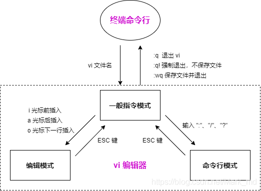
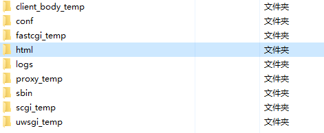
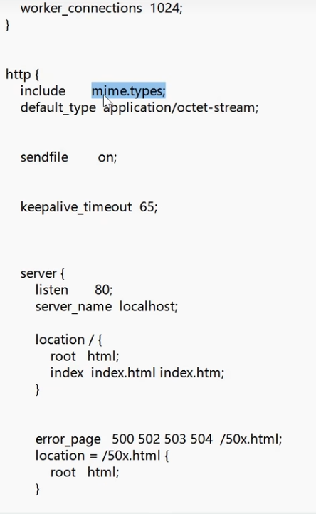
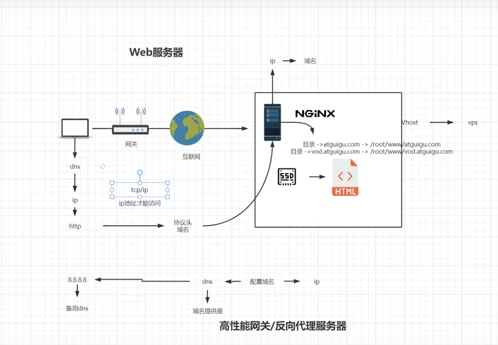
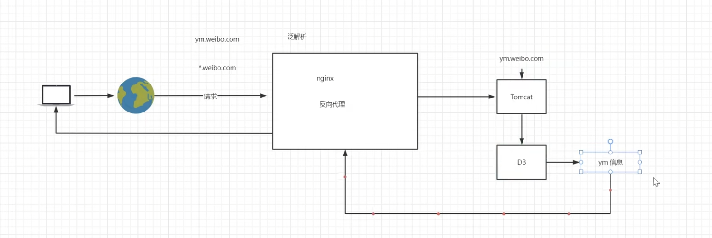
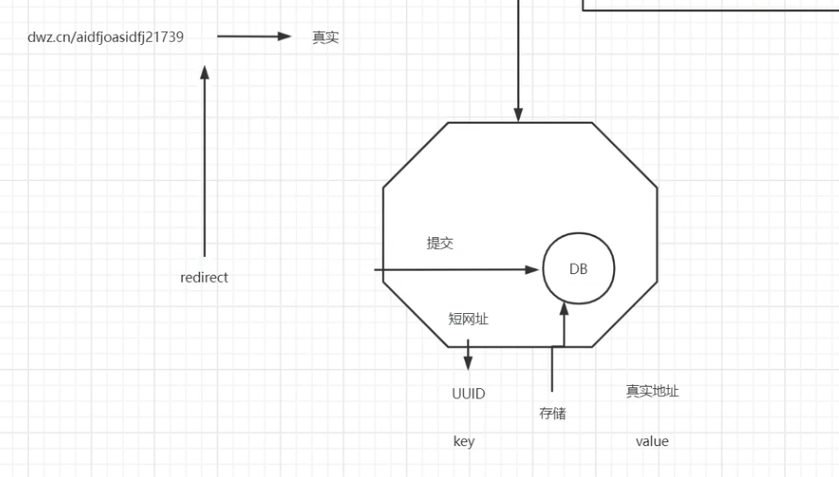
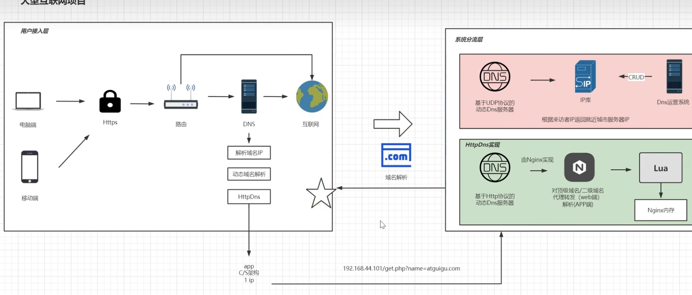
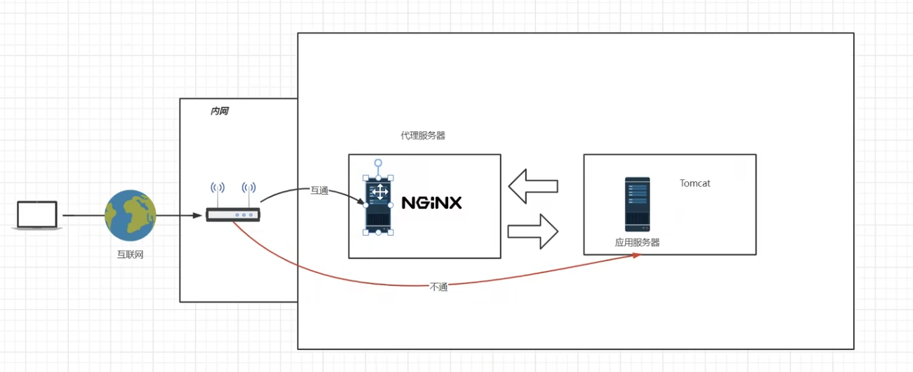
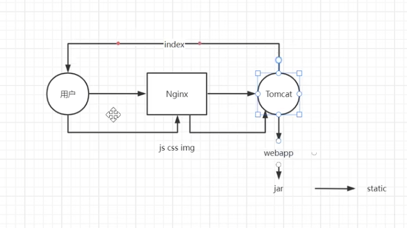

# Nginx

### centos配置

1、进入这个地址修改网卡配置`/etc/susconfiq/network-scripts/ifcfg-ens33`

```bash
BOOTPROTO=static

ONB00T=yes
IPADDR=192.168.44.101
NETMASK=255.255.255.0
GATEWAY=192.168.44.1
DNS1=8.8.8.8
```

2、重启网络`systemctl restart network`

3、`ip addr`查看ip

4、相关DNS

阿里：223.5.5.5、223.6.6.6

腾讯：119.29.29.29、182.254.118.118

百度：180.76.76.76

5、vi命令基础原理



### 编译安装

进入nginx解压目录里，寻找configure。

```
./configure --prefix=/usr/local/nginx
安装gcc
yum install -y gcc
安装perl库
yum install -y pcre pcre-devel
安装zlib库
yum install -y zlib zlib-devel
make
make install
```

关闭防火墙
systemct] stop firewalld.service
禁止防火墙开机启动
systemct] disable firewalld.service

放行端口
firewall-cmd  --zone=public --add-port=80/tcp --permanent
重启防火墙
firewall-cmd --reload

ps -ef | grep nginx  查看nginx进程号

### 启动nginx

进入安装好的目录 /usr/local/nginx/sbin

```
./nginx 启动
./nginx- -s stop 快速停止
./nginx -s quit 优雅关闭，在退出前完成已经接受的连接请求
./nginx -s reload 重新加载配置
```

### 目录结构与运行原理




### Nginx配置文件


除去注释后的主要配置



### 虚拟主机

对不同域名处理，都只部署在一台主机上，则产生了虚拟主机。



更改本机域名解析

在`C:\Windows\System32\drivers\etc`下更改hosts，添加IP地址 和对应域名即可

虚拟主机域名配置


servername匹配规则
我们需要注意的是servername匹配分先后顺序，写在前面的匹配上就不会继续往下匹配了
完整匹配
我们可以在同一servername中匹配多个域名
`server_name vod.mmban.com  www1. mmban.com;`
通配符匹配
`server_name  *.mmban.com;`
通配符结束匹配
`server_name  vod.*;`
正则配
`server_name  ~^[0-9]+\.mmban\.com$;`

多用户二级域名



短网址



httpdns



### 反向代理

隧道式代理



如果返回的请求由服务器直接传给客户端，则为DR（lvs提供）

负载均衡

轮询算法，使稳定在线提供功能

集群：功能都一样的服务器组成

Nginx配置实现

```
server {
    listen 80;
    server_name localhost;
    location/ {
    proxy_pass http://www.atguigu.com;#不支持https
    root html;
    index index.html index.htm;
    }
    error_page 500 502 503 504 /50x.html;
    location = /50x.html {
     	root html;
    }
 }
```

负载均衡实现

```
upstream httpds {
server 192.168.44.102:80 weight=8 down; #加down就是下线
server 192.168.44.103:80 weight=2 backup; #加backup备用
}
server {
    listen
    80:
    server name localhost;
    location/ {
    proxy_pass http://httpds;
    root html;
	index index.html index.htm;
	}
}
```

### Nginx动静分离

适合小型网站、传统项目



```
server {
    listen 80;
    server name localhost;
    location / {
    proxy_pass http://192.168.44.104:8080
    }
    location /js {
    root html;
    index index.html index.htm;
    }
    location /img (
    root html;
    index index.html index.htm;
    }
    location /css {
	root html;
    index index.html index.htm;
    }
}
#正则匹配
 location ~*/(js|css|img) {
    root html;
    index index.html index.htm;
  }
```

URLrewirte

```
location / {
    rewrite ^/2.html$ /index.jsp?pageNum=2 break;
    proxy_pass http://192.168.44.104:8080;
}
#正则表达式版
rewrite ^/([0-9]+).html$  /indexjsp?pageNum=$1 break;
```

