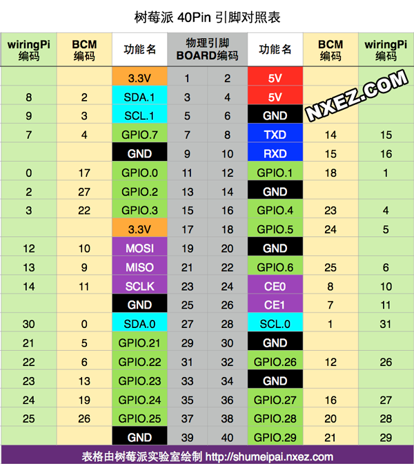

## Raspberry Pi(树莓派)学习记录

树莓派（Raspberry Pi）是尺寸仅有信用卡大小的一个小型电脑，您可以将树莓派连接电视、显示器、键盘鼠标等设备使用。

操作系统：各种Linux。官方编程语言：推荐python。

`GPIO`：一般用途输入输出接口。可以通过编程，直接控制引脚高低电平变化的底层扩展口。

`GPU`：图形处理单元，管理图形的硬件，等同于一般计算机的显卡。



在烧录系统后，在没有显示器的情况下，如何获得树莓派的ip地址？

可以将/etc/wpa_supplicant/wpa_supplicant.conf修改，添加如下：

```shell
ctrl_interface=DIR=/var/run/wpa_supplicant GROUP=netdev
update_config=1
country=CN

network={
    ssid="无线网络名称"
    psk="密码"
    key_mgmt=WPA-PSK
    priority=5 //优先级数字越大，优先级越高。
}
```

再在/etc/network/interfaces中修改，改成如下：

```shell
allow-hotplug wlan0
auto wlan0
iface wlan0 inet dhcp
wpa-conf /etc/wpa_supplicant/wpa_supplicant.conf
```

再在/boot/config.txt文件最后添加

```
dtoverlay=disable-bt
```

之后将SD卡插入树莓派，通过路由器管理得到分配给树莓派的ip地址，即可用puTTy远程登录。

