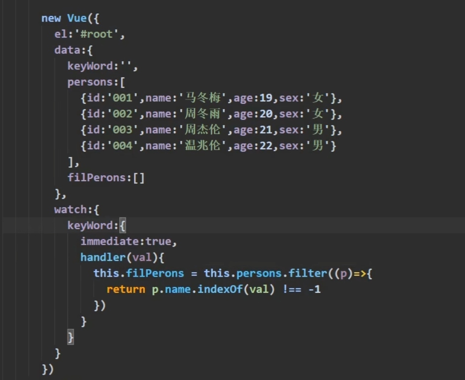
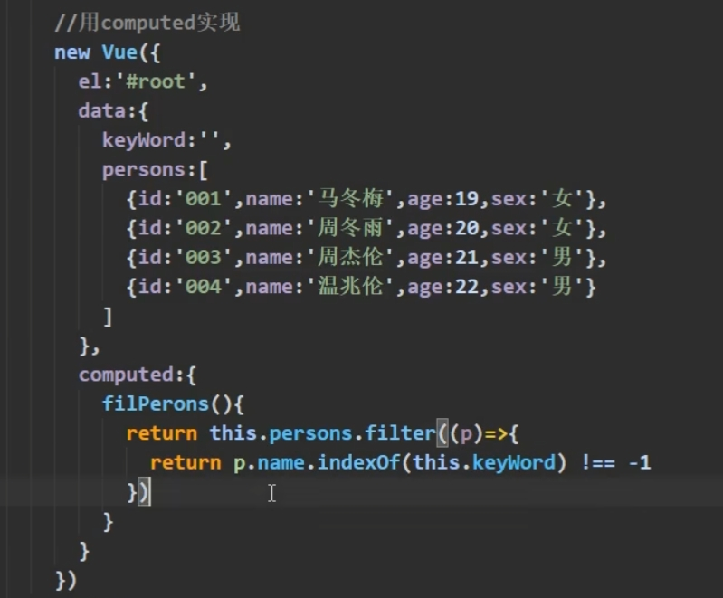
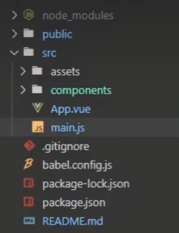
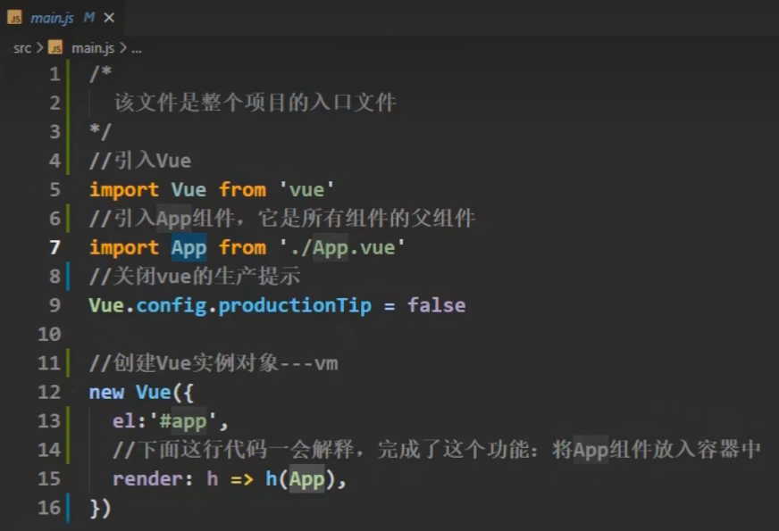
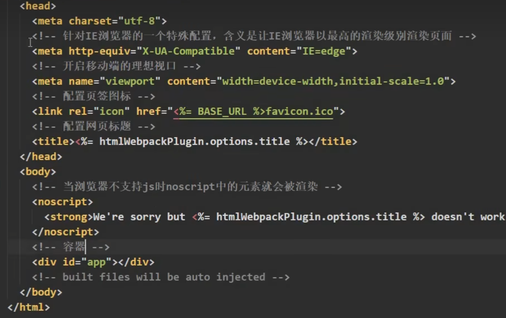
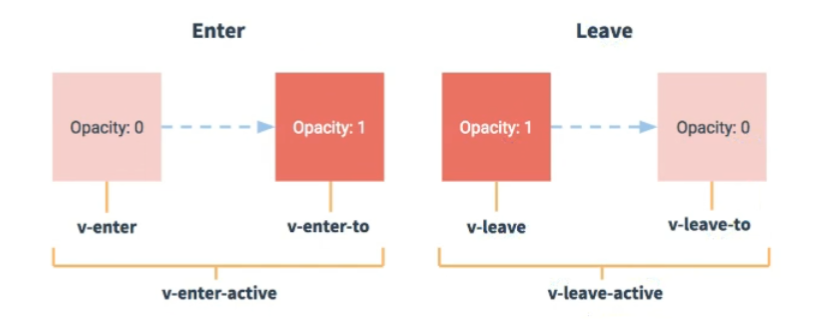

# Vue2

## Vue核心

定义：一套用于构建用户界面的渐进式JavaScript框架。

特点：

- 采用组件化模式，提高代码复用率，让代码更好维护。
- 声明式编码，让编码人员无需直接操作DOM
- 使用虚拟DOM和Diff算法，尽量复用DOM节点 

 ES6语法规范、ES6模块化、包管理器、原型、原型链、数组常用方法、axios、promise

### 初识Vue

1.想让Vue工作，就必须创建一个Vue实例，且要传入一个配置对象;

2.root容器里的代码依然符合html规范，只不过混入了一些特殊的Vue语法;

3.root容器里的代码被称为[Vue模板] ;

4.Vue实例和容器是一一对应的;

5.真实开发中只有一个Vue实例，并且会配合着组件一起使用;

6.{{xxx}}中的xxx要写js表达式，且xxx可以自动读取到data中的所有属性

7.一旦data中的数据发生改变，那么页面中用到该数据的地方也会自动更新

```html
<div id="root">
        <h1>Hello,{{ name }}</h1>
</div>
 <script type="text/javascript">
     new Vue({
         el: '#root', //el用于指定当前Vue实例为哪个容器服务，值通常为css选择器字符串。
         data:{ 
             name:'尚硅谷' //data中用于存储数据，数据供e1所指定的容器去使用，值我们暂时先写成一个对象.
         }
     })
</script>
```

el与data的两种写法

```html
<body>
    <script type="text/javascript">
        const v = new Vue({
            el: '#root', //第一种写法
            data:{ 
                name:'尚硅谷' //data第一种写法对象式
            }
            data:fuction(){  //data第二种写法函数式
            return {
                name:"尚硅谷"
            }
        }
        })
        v.$mount('#root') //第二种写法

    </script>
</body>
```

data与el的2种写法

1.el有2种写法(1).new Vue时候配置el属性。(2).先创建Vue实例，随后再通过vm.$mount('#root')指定el的值。

2.data有2种写法(1).对象式(2).函数式如何选择:目前哪种写法都可以，以后学习到组件时，data必须使用函数式.否则会报错。

3.一个重要的原则:由Vue管理的函数一定不要写箭头函数，写了箭头函数，this就不再是Vue实例了。

### 模板语法

Vue模板语法有2大类:
1.插值语法:
用于解析标签体内容功能:
写法:{{xxx}}，xxx是js表达式，且可以直接读取到data中的所有属性。

2.指令语法:

功能:用于解析标签 包括: 标签属性、标签体内容、绑定事件.....)

举例: v-bind:href="xxx”或 简写为 :href="xxx"，xxx同样要写js表达式，且可以直接读取到data中的所有属性。

备注: Vue中有很多的指令，且形式都是: v-????，此处我们只是拿v-bind举个例子。

#### 数据绑定

Vue中有2种数据绑定的方式:
1.单向绑定(v-bind): 数据只能从data流向页面

2.双向绑定(v-model): 数据不仅能从data流向页面，还可以从页面流向data。

备注:
1.双向绑定一般都应用在表单类元素上(如: input、select等)

2.V-model:value 可以简写为 v-model，因为v-model默认收集的就是value值。

```html
简写
单向数据绑定:<input type="text" :value="name"><br/>
双向数据绑定: <input type="text” v-model="name"><br/>
```

### MVVM模型

1.M:模型(Model):对应data 中的数据
2.V: 视图(View) : 模板
3.VM: 视图模型(ViewModel) : Vue实例对象

观察发现:
1.data中所有的属性，最后都出现在了vm身上。
2.vm身上所有的属性 及 Vue原型上所有属性，在Vue模板中都可以直接使用。

### 数据代理

```
//为对象增加属性
Object.defineProperty(person, ' age',{
    value:18
    enumerable:true，//控制属性是否可以枚举，默认值是false
    writable:true，//控制属性是否可以被修改，默认值是false
    configurable:true //控制属性是否可以被删除，默认值是false
	//当有人读取person的age属性时，get函数(getter)就会被调用，且返回值就是age的值
	get(){
		console.log("有人读取age属性了)
		return number;}
	//当有人修改person的age属性时，set函数(setter)就会被调用，且会收到修改的具体值
	set(value){
		console.log("有人修改了age属性，且值是',value);
		number = value;
	}
}
```

数据代理:通过一个对象代理对另一个对象中属性的操作 (读/写)

1.Vue中的数据代理:

通过vm对象来代理data对象中属性的操作(读/写)

2.Vue中数据代理的好处:

更加方便的操作data中的数据

3.基本原理:
通过object.defineProperty()把data对象中所有属性添加到vm上

为每一个添加到vm上的属性，都指定一个getter/setter。

在getter/setter内部去操作 (读/写) data中对应的属性。

### 事件处理

```html
<button v-on:click="showInfo">点我提示信息</button>
<button @click="showInfo">点我提示信息</button>

const vm = new Vue( {
	el:'#root',
	data: {
		name:'尚佳谷
	},
	methods: {
		showInfo1(event){
			console.log(event.target .innerText)}
			console.log(this) //此处的this是vm
			alert('同学你好')
		}
	}
}
```

事件的基本使用:
1.使用v-on:xxx 或 @xxx 绑定事件，其中xxx是事件名;

2.事件的回调需要配置在methods对象中，最终会在vm上;

3.methods中配置的函数，不要用箭头函数!否则this就不是vm了;

4.methods中配置的函数，都是被Vue所管理的函数，this的指向是vm 或 组件实例对象

5.@click="demo”和 @click="demo($event)”效果一致，但后者可以传参;

#### 事件修饰符

Vue中的事件修饰符:
1.prevent:阻止默认事件 (常用) ;
2.stop: 阻止事件冒泡(常用) ;
3.once:事件只触发一次(常用) :
4.capture:使用事件的捕获模式:
5.self:'只有event.target是当前操作的元素时才触发事件;

6.passive:事件的默认行为立即执行，无需等待事件回调执行完毕;

修饰符可以连续写

```
<!-- 阻止默认事件(常用) -->
<a href="http://www.atguigu.com"@click.prevent="showInfo">点我提示信息</a>
<!-- 阻止事件冒泡(常用) -->
<div class="demo1" @click="showInfo">
<button @click.stop="showInfo">点我提示信息</button></div>
<!-- 事件只触发一次(常用)-->
<button @click.once="showInfo">点我提示信息</button>
```

#### 键盘事件

1.Vue中常用的按键别名:
回车 => enter
删除 => delete (捕获“删除”和“退格”键)
退出 =>esc
空格 =>space
换行 => tab(特殊，必须配合keydown去使用)
上 => up
下 => down
左 => left
右 => right

2.Vue未提供别名的按键，可以使用按键原始的key值去绑定，但注意要转为kebab-case (短横线命名)
3.系统修饰键 (用法特殊) : ctrl、alt、shift、meta
(1).配合keyup使用: 按下修饰键的同时，再按下其他键，随后释放其他键，事件才被触发。
(2).配合keydown使用: 正常触发事件。
4.也可以使用keycode去指定具体的按键 (不推荐)
5.Vue.config.keyCodes.自定义键名 = 键码，可以去定制按键别名

```
<div id="root">
<h2>欢迎来到{{name}学习</h2>
<input type="text”placeholder="按下回车提示输入” @keyup.alt="showInfo">
</div>

Vue.config.keyCodes.huiche = 13 //定义了一个别名按键
```

### 计算属性

1.定义:要用的属性不存在，要通过已有属性计算得来。
2.原理:底层借助了objcet.defineproperty方法提供的getter和setter。
3.get函数什么时候执行?
(1).初次读取时会执行一次。
(2).当依赖的数据发生改变时会被再次调用。
4.优势:与methods实现相比，内部有缓存机制(复用)，效率更高，调试方便

5.备注:
1.计算属性最终会出现在vm上，直接读取使用即可。
2.如果计算属性要被修改，那必须写set函数去响应修改，且set中要引起计算时依赖的数据发生改变。

```
new Vue({
    el:'#root",
    data:{
        firstName:'张',
        lastName :'san'
    },
    computed:{
        fullName:{
            //get有什么作用?当有人读取fullName时，get就会被调用，且返回值就作为fulIName的值
            //get什么时候调用? 1.初次读取fullName时。2.所依赖的数据发生变化时。
            get(){
                console.log('get被调用了)
                // console.log(this) //此处的this是vm
                return this.firstName + '_' + this.lastName
        	}
        	set(value){
        	
        	}
    	}
    	简写，只有getter时 
        fullName(){
            console.log('get被调用了)
            return this.lastName + this.firstName
        }
    }
}

```

###  监视属性

监视属性watch:
1.当被监视的属性变化时，回调函数自动调用，进行相关操作

2.监视的属性必须存在，才能进行监视!!

3.监视的两种写法:
(1).new Vue时传入watch配置
(2).通过vm.$watch监视

```
watch:{
	isHot:{
        immediate:true;
        //初始化时让handler调用一下
        //handler什么时候调用? 当isHot发生改变时。
        handler(newValue,oldValue){
            console.log('isHot被修改了,newValue,oldValue);
        }
    }
}

vm.$watch('isHot',{
	immediate:true;
	handler(newValue,oldValue){
		console.log("isHot被修改了,newValue,oldValue)
	}
})
```

#### 深度监视

深度监视:
(1).Vue中的watch默认不监测对象内部值的改变 (一层)
(2).配置deep:true可以监测对象内部值改变(多层)。

备注:
(1).Vue自身可以监测对象内部值的改变，但Vue提供的watch默认不可以!
(2).使用watch时根据数据的具体结构，决定是否采用深度监视。

```
watch:(
    isHot:{
    //监视多级结构中某个属性的变化*
    'numbers .a':handler(){
    	    console.log("a被改变了)
    }
    //监视多级结构中所有属性的变化
    numbers:{
    	deep:true
    	handler(){
    		console.log('numbers改变了)}
    }
}
```

简写，当只有handler时，不配置其他项时。

```
//简写
watch:{
    isHot(newValue,oldValue) {
            console.log("isHot被修改了,newValue,oldValue);
    }
}
vm.$watch('isHot',function(){
     console.log("isHot被修改了,newValue,oldValue);
})
```

computed和watch之同的区别:
1.computed能完成的功能，watch都可以完成。
2.watch能完成的功能，computed不一定能完成，例如: watch可以进行异步操作.

两个重要的小原则:
1.所被Vue管理的函数，最好写成普通函数，这样this的指向才是vm 或 组件实例对象。
2.所有不被Vue所管理的函数(定时器的回调函数、ajax的回调函数等、Promise的回调函数)，最好写成箭头函数.
这样this的指向才是vm 或 组件实例对象。

### 绑定样式

绑定样式:
1、class样式
写法:class="xxx”，xxx可以是字符串、对象、数组。

字符串写法适用于:类名不确定，要动态获取。

对象写法适用于:要绑定多个样式，个数不确定，名字也不确定。

数组写法适用于:要绑定多个样式，个数确定，名字也确定，但不确定用不用。

2、style样式
:style="{fontsize: xxx]"，其中xxx是动态值:style="[a,b]"其中a、b是样式对象。

```
<!-- 绑定class样式--字符串写法，适用于:样式的类名不确定，需要动态指定-->
<div class="basic" :class="mood" @click="changeMood">{{name}}</div>

new Vue({
    el:'.basic',
    data:{
        name:'hello world',
        mood:'normal'
    },
    methods:{
        changeMood(){
        this.mood = 'sad'
        }
    }
 })
 
<!-- 绑定class样式--数组写法，适用于: 要绑定的样式个数不确定、名字也不确定 -->
<div class="basic” :class="classArr">{{name}}</div>
new Vue({
    el:'.basic',
    data:{
        name:'hello world',
        classArr:['atguigu1, atguigu2', atguigu3']
    },
    }
 })
 
<!-- 绑定class样式--对象写法，适用于:要绑定的样式个数确定、名字也确定，但要动态决定用不用 -->
<div class="basic” :class="classObj">{{name}}</div>
new Vue({
    el:'.basic',
    data:{
        name:'hello world',
		classObj:{
			atguigu1:false,
			atguigu2:false,
		}
    },
    }
 })
 
<!-- 绑定style样式--对象写法 -->
<div class="basic":style="styleObj">{{name}}</div>
new Vue({
    el:'.basic',
    data:{
        name:'hello world',
		styleobj:{
			fontSize:40px',
			color;'red'
		}
    }
 })
```

### 条件渲染

条件渲染:
1.V-if，写法:
(1).v-if="表达式"
(2).v-else-if="表达式
(3).v-else="表达式"
适用于:切换频率较低的场景。
特点:不展示的DOM元素直接被移除。
注意: v-if可以和:v-else-if、v-else一起使用，但要求结构不能被“打断”
2.V-show
写法:V-show="表达式"
适用于:切换频率较高的场景。
特点:不展示的DOM元素未被移除，仅仅是使用样式隐藏掉
3.备注: 使用v-if的时，元素可能无法获取到，而使用v-show一定可以获取到。

```
<!-- 使用v-show做条件渲染 -->
<h2 v-show="false">欢迎来到{{name}}</h2> 
<h2 v-show="1~=== 1">欢迎来到{{name}}</h2>
<!-- 使用v-if做条件渲染 -->
<h2 v-if="false">欢迎来到{{name}}</h2> 
<h2 v-if="1 === 1">欢迎来到{{name]}</h2> 
<!-- V-else和v-else-if -->
<div v-if="n === 1">Angular</div>
<div v-else-if="n === 2">React</div>
<div v-else-if="n === 3">Vue</div>
<div v-else>哈哈</div>
```

### 列表渲染

v-for指令
1.用于展示列表数据

2.语法: v-for="(item, index) in xxx” :key="yyy"

3.可遍历: 数组、对象、字符串 (用的很少)、指定次数(用的很少)

```html
<!-- 遍历数组 -->
<h2>人员列表(遍历数组)</h2>
<ul><li v-for="(p,index) of persons" :key="index">{{p.name}}-{{p.age}}
</li></ul>
<!-- 遍历对象 --><h2>汽车信息(遍历对象)</h2>
<ul>
<li v-for="(value,k) of car" :key="k">{{k}}-{{value}}</li>
</ul>
<!-- 遍历字符串 --><h2>测试遍历字符串(用得少)</h2>
<ul>
<li v-for="(char,index) of str” :key="index">{{char}}-{{index}}</li>
</ul>
```

面试题: react、vue中的key有什么作用? (key的内部原理)
1、虚拟DOM中key的作用:
key是虚拟DOM对象的标识，当数据发生变化时，Vue会根据[新数据]生成[新的虚拟DOM]
随后Vue进行[新虚拟DOM] 与[旧虚拟DOM] 的差异比较，比较规则如下:
2、对比规则:
(1).旧虚拟DOM中找到了与新虚拟DOM相同的key:
若虚拟DOM中内容没变，直接使用之前的真实DOM!
若虚拟DOM中内容变了，则生成新的真实DOM，随后替换掉页面中之前的真实DOM。
(2).旧虚拟DOM中未找到与新虚拟DOM相同的key创建新的真实DOM，随后渲染到到页面。

3、用index作为key可能会引发的问题:
1。若对数据进行:逆序添加、逆序删除等破坏顺序操作:“会产生没有必要的真实DOM更新 ==> 界面效果没问题，但效率低。
2。如果结构中还包含输入类的DOM:会产生错误DOM更新 ==> 界面有问题。
4、开发中如何选择key?:
1.最好使用每条数据的唯一标识作为key，比如id、手机号、身份证号、学号等唯一值。

2.如果不存在对数据的逆序添加、逆序删除等破坏顺序操作，仅用于渲染列表用于展示,使用index作为key是没有问题的。

#### 列表过滤

```html
<div id="root"
<h2>人员列表</h2>
<input type="text” placeholder="请输入名字” v-model="keyWord"
<ul>
<li v-for="(p,index) of persons": key="index">{{p.name}}-{{p.age}}-{{p.sex}}</li>
</ul>
</div>
```





### vue数据监视的原理

vue会监视data中所有层次的数据。

#### 数据是对象时

通过setter实现监视，且要在new Vue时就传入要监测的数据。

(1).对象中后追加的属性，Vue默认不做响应式处理

(2).如需给后添加的属性做响应式，请使用如下API:

Vue.set(target，propertyName/index，value) 或vm.$set(target，propertyName/index， value)

#### 数据是数组时

通过包裹数组更新元素的方法实现，本质就是做了两件事:

(1).调用原生对应的方法对数组进行更新。

(2).重新解析模板，进而更新页面。

在Vue修改数组中的某个元素一定要用如下方法:

1.使用这些API:push()、pop()、shift()、unshift()、splice()、sort()、reverse()

2.Vue.set)或 vm.$set()

特别注意: Vue.set() 和 vm.$set() 不能给vm 或 vm的根数据对象 添加属性!!!

### 收集表单数据

收集表单数据:

```
若:<input type="text"/>，则v-model收集的是value值，用户输入的就是value值.
若:<input type="radio”/>，则v-model收集的是value值，且要给标签配置value值
若:<input type="checkbox"/>
1.没有配置input的value属性，那么收集的就是checked (勾选 or 未勾选，是布尔值)
2.配置input的value属性:
(1)v-model的初始值是非数组，那么收集的就是checked(勾选 or 未勾选，是布尔值)
(2)v-model的初始值是数组，那么收集的的就是value组成的数组
备注: v-model的三个修饰符:
lazy: 失去焦点再收集数据
number:输入字符串转为有效的数字
trim:输入首尾空格过滤
```

### 过滤器

过滤器:
定义:对要显示的数据进行特定格式化后再显示(适用于一些简单逻辑的处理)
语法:

1.注册过滤器:Vue.filter(name,callback) 或 new Vue {filters:{ }};

2.使用过滤器:{[ xxx | 过滤器名]] 或 v-bind:属性 =“xxx | 过滤器名"

备注:
1.过滤器也可以接收额外参数、多个过滤器也可以串联

2.并没有改变原本的数据，是产生新的对应的数据

```
<div>
<h3>现在是: {{time | timeFormater}}</h3>
<h3>现在是: {{time | timeFormater('YYYY_MM_DD') | myslice}}</h3>
</div>


//全局过滤器
Vue.filter('mySlice',function(value){
	return value.slice(0,4)
}
new Vue ({
	el:'#root',
	data:{
		time:1623823678743289
	},
	//局部过滤器 
	filters:{
		timeFormater(value,str=''){
			return dayjs(value).format(str)
		},
		myslice(value){
			return value.slice(0,4)
		}
	}
})
```

### 内置指令

我们学过的指令:
v-bind :单向绑定解析表达式，可简写为 :xxx
v-model : 双向数据绑定
V-for：遍历数组/对象/字符串
V-on：绑定事件监听，可简写为@

V-if：条件渲染(动态控制节点是否存存在)

v-else：条件渲染 (动态控制节点是否存存在).

V-show：条件渲染 (动态控制节点是否展示)

**v-text指令:**
1.作用:向其所在的节点中渲染文本内容.
2.与插值语法的区别: v-text会替换掉节点中的内容，{{xx}}则不会

**v-html指令:**
1.作用:向指定节点中渲染包含htm1结构的内容。
2.与插值语法的区别:
(1).v-htm1会替换掉节点中所有的内容，{{xx}}则不会

(2).v-html可以识别html结构。

3.严重注意: v-htm1有安全性问题!
(1).在网站上动态渲染任意HTML是非常危险的，容易导致XSS攻击。
(2).一定要在可信的内容上使用v-htm1，永不要用在用户提交的内容上!

**v-cloak**指令(没有值) :
1.本质是一个特殊属性，Vue实例创建完毕并接管容器后，会删掉v-cloak属性。
2.使用css配合v-cloak可以解决网速慢时页面展示出{{xxx}}的问题。

**V-once指令:**（没有值）
1.v-once所在节点在初次动态渲染后，就视为静态内容了。
2.以后数据的改变不会引起v-once所在结构的更新，可以用于优化性能。

**v-pre指令:**
1.跳过其所在节点的编译过程。
2.可利用它跳过:没有使用指令语法、没有使用插值语法的节点，会加快编译。

### 自定义指令

1、定义语法:
(1).局部指令:
new Vue({ directives:{指令名:配置对象}}) 或 new Vue({directives{指令名:回调函数}})

(2).全局指令:

Vue.directive(指令名,配置对象) 或Vue.directive(指令名，回调函数)

2、配置对象中常用的3个回调:

(1).bind:指令与元素成功绑定时调用。

(2).inserted: 指令所在元素被插入页面时调用。

(3).update:指令所在模板结构被重新解析时调用
3、备注:
1.指令定义时不加v-，但使用时要加v-;
2.指令名如果是多个单词，要使用kebab-case命名方式，不要用camelCase命名

####  函数式

```js
directives:{
	//big函数何时会被调用? 1.指令与元素成功绑定时(一上来) 。2.指令所在的模板被重新解析时。
	big(element,binding){
	element.innerText = binding.value * 10
	}
}
```

#### 对象式

```javascript

directives:{
	fbind:{
	//指令与元素成功绑定时 (一上来)
	bind(element,binding){
		element.value = binding.value
	}
	//指令所在元素被插入页面时
	inserted(element,binding){
		element.focus()}
	//指令所在的模板被重新解析时
 	update(element,binding){	
	element.value = binding.value}
}
```

###  生命周期

1.又名:生命周期回调函数、生命周期函数、生命周期钩子。
2.是什么: Vue在关键时刻帮我们调用的一些特殊名称的函数。
3.生命周期函数的名字不可更改，但函数的具体内容是程序员根据需求编写的。
4.生命周期函数中的this指向是vm 或 组件实例对象。

```
new Vue({
	//Vue完成模板的解析并把初始的真实DOM元素放入页面后(挂载完毕) 调用mounted
	mounted(){
		
	}
})
```

 vm的一生(vm的生命周期)：

将要创建调用，beforeCreate函数

创建完毕调用created函数。

将要挂载调用beforeMount函数。

（重要)挂载完毕调用mounted函数。=====>(重要的钩子]

将要更新调用beforeUpdate函数。

更新完毕调用updated函数。

将要销毁调用beforeDestroy函数。========>(重要的钩子]

销毁完毕调用destroyed函数。


常用的生命周期钩子:

1.mounted: 发送ajax请求、启动定时器、绑定自定义事件、订阅消息等[初始化操作]

2.beforeDestroy: 清除定时器、解绑自定义事件、取消订阅消息等[收尾工作]。
关于销毁Vue实例 

1.销毁后借助Vue开发者工具看不到任何信息。

2.销毁后自定义事件会失效，但原生DOM事件依然有效。

3.一般不会在beforeDestroy操作数据，因为即便操作数据，也不会再触发更新流程了。

## Vue组件化编程

### 组件的理解

组件的定义：实现应用中局部功能代码和资源的集合。

1.理解:用来实现局部(特定)功能效果的代码集合(html/css/js/image.....)
2.为什么:一个界面的功能很复杂“
3.作用:复用编码，简化项目编码，提高运行效率

模块
1.理解:向外提供特定功能的js程序，一般就是一个js文件
2.为什么: js文件很多很复杂
3.作用: 复用js，简化js的编写，提高js 运行效率

### 非单文件组件

一个文件中包含有n个组件

Vue中使用组件的三大步骤:
**定义组件(创建组件)、注册组件、使用组件(写组件标签)**
如何定义一个组件?
使用Vue.extend(options)创建，其中options和new Vue(options)时传入的那个options几乎一样，但也有点区别:
区别如下:

1.el不要写，为什么? 最终所有的组件都要经过一个vm的管理，由vm中的el决定服务哪个容器。

2.data必须写成函数，为什么? - 避免组件被复用时，数据存在引用关系。备注:使用template可以配置组件结构。

如何注册组件?
1.局部注册:靠new Vue的时候传入components选项
2.全局注册:靠Vue.component(('组件名',组件)
编写组件标签:`<school></school>`

几个注意点:
1.关于组件名:

一个单词组成:

第一种写法(首字母小写): school
第二种写法(首字母大写): Schoo1

多个单词组成:
第一种写法(kebab-case命名): my-school
第二种写法(Camelcase命名): MySchool (需要Vue脚手架支持)

备注:
(1).组件名尽可能回避HTML中已有的元素名称，例如: h2、H2都不行。
(2).可以使用name配置项指定组件在开发者工具中呈现的名字。

2.关于组件标签:
第一种写法:`<school></school>`
第二种写法:`<school/>`
备注:不用使用脚手架时，`<school/>`会导致后续组件不能渲染

3.一个简写方式:
const school = Vue.extend(options) 可简写为: const school = options

### 组件的嵌套

关于VueComponent:
1.school组件本质是一个名为VueComponent的构造函数，且不是程序员定义的，是Vue.extend生成的.
2.我们只需要写`<school/>或<schoolx/school>`，Vue解析时会帮我们创建school组件的实例对象,即Vue帮我们执行的: new VueComponent(options)。
3.特别注意: 每次调用Vue.extend，返回的都是一个全新的VueComponent!!!!

4.关于this指向:
(1). 组件配置中:data函数、methods中的函数、watch中的函数、computed中的函数 它们的this均是[VueComponent实例对象]

(2) new Vue(options)配置中:
data函数、methods中的函数、watch中的函数、computed中的函数 它们的this均是[Vue实例对象]

5.VueComponent的实例对象，以后简称vc(也可称之为:组件实例对象)Vue的实例对象，以后简称vm。

#### 重要的内置关系

1.一个重要的内置关系:` VueComponent.prototype.__proto__ === Vue.prototype`
2.为什么要有这个关系: 让组件实例对象(vc) 可以访问到 Vue原型上的属性、方法。

### 单文件组件

school.vue

```vue
<template>
<!--组件的结构-->
    <div>
      <h1>你好，{{ name }}</h1>
      <h1>我们学校在{{ address }}</h1>
     </div>
</template>
<script>//组件交互相关的代码(数据、方法等等)
    export default {
        data() {
            return {
               name: '虫带',
               address: '重庆'
            }
       },
    }
</script>
<style>
/* 组件的样式 */
    .demo{
        
    }
</style>
```

App.vue

```vue
<template>
	<div>
		<School></School>
        <Student></student>
    </div>
</template>
<script>
    //引入组件
    import School from './School!
    import Student from ' ./Student!
    export default {
        name: ' App",
        components:{	
            School,
            Student
        }
    }
</script>
```

main.js

```
import App from './App.vue'
new Vue({
	el:'#root,
	template:`<App></App>`,
	components:{App},
})
```

## 使用Vue脚手架

Vue脚手架是Vue官方提供的标准化开发工具(开发平台）

### 具体步骤 

第一步(仅第一次执行):全局安装@vue/cli。
npm install -g @vue/cli
第二步: 切换到你要创建项目的目录，然后使用命令创建项目
vue create xxxx
第三步:启动项目
npm run serve

### 分析脚手架结构



babel是将ES6标准转化为ES5标准的工具，babel.config.js就是其配置文件。

main.js文件是入口文件，内容如下：



public文件下的index.html是容器文件，内容如下：



#### render函数

关于不同版本的Vue:

1.vue.js与vue.runtime.xxx.js的区别:

(1).vue.js是完整版的Vue，包含: 核心功能+模板解析器。

(2).vue.runtime.xxx.js是运行版的Vue，只包含: 核心功能:没有模板解析器

2.因为vue.runtime.xxx.js没有模板解析器，所以不能使用template配置项，需要使用render函数接收到的createElement函数去指定具体内容。

#### ref属性

1.被用来给元素或子组件注册引用信息(id的替代者)

2.应用在html标签上获取的是真实DOM元素，应用在组件标签上是组件实例对象(vc)

3.使用方式:
打标识: <h1 ref="xxx">.....</h1> 或 <School ref="xxx"></School>

获取: this.$refs.xxx

#### props属性

功能:让组件接收外部传过来的数据
(1).传递数据:
`<Demo name="xxx"/>`
(2).接收数据:
第一种方式(只接收):
`props:['name']`
第二种方式(限制类型) :
props:{

​	name: String

}

第三种方式(限制类型、限制必要性、指定默认值) :

props:{ 

​	name:{ 

​		type:String，//类型

​		required:true，//必要性

​		default: '老王’ //默认值}

}

备注: props是只读的，Vue底层会监测你对props的修改，如果进行了修改，就会发出警告，若业务需求确实需要修改，那么请复制props的内容到data中一份，然后去修改data中的数据。

#### mxin属性

功能:可以把多个组件共用的配置提取成一个混入对象使用方式:
第一步定义混合，例如:

{

​	data(){.....},
​	methods:{....},

​	.....

}

第二步使用混入，例如:
(1).全局混入: Vue.mixin(xxx)
(2).局部混入: mixins:[ 'xxx']

#### Vue插件 

功能:用于增强Vue一个对象，install的第一个参数是Vue，第二个以后的参数是插件使用者传递的数据 本质:包含install方法。
定义插件:

```vue
对象.install = function (Vue, options) {
	// 1。添加全局过滤器
	Vue.filter(....)
	// 2。添加全局指令
	Vue.directive(.....)
	
	// 3。配置全局混入(合)
	Vue.mixin(....)
	// 4。添加实例方法
	Vue.prototype.$myMethod = function() {...}
	Vue.prototype.$myProperty = xxxx
使用插件: Vue.use()
```

#### scoped属性

作用:让样式在局部生效，防止冲突。

写法: `<style scoped>`

### 组件化编码流程（通用）

1.实现静态组件:抽取组件，使用组件实现静态页面效果
2.展示动态数据:
	2.1.数据的类型、名称是什么?
	2.2数据保存在哪个组件?
3.交互一一从绑定事件监听开始

#### Todo案例总结

1.组件化编码流程:

(1).拆分静态组件:组件要按照功能点拆分，命名不要与html元素冲突

(2).实现动态组件:考虑好数据的存放位置，数据是一个组件在用，还是一些组件在用:

- 一个组件在用: 放在组件自身即可
- 一些组件在用: 放在他们共同的父组件上(状态提升)(3).实现交互:从绑定事件开始

2.props适用于:

(1)父组件 ==>子组件 通信

(2).子组件==>父组件通信(要求父先给子一个函数)

3.使用v-model时要切记: v-model绑定的值不能是props传过来的值，因为props是不可以修改的!

4.props传过来的若是对象类型的值，修改对象中的属性时Vue不会报错，但不推荐这样做。

### 浏览器本地存储

localstorage.setItem( 'msg,hello!!!')

localstorage.setItem( ' person',JSON.stringify(p))，P为对象

localstorage.getItem( 'msg'))

localstorage.removeItem( 'msg')

localstorage.clear()

同理：session.storage也有以上方法

#### webstorage

1.存储内容大小一般支持5MB左右 (不同浏览器可能还不一样)
2.浏览器端通过 Window.sessionStorage 和 Window.localStorage 属性来实现本地存储机制。
3.相关API:
1) xxxxxStorage.setItem( ' key',value'); 该方法接受一个键和值作为参数，会把键值对添加到存储中，如果键名存在，则更新其对应的值。
2) xxxxxStorage.getItem( 'person'); 该方法接受一个键名作为参数，返回键名对应的值
3) xxxxxStorage .removeItem('key'); 该方法接受一个键名作为参数，并把该键名从存储中删除.
4) xxxxxStorage .clear()4.; 该方法会清空存储中的所有数据
4.备注
1.SessionStorage存储的内容会随着浏览器窗口关闭而消失
2.LocalStorage存储的内容，需要手动清除才会消失J
3.xxxxxStorage.getItem(xxx) 如果xxx对应的value获取不到，那么getltem的返回值是null.
4.JSON.parse(null) 的结果依然是null.

### 组件的自定义事件

简单来说就是：给组件使用的事件

#### 绑定事件

```vue
<!-- 通过父组件给子组件传递函数类型的props实现:子给父传递数据 -->
<School :getSchooName="getSchooName"/>

<!-- 通过父组件给子组件绑定一个自定义事件实现: 子给父传递数据(第一种写法，使用@或v-on)-->
<Student @atguigu="getStudentName"/>

<!-- 通过父组件给子组件绑定一个自定义事件实现:子给父传递数据(第二种写法，使用ref) -->
<Student ref="student"/>

<script>
	export default {
        name : "App",
		components:{School,Student},
        data() {
        	msg:“nihao”
    	},
		methods: {
			getSchooName(name){console.log('App收到了学校名:',name)}
			getStudentName(name){console.log('App收到了学生名:',name)}
  	  	},
		mounted() {
       		this.$refs.student.$on('atguigu',this.getStudentName)//绑定自定义事件 
            this.$refs.student.$once('atguigu',this.getStudentName)//绑定自定义事件(一次性)
		},
    }
</script>

sendStudentIName(){
	//触发student组件实例身上的atguigu事件
	this.$emit('atguigu',this.name)
}
```

####  解绑自定义事件

```
<!-- 通过父组件给子组件绑定一个自定义事件实现: 子给父传递数据(第一种写法，使用@或v-on)-->
<Student @atguigu="getStudentName"/>

<!-- 通过父组件给子组件绑定一个自定义事件实现:子给父传递数据(第二种写法，使用ref) -->
<Student ref="student"/>

<script>
	export default {
        name : "App",
		components:{School,Student},
        data() {
        	msg:“nihao”
    	},
		methods: {
			getSchooName(name){console.log('App收到了学校名:',name)}
			getStudentName(name){console.log('App收到了学生名:',name)}
  	  	},
		mounted() {
       		this.$refs.student.$on('atguigu',this.getStudentName)//绑定自定义事件 
            this.$refs.student.$once('atguigu',this.getStudentName)//绑定自定义事件(一次性)
		},
    }
</script>


//student.vue
methods:{
	sendStudentIName(){
		//触发student组件实例身上的atguigu事件
		this.$emit('atguigu',this.name)
	}，
	unbind(){
		this.$off('atiguidu') //解绑一个自定义事件
		this.$off(['atiguidu','demo]) //解绑多个自定义事件
		this.$off()//解绑所有自定义事件
	}，
	death(){
		this.$destroy() //销毁当前VC组件实例，销毁后所有student实例的自定义事件全都不奏效。
	}
}
```

#### 总结

1.一种组件间通信的方式，适用于: 子组件 ===>父组件

2.使用场景:A是父组件，B是子组件，B想给A传数据，那么就要在A中给B绑定自定义事件(事件的回调在A中)

3.绑定自定义事件:
	1.第一种方式，在父组件中:<Demo @atguigu="test"/> 或<Demo v-on:atguigu="test"/>
	2.第二种方式，在父组件中:

```
<Demo ref="demo"/>
...
mounted(){
	this.$refs.xxx.$on('atguigu',this.test)
}
```

​	3.若想让自定义事件只能触发一次，可以使用once 修饰符，或 $once方法

4.触发自定义事件:this.$emit('atguigu'数据)

5.解绑自定义事件this.$off('atguigu')

6组件上也可以绑定原生DOM事件，需要使用 native 修饰符

7.注意:通过 this.$refs.xxx.$on('atguigu',回调)绑定自定义事件时，回调要么配置在methods中，要么用箭头函数，否则this指向会出问
题，会指向vc组件。

### 全局事件总线(GlobalEventBus)

实现任意组件间通信

在main.js里创建一个所有组件都能访问的总线，安装全局事件总线

```
//创建vm
new Vue({
	el:'#app',
	render: h => h(App),
	beforeCreate() {
		Vue.prototype.$bus = this //安装全局事件总线，$bus就是当前应用的vm
	},
})
```

使用事件总线:
	1.接收数据: A组件想接收数据，则在A组件中给Sbus绑定自定义事件，事件的回调留在A组件自身

```
methods(){
	demo(data){......}
}
......
mounted(){
	this.$bus.$on('xxxx',this.demo)
}
```

​	2.提供数据: `this.$bus.$emit('xxxx’,数据)`
最好在beforeDestroy钩子中，用$off去解绑当前组件所用到的事件

### 消息订阅与发布

一种组件间通信的方式，适用于任意组件间通信。
使用步骤:
	1.安装pubsub:npm i pubsub-js
	2.引入: import pubsub from 'pubsub-js'
	3.接收数据: A组件想接收数据，则在A组件中订阅消息，订阅的回调留在A组件自身。

```
methods(){
	demo(data){......}
}
mounted() {
	this.pid = pubsub.subscribe('xxx',this.demo) //订阅消息
}
```

​	4.提供数据:` pubsub.publish('xxx’数据)`

​	5.最好在beforeDestroy钩子中，用 PubSub.unsubscribe(pid)去<span style="color:red">取消订阅。</span>

### nextTick属性

1.语法: this.$nextTick(回调函数)

2作用:在下一次 DOM 更新结束后执行其指定的回调。

3.什么时候用: 当改变数据后，要基于更新后的新DOM进行某些操作时，要在nextTick所指定的回调函数中执行.

### Vue封装的过渡与动画

 1.作用:在插入、更新或移除DOM元素时，在合适的时候给元素添加样式类名

2.图示:



3.写法

- 准备好样式

  - 元素进入的样式:
    	1.v-enter:进入的起点
      	2.v-enter-active:进入过程中
      	3.v-enter-to:进入的终点

  - 元素离开的样式:

    ​	1.v-leave:离开的起点
    ​    2.v-leave-active:离开过程中
    ​    3.v-leave-to:离开的终点

- 使用`<transition>`包惠要过度的元素，并配置name属性:

```
<transition name="hello">
	<h1 v-show="isShow">你好啊! </h1>
</transition>
```

- 备注:若有多个元素需要过度，则需要使用`<transition-group>`，且每个元素都要指定key值

## Vue中的ajax

### Vue脚手架配置代理

方法一，在vue.config.js中添加如下配置

```
devServer:{
	proxy:"http://localhost:5000"
}
```

说明:
1.优点:配置简单，请求资源时直接发给前端(8080) 即可

2.缺点:不能配置多个代理，不能灵活的控制请求是否走代理

3.工作方式:若按照上述配置代理，当请求了前端不存在的资源时，那么该请求会转发给服务器(优先匹配前端资源)

方法二，编写vue.config.js配置具体代理规则:

```js
module.exports = {
	devServer:{
		proxy:{
			'/api1': {// 匹配所有以/api1'开头的请求路径
				target:http://localhost:5000,// 代理目标的基础路径
				changeOrigin: true,
				pathRewrite:{'^/api1' : ''}
			},
			'/api2': {// 匹配所有以/api2'开头的请求路径
				target:http://localhost:5001',// 代理目标的基础路径
				changeOrigin: true,
				pathRewrite:{'^/api2':''}
			}
		}
	}
}
/*
changeOrigin设置为true时服务器收到的请求头中的host为: localhost:5000
changeOrigin设置为false时，服务器收到的请求头中的host为: localhost:8080
changeOrigin默认值为true
*/
```

说明:
1.优点:可以配置多个代理，且可以灵活的控制请求是否走代理
2.缺点:配置略微繁琐，请求资源时必须加前缀

### vue-resource

vue插件库vue1.x 使用广泛，官方已不维护


### slot插槽

1.作用:让父组件可以向子组件指定位置插入html结构，也是一种组件间通信的方式，适用于 父组件 ===>子组件

2.分类:默认插槽、具名插槽、作用域插槽

3.使用方式：

```
//默认插槽
父组件中：
<Category>
	<div>html结构1</div>
</Category>
子组件中:
<template>
	<div>
		<!-- 定义插槽 -->
		<slot>插槽默认内容...</slot>
	</div>
</template>
```

```
//具名插槽
用template标签的原因是，不会改变html的结构，且slot名字会有第二种写法；v-slot:footer
父组件中:
<Category>
	<template slot="center">
		<div>htm1结构1</div>
	</template>
	<template v-slot :footer>
		<div>htm1结构2</div>
	</template>
</Category>
子组件中:
<template>
	<div>
		<!-- 定义插槽-->
		<slot name="center">插槽默认内容...</slot>
		<slot name="footer”插槽默认内容...</slot>
	</div>
</template>
```

​		**作用域插槽**

数据在组件的自身，但根据数据生成的结构需要组件的使用者来决定(games数据在Category组件中，但使用数据所遍历出来的结构由App组件决定)

具体编码:

```vue
//template必须使用，要不然收不到数据
父组件中:
	<Category>
		<template scope="scopeData"> //或者 scope="{games}" 解构赋值
			<!-- 生成的是u1列表 -->
			<ul>
				<li v-for="g in scopeData.games"” :key="g">((g)}</li>
			</uI>
		</template>
	</Category>
	<Category>
		<template slot-scope="scopeData">
			<!-- 生成的是h4标题 -->
			<h4 v-for="g in scopeData.games” :key="g">{{g}}</h4>
		</template>
	</Category>
	
子组件中：
	<template>
		<div>
            //games传给了插槽的使用者
			<slot :games="games"></slot>
		</div>
	</template>
	<script>
		export default {
			name:'Category',
			props:['title'],
			//数据在子组件自身
			data() {
				return {
					games:[红色警戒，穿越火线 ，劲舞团 ，超级玛丽]
				}
			}, 
	</script>
```

## Vuex

概念:专门在Vue中实现集中式状态(数据)管理的一个Vue 插件，对vue应用中多个组件的共享状态进行集中式的管理(读/写)，也是一种组

件间通信的方式，且适用于任意组件间通信。

**什么时候使用Vuex?**

1、多个组件依赖于同一状态
2、来自不同组件的行为需要变更同一状态

原理图：


### vuex使用

```
src/store/index.js

import vue from 'vue'
import vuex from 'vuex'
vue.use(vuex)

//准备actions-用于响应组件中的动作
const actions = {

}
//准备mutations-用于操作数据 (state)
const mutations = {

}
//准备state)-用于存储数据
const state = {
	sum:0 //当前的和
}
//准备getters-用于将state中的数据进行加工
const getters = {
	bigSum(state){
		return state.sum*10	
	}
}

//创建并暴露store
export default new Vuex.Store({
	actions,
	mutations.
	state,
    getters
})
```

vuex开发者工具，Devtools

### 四个map方法

1.mapstate方法:用于帮助我们映射state中的数据为计算属性

```vue
computed:{
	//借助mapState生成计算属性: sum、schoo1、subject (对象写法)
	...mapState({sum:'sum',school:'school' ,subject:'subject'}),
	//借助mapstate生成计算属性: sum、school、subject (数组写法)
	...mapState(['sum','school','subject'])
}
```

2.mapGetters方法:用于帮助我们映射getters中的数据为计算属性

```vue
computed: {
	//借助mapGetters生成计算属性: bigSum(对象写法)
	...mapGetters({bigSum:'bigSum'}),
	//借助mapGetters生成计算属性: bigSum (数组写法)
	...mapGetters(['bigSum'])
}
```

3.mapActions方法:用于帮助我们生成与actions 对话的方法，即: 包含`store.dispatch(xxx)`的函数

```
methods:{
	//靠mapActions生成: incrementOdd、incrementWait (对象形式)
	...mapActions({incrementOdd:'jiaOdd',incrementWait:'jiaWait'})
	//靠mapActions生成: incrementOdd、incrementWait (数组形式)
	...mapActions(['jiaOdd','jiawait'])
}

```

4.mapMutations方法: 用于帮助我们生成与mutations 对话的方法，即: 包含Sstore.commit(xxx)的函数

```
methods:{
	//靠mapActions生成: increment、decrement (对象形式)
	...mapMutations({increment:'JIA',decrement: JIAN'})
	//靠mapMutations生成:JIA、JIAN (对象形式)...
	mapMutations(['JIA','JIAN']),
}
```

备注: mapActions与mapMutations使用时，若需要传递参数需要: 在模板中绑定事件时传递好参数，否则参数是事件对象。

### Vuex模块化

目的:让代码更好维护，让多种数据分类更加明确

使用：修改store.js

```js
const countAbout = {
	namespaced:true,//开启命名空间
	state:(x:1},
	mutations: {},
	actions:{},
	getters:{
		bigSum(state){
			return state.sum *10		
		}
	}
}
const personAbout = {
	namespaced:true,//开启命名空间
	state:{},
	mutations:{},
	actions: {...}
}
const store = new Vuex.Store({
	modules:{
		countAbout,
		personAbout
	}
})
```

开启命名空间后，组件中读取state数据

```
//方式一:自己直接读取
this.$store.state.personAbout.list
//方式二:借助mapState读取:
...mapState('countAbout',['sum','school','subject']),
```

开启命名空间后组件中读取getters数据

```
//方式一:自己直接读取
this.$store.getters['personAbout/firstPersonName']
//方式二:借助mapGetters读取:
...mapGetters('countAbout',['bigSum'])
```

开启命名空间后，组件中调用dispatch

```
//方式一:自己直接dispatch
this.$store.dispatch('personAbout/addPersonWang',person)
//方式二:借助mapActions:
...mapActions('countAbout',{incrementOdd:'jia0dd',incrementWait:'jiawait'})
```

 开启命名空间后，组件中调用commit

```
//方式一:自己直接commit
this.$store.commit('personAbout/ADD PERSON,person)
//方式二:借助mapMutations:
...mapMutations('countAbout',{increment:'JIA',decrement:'JIAN'}),
```

## 路由

### 相关理解

**vue-router 的理解**：vue的一个插件库，专门用来实现SPA应用

**SPA应用的理解：**

​	1.单页 Web 应用(single page web application，SPA)
​	2.整个应用只有一个完整的页面
​	3.点击页面中的导航链接不会刷新页面，只会做页面的局部更新
​	4.数据需要通过ajax请求获取。

​	SPA(single page web application)应用需要路由完成内容切换

**路由的理解：**

1、什么是路由?
	一个路由就是一组映射关系(key - value)

​	key为路径 value可能是function 或component

2、路由分类
	1.后端路由:“
		1)理解: value是function,用于处理客户端提交的请求。
		2) 工作过程:服务器接收到一个请求时，根据**请求路径**找到匹配的**函数**来处理请求返回响应数据。
	2.前端路由:
		1) 理解: value是component，用于展示页面内容。
		2) 工作过程:当浏览器的路径改变时，对应的组件就会显示。

### 基本路由

#### 基本使用

1.安装vue-router，命令:npm i vue-router

2.应用插件:Vue.use(VueRouter)

3.编写router配置项：

```vue
//引入VueRouter
import VueRouter from 'vue-router
//引入Luyou组件
import About from '../components/About'
import Home from '../components/Home'
//创建router实例对象，去管理一组一组的路由规则
const router = new VueRouter({
	routes:[
		{
			path:'/about'
			component:About
		},
		{
			path:'/home"
			component:Home
		}
	]
})
//暴露router
export default router
```

4.实现切换(active-class可配置高亮样式)
`<router-link active-class="active" to="/about">About</router-link>`
5.指定展示位置
`<router-view></router-view>`

#### 几个注意点

1.路由组件通常存放在pages文件夹，一般组件通常存放在components文件夹

2.通过切换，“隐藏”了的路由组件，默认是被销毁掉的，需要的时候再去挂载。

3.每个组件都有自己的$route属性，里面存储着自己的路由信息

4.整个应用只有一个router，可以通过组件的$router 属性获取到

###  嵌套（多级）路由

1、配置路由规则，使用children配置项

```
routes : [
        {
            path:'/about',
            component:about
        },
        {
            path:'/home',
            component:home,
            children:[
                {
                    path:'news',
                    component:News
                },
                {
                    path:'message',
                    component:Message
                },
           }
        }
    ]
```

2、跳转（要写完整路径）：

`<router-link to="/home/news">News</router-link>`

### 路由的query参数、params参数

query参数

1、传递参数

```
<!-- 跳转并携带query参数，to的字符串写法 -->
<router-link :to="/home/message/detail?id=666&title=你好">跳转</router-link>

<!-- 跳转并携带query参数，to的对象写法 -->
<router-link
	:to="{
		path:'/home/message/detail',
		query:{
			id:666,
			title:"你好
		}
	}
>跳转</router-link>
```

2.接收参数:

```
$route.query.id
$route.query.title
```

路由命名：

```
routes : [
        {
            path:'/home',
            component:home,
            children:[
                {
                    path:'news',
                    component:News
                },
                {
                    name：“xiaoxi”,
                    path:'message',
                    component:Message
                },
           ]
        }
]
```

params参数

1、配置路由，声明接收params参数

```
routes : [
        {
            path:'/home',
            component:home,
            children:[
                {
                    path:'news',
                    component:News
                },
                {
                    name：“xiaoxi”
                    path:'message',
                    component:Message,
                    children:[
                    	{
                    		name:'xiangqing',
                    		path:'detail/:id/:title', //使用占位符声明接收params参数
                    		component:Detail
                    	}
                    ]
                },
           ]
        }
    ]
```

2、传递参数

```
<!-- 跳转并携带params参数，to的字符串写法 -->
<router-link :to="/home/message/detail/666/你好">跳转</router-link>

<!-- 跳转并携带params参数，to的对象写法 -->
<router-link
	:to="{
		name:'xiangqing ',
		params:{
			id:666,
			title:'你好'
		}
	}"
>跳转</router-link>
```

特别注意: 路由携带params参数时，若使用to的对象写法，则不能使用path配置项，必须使用name配置!

### 路由的props配置

作用:让路由组件更方便的收到参数

```
{
	name:'xiangqing',
	path:'detail/:id',
	component:Detail,
	//第一种写法: props值为对象，该对象中所有的key-value的组合最终都会通过props传给Detail组件
	// props:{a:900}
	//第二种写法: props值为布尔值，布尔值为true，则把路由收到的所有params参数通过props传给Detail组件
	// props:true
	//第三种写法: props值为函数，该函数返回的对象中每一组key-value都会通过props传给Detail组件
	props($route){
		return {
			id:$route.query.id,
			title:$route.query.title
		}
}	
```

### `<router-link>`的replace属性

1.作用:控制路由跳转时操作浏览器历史记录的模式
2.浏览器的历史记录有两种写入方式:分别为 push 和 replace，push 是追加历史记录，replace 是替换当前记录。

路由跳转时候默认为push

3.如何开启replace模式:`<router-link replace .......>News</router-link>`

### 编程式路由导航

1作用:不借助<router-link>实现路由转，让路由跳转更加灵活
2.具体编码

```
//$router的两个API
this.$router.push({
	name:'xiangqing',
	params:{
		id:xxx,
		title:xxx
	}
})
this.$router.replace({
	name:'xiangqing',
	params:{
		id:xxx,
		title:xxx
	}
})
this.$router.forward()//模拟浏览器的前进
this.$router.back()//后退
this.$router.go(3)//可随意跳转
```

### 缓存路由组件

1.作用:让不展示的路由组件保持挂载，不被销毁
2.具体编码

```
<keep-alive include="News">
<router-view></router-view>
</keep-alive>
缓存多个路由组件 
<keep-alive :include="['News ,'Message']">
```

### 两个新的生命周期钩子

1.作用:路由组件所独有的两个钩子，用于捕获路由组件的激活状态。
2.具体名字
	1.activated 路由组件被激活时触发
	2.deactivated 路由组件失活时触发

### 路由守卫

守护路由的安全（权限）。作用即对路由进行权限控制。

分类:全局守卫、独享守卫、组件内守卫

#### 全局守卫

```
//全局前置守卫:初始化时执行、每次路由切换前执行
router.beforeEach((to,from ,next)=>{
	console.log('beforeEach',to,from)
	if(to.meta.isAuth){
		//判断当前路由是否需要进行权限控制
		if(localstorage.getItem('school') ===atguigu'){ //权限控制的具体规则
			next() //放行
		}else{
			alert("暂无权限查看")
		}
	}else{
		next() //放行
	}
})
//全局后置守卫:初始化时执行、每次路由切换后执行
router.afterEach((to,from)=>{
	console.log('afterEach',to,from)
	if(to.meta.title){
		document.title = to.meta.title //修改网页的title
	}else{
		document.title = 'vue test'
	}
})
```

#### 独享路由守卫

某一个路由独享的

```
beforeEnter(to,from,next){
	console.log('beforeEach',to,from)
	if(to.meta.isAuth){
		//判断当前路由是否需要进行权限控制
		if(localstorage.getItem('school') ===atguigu'){ //权限控制的具体规则
			next() //放行
		}else{
			alert("暂无权限查看")
		}
	}else{
		next() //放行
	}
}
```

#### 组件内路由守卫

```
//进入守卫:通过路由规则，进入该组件时被调用
beforeRouteEnter(to, from, next) {...}
//离开守卫:通过路由规则，离开该组件时被调用
beforeRouteLeave (to,from，next) {...}
```

### 路由器的两种工作模式

1.对于一个url来说，什么是hash值?   #及其后面的内容就是hash值.

2.hash值不会包含在 HTTP 请求中，即: hash值不会带给服务器

3.hash模式:

​	1.地址中永远带着#号，不美观。
​	2.若以后将地址通过第三方手机app分享，若app校验严格，则地址会被标记为不合法
​	3.兼容性较好
4.history模式:
​	1.地址干净，美观
​	2.兼容性和hash模式相比略差
​	3.应用部署上线时需要后端人员支持，解决刷新页面服务端404的问题

## Vue UI组件库

移动端常用 UI 组件库

1. Vanthttps://youzan.github.io/vante
2. Cube Ulhttps://didi.github.io/cube-ui
3. Mint Ulhttp://mint-ui.github.io

PC端常用 UI组件库

1. Element Ulhttps://element.eleme.cn
2. IView Ulhttps://www.iviewui.com

#### element UI基本使用

项目安装element-ui后，

main.js:

```
//引入ElementUI组件库
import ElementUI from element-ui';
//引入ElementUI全部样式
import 'element-ui/lib/theme-chalk/index.css';
//应用ElementUI
Vue.use(ElementUI);
```

#### 按需引入

参考官方文档

# Vue3

## Vue3带来了什么

github上的tags地址：https://github.com/vuejs/vue-next/releases/tag/v3.0.0

性能提升、源码升级、拥抱TypeScript（TS）、新的特性

### 创建vue3工程

#### 使用vue-cli创建

官方文档: https://cli.vuejs.org/zh/guide/creating-a-project.html#vue-create
```
## 查看@vue/cli版本，确保@vue/cli版本在4.5.@以上
vue --version
## 安装或者升级你的@vue/cli
npm install -g @vue/cli
## 创建
vue create vue test
## 启动
cd vue test
npm run serve
```

#### 使用vite创建

官方文档: https://v3.cn.vuejs.org/guide/installation.html#vite
vite官网: https://vitejs.cn

什么是vite?--新一代前端构建工具

优势如下:
	开发环境中，无需打包操作，可快速的冷启动
	轻量快速的热重载(HMR)
	真正的按需编译，不再等待整个应用编译完成

```
创建工程
npm init vite-app <project-name>
进入工程目录
cd <project-name>
安装依赖
npm install
```

## 常用 Composition API

### setup

1.理解:Vue3.0中一个新的配置项，值为一个函数

2.setup是所有Composition API (组合API)“表演的舞台”

3.组件中所用到的:数据、方法等等，均要配置在setup中。

4.setup函数的两种返回值:
	1.若返回一个对象，则对象中的属性、方法在模板中均可以直接使用。(重点关注!)

```vue
steup(){
	let name = xxx
	let age =18
	function sayHello(){
		alert(xxxxx)
	}
	return{
		name,
		age,
		sayHello
	}
}
```

​	2.若返回一个渲染函数: 则可以自定义染内容。(了解)

```
steup(){
	let name = xxx
	let age =18
	function sayHello(){
		alert(xxxxx)
	}
	//返回一个渲染函数
	return ()=> h('h1','尚硅谷')
}
```

5.注意点:
		1.尽量不要与Vue2.x配置混用
				Vue2.x配置 (data、methos、computed...) 中可以访问到setup中的属性、方法

​				但在setup中不能访问到Vue2.x配置 (data、method、 computed...)。

​				如果有重名setup优先
​		2.setup不能是一个async函数，因为返回值不再是return的对象,而是promise,模板看不到return对象中的属性。(后期也可以返回一个Promise实例，但需要Suspense和异步组件的配合)

### ref函数

作用: 定义一个响应式的数据

语法:`const xxx= ref(initValue)`

​	创建一个包含响应式数据的引用对象(reference对象，简称ref对象)
​	JS中操作数据:`xxx.value`
​	模板中读取数据: 不需要.value，直接:`<div>{{xxx}}</div>`

备注:
	接收的数据可以是:基本类型、也可以是对象类型。

​	基本类型的数据:响应式依然是靠 `object.defineProperty()`的 `get `与` set `完成的。

​	对象类型的数据:内部“求助”了Vue3.0中的一个新函数--` reactive` 函数。

### reactive函数

作用: 定义一个对象类型的响应式数据(基本类型不要用它，要用 ref 函数)

`语法:const 代理对象=reactive(源对象)` 接收一个对象(或数组)，返回一个代理对象(proxy的实例对象)

reactive定义的响应式数据是“深层次的”。

内部基于 ES6 的 Proxy 实现，通过代理对象操作源对象内部数据进行操作

### reactive对比ref

从定义数据角度对比：
。ref用来定义:基本类型数据。
。reactive用来定义:对象(或数组)类型数据
。备注:ref也可以用来定义对象(或数组)类型数据,它内部会自动通过 reactive 转为代理对象

从原理角度对比:
。ref通过 object.defineProperty()的 get 与 set 来实现响应式(数据劫持)。
。reactive通过使用Proxy来实现响应式(数据劫持),并通过Reflect操作源对象内部的数据

从使用角度对比:
。ref定义的数据:操作数据需要.value ，读取数据时模板中直接读取不需要 .value

。reactive定义的数据:操作数据与读取数据:均不需要.value。

### Vue3.0中的响应式原理

#### vue2.x的响应式

实现原理:

对象类型:通过 object.defineProperty()对属性的读取、修改进行拦截(数据劫持)。

数组类型:通过重写更新数组的一系列方法来实现拦截。(对数组的变更方法进行了包裹)

```
0bject.defineProperty(data,'count',{
get(){}
set(){}
```

存在问题:
新增属性、删除属性,界面不会更新。
直接通过下标修改数组,界面不会自动更新。

#### vue3.0的响应式

实现原理：
	通过Proxy(代理):拦截对象中任意属性的变化,包括:属性值的读写、属性的添加、属性的删除等。

​	通过Reflect(反射):对源对象的属性进行操作。

```
new Proxy(data,{
	// 拦截读取属性值
	get(target, prop){
		return Reflect.get(target,prop)
	}
	// 拦截设置属性值或添加新属性
	set(target,prop,value){
		return Reflect.set(target,prop,value)
	}，
	// 拦截删除属性
	deleteProperty(target,prop){
		return Reflect.deleteProperty(target,prop)
	}
})
proxy.name =tom
```

### setup的两个注意点

setup执行的时机：在beforeCreate之前执行一次，this是undefined。

setup的参数
。props:值为对象，包含:组件外部传递过来，且组件内部声明接收了的属性
。context:上下文对象

​	attrs:值为对象，包含:组件外部传递过来，但没有在props配置中声明的属性,相当于 this.$attrs。

​	slots:收到的插槽内容,相当于 this.$slots

​	emit: 分发自定义事件的函数,相当于 this.$emit

### 计算属性与监视

#### 1、computed函数

与Vue2.x中computed配置功能一致

写法

```vue
        // computed属性-简写
        info:computed(()=>{
           return `${person.name}的年龄是${person.age}`
         })
        // computed属性-完整写法
        info:computed({
          get(){
            return `${person.name}的年龄是${person.age}`
          },
          set(value){
            console.log(value)
          }
        })
```

#### 2、watch函数

与Vue2.x中watch配置功能一致

两个注意事项“

- 监视reactive定义的响应式数据时:(oldValue无法正确获取、强制开启了深度监视(deep配置失效)
- 监视reactive定义的响应式数据中某个属性时:deep配置有效

```vue
let sum = ref(0)
let msg = ref('你好啊')
let person = reactive({
	name:'张三',
	age:18,
	job:{
		j1:{
		 salary:20
		}
	}
})
//情况一:监视ref所定义的一个响应式数据
watch(sum,(newValue,oldValue)=>{
	console.log('sum变了',newValue,oldValue)
},{immediate:true})
//情况二:监视ref所定义的多个响应式数据
watch([sum,msg],(newValue,oldValue)=>{
	console.log('sum或msg变了',newValue,oldValue)
})
//情况三:监视reactive所定义的一个响应式数据，
1、注意:此处无法正确的获取oldValue
2.注意:强制开启了深度监视(deep配置无效)
watch(person,(newValue,oldValue)=>{
	console.log('person变化了',newValue,oldValue)
})
//情况四:监视reactive所定义的一个响应式数据中的某个属性
watch(()=>person.name,(newValue,oldValue)=>{
	console.log('person的name变化了',newValue,oldValue)
}) 
//情况五:监视reactive所定义的一个响应式数据中的某些属性
watch([()=>person.name,()=>person.age],(newValue,oldValue)=>{
	console.log('person的name或age变化了',newValue,oldValue)
})
//特殊情况
watch(()=>person.job,(newValue,oldValue)=>{
	console.log('person的job变化了',newValue,oldValue)
},{deep:true})//此处由于监视的是reactive素定义的对象中的某个属性，所以deep配置有效
```

  3、watchEffect函数

watch的套路是:既要指明监视的属性，也要指明监视的回调
watchEfect的套路是:不用指明监视哪个属性，监视的回调中用到哪个属性，那就监视哪个属性。
watchEffect有点像computed:
	但computed注重的计算出来的值(回调函数的返回值)，所以必须要写返回值
	而watchEffect更注重的是过程(回调函数的函数体)，所以不用写返回值

```
//watchEffect所指定的回调中用到的数据只要发生变化，则直接重新执行回调 
watchEffect(()=>{
	const x1=sum.value
	const x2=person.age
	console.log('watchEffect配置的回调执行了')
})
```

### 生命周期

1、Vue3.0中可以继续使用Vue2.x中的生命周期钩子，但有有两个被更名
beforeDestroy改名为beforeUnmountO
destroyed改名为 unmounted

2、Vue3.0也提供了 Composition API形式的生命周期钩子，与Vue2.x中钩子对应关系如下：

beforeCreate ===> setup()
created ===> setup()

beforeMount ===> onBeforeMount
mounted ===> onMounted

beforeUpdate ===> onBeforeUpdate
Updated ===> updatedon

beforeUnmount==>onBeforeUnmount

unmounted ===> onUnmounted

### hook函数

什么是hook? 本质是一个函数，把setup函数中使用的Composition API进行封装。

类似于vue2.x中的mixin。
自定义hook的优势: 复用代码,让setup中的逻辑更清楚易懂,

### toRef

作用: 创建一个ref 对象，其value值指向另一个对象中的某个属性。
语法: const name =toRef(person,'name')
应用: 要将响应式对象中的某个属性单独提供给外部使用时，同时不想丢失响应式
扩展: toRefs 与 toRef 功能一致，但可以批量创建多个ref 对象，语法: toRefs(person)

## 其他composition API

### shallowReactive与shallowRef

shallowReactive:只处理对象最外层属性的响应式(浅响应式)
shallowRet: 只处理基本数据类型的响应式,不进行对象的响应式处理。
什么时候使用?
。如果有一个对象数据，结构比较深,但变化时只是外层属性变化 ===>shallowReactive.
。如果有一个对象数据，后续功能不会修改该对象中的属性，而是生新的对象来替换 ===>shallowRef.

### readonly与shallowReadonly

readonly: 让一个响应式数据变为只读的(深只读)
shallowReadonly:让一个响应式数据变为只读的(浅只读)
应用场景: 不希望数据被修改时

### toRaw与markRaw

toRaw:

作用:将一个由reactive 生成的响应式对象转为普通对象。
使用场景:用于读取响应式对象对应的普通对象，对这个普通对象的所有操作，不会引起页面更新。

markRaw:
作用:标记一个对象，使其永远不会再成为响应式对象。
应用场景:
1.有些值不应被设置为响应式的，例如复杂的第三方类库等
2.当渲染具有不可变数据源的大列表时，跳过响应式转换可以提高性能。

### customRef

作用:创建一个自定义的ref，并对其依赖项跟踪和更新触发进行显式控制。

实现防抖效果

```vue
setup(){
	//自定义一个ref-名为:myRef
	function myRef(value,delay){
		let timer
		return customRef((track,trigger)=>{
			return {
				get(){
					console.log(`有人从myRef这个容器中读取数据了，我把${value}给他了`)
					track()//通知Vue追踪value的变化(提前和get商量一下，让他认为这个value是有用的)
					return value
				},
				set(newValue){
					console.log(`有人把myRef这个容器中数据改为了:${newValue})
					clearTimeout(timer)
					timer = setTimeout(()=>{
						value = newValue
                        trigger()//通知Vue去重新解析模板
                     },delay)
                },
            }
		})
	}
	// let keyWord =ref('hello')//使用Vue提供的ref
	let keyWord = myRef('hello',500)//使用程序员自定义的ref
}
```

### provide与inject

作用:实现祖与后代组件间通信
套路:父组件有一个 provide 选项来提供数据，后代组件有一个 inject 选项来开始使用这些数据

具体写法:
1.祖组件中:

```
setup(){
let car = reactive({name:'奔驰',price:'40万'})
provide('car',car)
}
```

2.后代组件中:

```
setup(props,context){
const car =inject('car')
return {car}
}
```

### 响应式数据的判断

isRef: 检查一个值是否为一个 ref 对象
isReactive:检查一个对象是否是由 reactive创建的响应式代理

isReadonly: 检查一个对象是否是由readonly 创建的只读代理

isProxy: 检査一个对象是否是由 reactive或者 readonly 方法创建的代理

## Composition APl的优势

### 1.Options API存在的问题

使用传统OptionsAPI中，新增或者修改一个需求，就需要分别在data，methods，computed里修改

### 2.Composition APl 的优势

我们可以更加优雅的组织我们的代码，函数。让相关功能的代码更加有序的组织在一起。

## 新的组件

### 1.Fragment

在Vue2中: 组件必须有一个根标签

在Vue3中:组件可以没有根标签,内部会将多个标签包含在一个Fragment虚拟元素中

好处: 减少标签层级,减小内存占用

### 2、Teleport

什么是Teleport?-- Teleport 是一种能够将我们的组件html结构移动到指定位置的技术

```
<teleport to="移动位置">
	<div v-if="isShow" class="mask">
		<div class="dialog">
			<h3>我是一个弹窗</h3>
			<button @click="isShow = false">关闭弹窗</button>
		</div>
	</div>
</teleport>
```

### 3、Suspense

等待异步组件时渲染一些额外内容，让应用有更好的用户体验

使用步骤：

​		异步引入

```
import child from'./components/child'//静态引入
import {defineAsyncComponent}from 'vue"
const child = defineAsynccomponent(()=>import('./components/child'))//异步引入
```

使用 Suspense包裹组件，并配置好default与 fallback
```
<template>
	<div class="app">
		<h3>我是App组件</h3>
		<Suspense>
			<template v-slot:default>
				<Child/>
			</template>
			<template v-slot:fallback>
				<h3>加载中.....</h3>
			</template>
		</Suspense>
	</div>
</template>
```

## 其他

全局API的转移
Vue 2.x有许多全局 API和配置。
例如:注册全局组件、注册全局指令等