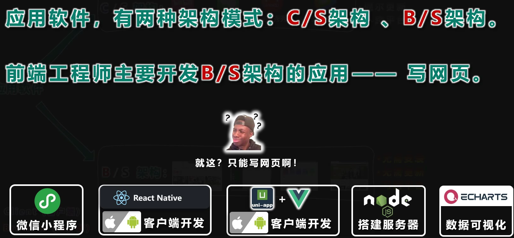
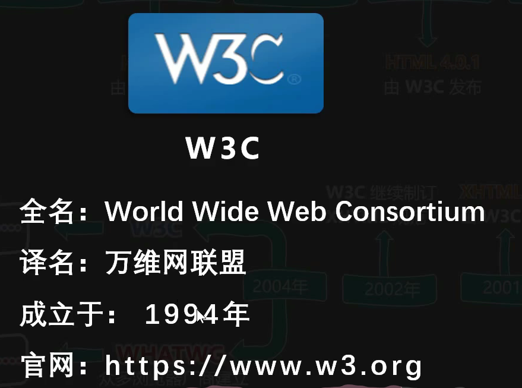

# 工具与知识杂记

## Minio

MinIO 是一个基于Apache License v2.0开源协议的对象存储服务。它兼容亚马逊S3云存储服务接口，非常适合于存储大容量非结构化的数据，例如图片、视频、日志文件、备份数据和容器/虚拟机镜像等，而一个对象文件可以是任意大小，从几kb到最大5T不等。

#### Minio纠删码

纠删码是一种恢复丢失和损坏数据的数学算法

## 正则表达式

通过使用正则表达式，可以：

- 测试字符串内的模式。
  例如，可以测试输入字符串，以查看字符串内是否出现电话号码模式或信用卡号码模式。这称为数据验证。
- 替换文本。
  可以使用正则表达式来识别文档中的特定文本，完全删除该文本或者用其他文本替换它。
- 基于模式匹配从字符串中提取子字符串。
  可以查找文档内或输入域内特定的文本。

|  字符  |                             描述                             |
| :----: | :----------------------------------------------------------: |
| [ABC]  |                      匹配[]中的所有字符                      |
| [^ABC] |                    匹配除了[]中的所有字符                    |
| [A-Z]  | [A-Z] 表示一个区间，匹配所有大写字母，[a-z] 表示所有小写字母 |
|   .    |  匹配除换行符（\n、\r）之外的任何单个字符，相等于 [^\n\r。   |
| [\s\S] |                           匹配所有                           |
|   \w   |         匹配字母、数字、下划线。等价于 [A-Za-z0-9_]          |
|   $    |                  匹配输入字符串的结尾位置。                  |
|   ^    |                  匹配输入字符串的开始位置，                  |
|  ( )   |              标记一个子表达式的开始和结束位置。              |
|   *    |                匹配前面的子表达式零次或多次。                |
|   +    |                匹配前面的子表达式一次或多次。                |
|   ?    |                匹配前面的子表达式零次或一次，                |

## Websocket

Web socket的一大特点是：服务器可以主动向客户端推送信息，客户端也可以主动向服务器发送信息，是真正的双向平等对话，属于服务器推送技术的一种。

在我们的项目中，我选择运用适合go语言的gorilla/websocket框架：

- 创建Upgrader实例用于升级请求
- 用ReadMessage()和WriteMessage()来读写消息

## BS架构与CS架构

## 国际组织

## 编码与解码

计算机存储数据的编码解码字符集

