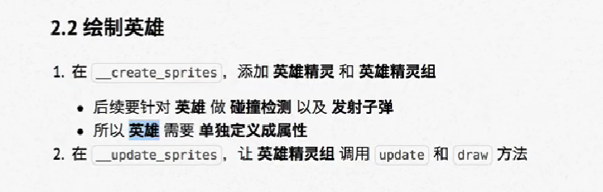

## python

python是解释型语言、交互式语言、面向对象的语言。

设计哲学：优雅、明确、简单。python开发者的哲学：用一种方法做一件事。

`IDE`：集成开发环境——集成了开发软件需要的所有工具。

- 包含：图形用户界面、代码编辑器、编译器/解释器、调试器（断点/单步执行）
- `pycharm`中的快捷功能：`crtl + /`：注释选中的多行，`tab 或shift + tab`：选中多行一起增加或减少缩进。`file里的settings中Editor里的Font里可以更改字体和大小`
- `pycharm`中的开发技巧：想重命名一个变量，在所有出现的程序代码中，点击那个变量，右键`refactor`，然后`rename`，更改。

程序的核心作用就是处理数据

### 基础语法

##### 1、print函数

可以输出数字、字符串、含有运算符的表达式

可以输出到显示器、文件

不换行输出，则用逗号隔开`print('hello','world')`

`print("OK",end="")`加end可以去除自动换行

##### 2、算数运算符

`//`取整除，`**`幂。

运算符还可以运用于字符串如：`_ * 10`，将`_`拼接10次。

赋值运算符：`+= 、-= 、*=、//=、`

##### 3、变量

变量是在内存中存储数据。

变量名 = 值

在python中，定义变量时不需要制定变量的类型，python解释器会根据赋值语句等号右侧的数据自动推导数据的准确类型。

数字型：`int、float、bool、complex`，非数字型：字符串、列表、元组、字典

type函数：确定变量的类型，例：`type(name)`

不同类型变量之间的计算：

- 数字型变量之间可以直接计算
- 字符串变量 可用 + 拼接， * 重复拼接相同字符

变量的输入：input函数。`字符串变量 = input（“提示信息”）`

格式操作符，`%s %f %d %06d %.2f`  。例：

```python
name = "marks"
age = "18"
print("name:%s" % name)
#多变量
print("name:%s %s" % (name,age))
```

标识符，就是定义的变量名和函数名。可以由字母、下划线和数字组成，不能以数字开头。

关键字，内部已使用的标识符，具有特殊功能和含义。

变量命名规则，区分大小写，多个单词用下划线连接。

##### 4、`if`语句

```python
if 要判断的条件：
	条件成立时，要做的事情
else:
    条件不成立时，要做的事情
#代码的缩进为一个tab键，或者为4个空格——建议使用空格
```

```python
#elif、else必须和if联合使用
if 要判断的条件:
	条件成立时，要做的事情
elif 条件2:
    代码
elif 条件3:
    代码
else:
    条件不成立时，要做的事情
```

if 、else、elif 语句以及缩进部分是一个完整的代码块。

```python
#if 嵌套
if 条件1:
    代码
    if 条件1基础上的条件2:
        代码
    else:
        代码
else:
    代码
```

##### 5、逻辑运算

`and`：与、`or`：或、`not`：非

##### 6、循环

程序的三大流程：顺序、分支、循环

`while`语句基本语法：

```python
初始条件设置 —— 通常是计数器
while 条件（判断计数器是否达到目标次数）:
    条件满足时，做的事情1
    条件满足时，做的事情2
    处理条件（计数器+1）
```

while语句以及缩进部分是一个完整的代码块。

程序计数方法：从0开始。

`break`：条件满足，跳出所有循环

`continue`：条件满足，跳出当次循环

`转义字符`：`\t`：制表符，协助输出文本时，垂直方向保持对齐。

##### 7、函数

函数定义：把具有独立功能的代码块组织为一个小模块。

定义格式：

```python
#函数上方一般有两行空白，注释一般在函数内写，用三对引号，用Ctrl+Q可查看函数注释信息


def 函数名():
    '''打招呼'''
    
    函数封装的代码
    
def sum_nm(num1,num2)
	''''''
    
    return num1+num2

```

step over：调试中的单步执行，会略过代码块

step into：调试中的单步执行，但会进入代码块内（比如函数），variables里会有当前有的变量，

##### 8、模块

每一个以扩展名py结尾源代码文件都是一个模块，且在模块中定义的全局变量和函数能提供个外界使用。

模块名也是标识符，符合标识符命名规则。

```python
import 模块 as 模块别名（大驼峰命名法）

#从某个模块导入部分工具（全局变量、类、函数）
from 模块名 import 工具名 #调用时可不适用模块名.
同名函数导入时，后导入覆盖之前的，可以用as起别名。

```

导入模块时，解释器的搜索顺序，先搜索当前目录，在搜索系统目录。

当一个文件被导入时，其中没有任何缩进的代码都会被执行一遍。这时，可以用`__name__`属性来避免测试代码被调用模块的程序执行。

```python
#导入模块
#定义全局变量
#定义类
#定义函数

def main():
    #...
    pass

#根据__name__判断是否执行下方代码
if __name__ == "__main__":
    main()
```


##### 9、列表

`List`，定义用`[]`，其他语言通常叫数组。

```python
name_list = ["zhangsan","lisi","wangwu"]
name1 = name_list[0]
name_list[2] = "王五"
#取索引：
name_list.index()
#增加元素
name_list.append("wangxiaoer")
name_list.insert(index,object)
temp_list = ["11"]
name_list.extend(temp_list)
#删除数据
name_list.remove(object)
name_list.pop(index)
name_list.clear()
#del关键字删除列表中的元素,本质上是讲一个变量从内存中删除
del name_list[1]
#count统计列表中一个数据出现的次数
name_list.count("zhangsan")
len(name_list)
#列表排序
name_list.sort()
name_list.sort(reverse=true)
name_lsit.reverse
#列表循环遍历
for name in name_list:
    相关操作
```

##### 10、函数、关键字、方法区别

关键字，python内部已使用的标识符，具有特殊功能和含义。

函数，封装了独立功能，可以直接调用。函数名（参数）

方法，也封装了独立功能，要通过对象调用。对象.方法名（参数）。

方法、函数不知道其作用可以用Ctrl +Q搜索详细信息。

##### 11、元组

`Tuple`，用`()`定义，与列表类似，但定义好后不能修改其中的元素。

```python
info_tuple = ("zhangsan", 18 , 1.75)
#当只定义一个元素的元组，则要在该元素后面加上一个逗号
empty_tuple = ( "lisi",)
```

应用场景：

- 函数的参数和返回值，可以接受任意多的参数和返回多个数据
- 格式化字符串
- 让列表的值不被修改，tuple(列表)，list(元组)。

##### 12、字典

`dictionary`，用`{}`定义，使用键值对存储数据。

列表是有序的对象集合，字典是无序的对象集合。

键`key`是索引，值`value`是数据，键是唯一的。值可以使任意数据，键只能是字符串、数字或元组。

```python
stu_dict = {"name":"xiaoming", }
#取值
name = stu_dict["name"]
#增加修改
key不存在时则为增加，存在则为修改
stu_dict["age"] = 18
stu_dict["name"] = "xiaohua"
#删除
stu_dict.pop("name")
#len可以统计字典、列表、元组的长度
#合并字典
temp= {"age":18,}
stu_dict.update(temp)
#清空字典
stu_dict.clear()
#循环遍历,k是每一次循环中，获取到的键值对的key
for k in stu_dict:
    print(%s - %s % (k,stu_dict[k]))
```

应用场景：使用多个键值对，存储描述一个物体的相关信息；将多个字典放在一个列表中，再进行遍历，再循环中对每一个字典进行相同的处理。

字典定义时，要用冒号的形式：而在使用、修改的时候，需要改成等号。

##### 13、字符串

一串字符，可以使用 " " ,也可以使用 ' '定义。

也可以用索引将字符拿出来，也可以用for循环遍历

```python
str1="hello world"
for char in str1:
    print(char)
#统计某个子字符串出现的次数
str1.count(lo)
#某个字符串出现的位置
str1.index(lo)
#字符串的方法
#1、判断类型
判断是否为空白字符，\n, \t, \r, "空格"都是空白字符
.isspace（str1）
判断是否只包含数字
.isdecimal()
.isdigit()- 可以判断Unicode 编码数字
.isnumeric() - 可以判断中文数字
#2、查找与替换
.startswith() 判断是否以某个字符串开始
.endswith() 判断是否某个字符结束
.find() 查找某个子字符
.replace() 替换字符串，但不会修改原有字符串内容，返回一个新的字符串
#3、文本对齐
.ljust(width,fillchar) 向左对齐
.rjust(width,fillchar) 向右对齐
.center(width,fillchar) 居中对齐
#4、去除空白字符
.lstrip()
.rstrip()
.strip()
#5、拆分和连接
.split()
.join()
# 字符串的切片，适用于字符串、列表、元组
字符串[开始索引:结束索引:步长]
步长可以取-1，索引也是可以逆序取-1
```

##### 14、公共方法

列表、元组、字符串都能使用的方法。

1）python内置函数

len、del、 max、min、

2）切片

列表、元组、字符串可以使用

3）公共运算符

`+、*	`：元组、列表、字符串可以使用

`in、not in`：成员运算符，元组、列表、字符串、字典可以使用，字典是争对键key

4）完整的for循环语法

```python
for 变量 in 集合:
    
    循环体代码
else:
    没有通过break退出循环，遍历循环结束后，会执行代码。
    
```

##### 15、项目系统初步探讨开发

试例：名片管理系统

1）框架搭建

准备文件，确定文件名；编写主运行程序，实现基本的用户输入和判断。

- 文件准备

  新建主程序功能代码，名片功能函数。

  pass关键字，表示一个占位符，能够保证程序代码结构正确。当开发程序时，不希望立即编写分支内部代码时可以使用。

  while True:  无限循环，由用户决定什么时候退出。
  
  #TODO(作者/邮件) 注释：用于标记需要去做的工作。

2）数据结构确定

字典存储每个名片内容，列表存储字典信息。在顶部定义全局变量名片列表便于后续使用。

3）名片功能函数编制

##### 16、linux上的Shebang符号（#!）

shebang通常在unix系统脚本中的第一行开头使用，指明执行这个脚本文件的解释程序。

`#！python的解释器所在文件路径`。

##### 17、变量进阶

变量和数据时分开存储的，数据保存在内存中的一个位置，变量中保存着数据在内存中的地址。变量中记录数据的地址，就叫做引用。

数据的地址本质上就是一个数字。

函数的实参形参传递是通过引用，函数的返回值传递也是引用。

##### 18、可变类型与不可变类型

不可变类型数据：元组、数字、字符串

可变类型数据：列表、字典

字典的key只能使用不可变类型的数据，因为python中对KEY使用哈希算法决定如何保存值。

##### 19、全局变量与局部变量

在函数内部，不允许修改全局变量的值，如果需要修改，则要使用global进行声明，`global a`。

全局变量的命名建议：`g_, gl_`等。

##### 20、函数的返回值

如果函数返回的类型是元组，可以省略小括号。如`return temp,wetness`；也可以使用多个变量一次接受返回结果。

如果传递的参数是可变类型，使用**方法**修改了数据内容，同样会影响到外包部的数据。

```python
def demo(num_list)
	num_list.append(9) #方法

gl_list=[1,2,3]
demo(gl_list)
print(gl_list)
```

列表变量使用+=不会做相加再赋值的操作，是调用extend方法。

缺省参数定义：`def pf(name,gender=true):`，缺省参数定义时要在末尾

多值参数：

- 参数名前增加一个*就可以接受元组；`agrgs`

- 参数名前增加两个*就可以接受字典；`kwargs`

如：`def demo(*args,**kwargs):`

元组和字典的拆包：

- 元组变量之前加一个*
- 字典变量之前加两个*

如：`demo(*name,**map)`

##### 21、递归

特点：一个函数内部自己调用自己

要设置出口，避免死循环，要假设之前的递归调用成立

在处理不确定的循环条件时比较有用

##### 22、面向对象编程OOP

面向对象是更大的封装，根据职责在一个对象中封装多个方法。

类与对象：先有类再有对象，类是模板，对象是根据这个模板创建的。

类包含属性和方法。

类名取名要用大驼峰命名法，属性：这类事物具有什么样的特征。方法：这类事物具有什么行为

设计时：对对象的特征描述为属性，对象具有的行为可设为方法

dir()函数可以查看该对象的所有属性和方法。

```python
class 类名:
    def 方法1(self,参数列表):
        pass
    def 方法2(self,...):
        pass
    
对象变量 = 类名()
```

使用print打印对象变量，输出这个变量引用的对象由哪个类创建以及内存地址

self:哪个对象调用的方法就是对哪个对象的引用。

初始化方法：`__init__`，定义一个类有哪些属性的方法。创建对象时会自动调用。

```python
class Cat:
	def __init__(self,new_name)
		self.name = new_name
```

在对象销毁时，会自动调用`__del__`方法。

想自定义print(对象)的内容时，可以自定义`__str__`方法。

一个对象的属性可以是另外一个类创建的对象。

None关键字，空对象，表示什么都没有，没有方法和属性，是一个特殊的常量。

身份运算符：`is / is not`，用于比较两个对象的内存地址是否一致，即是否是对同一个对象的引用。对`None`的比较采用`is`比较.

##### 23、私有属性与私有方法

在定义属性和方法时，在名前加两个下划线就行了。

但在python中并没有真正意义的私有，用`_类名__名称`就能从外部访问到。

##### 24、继承

子类能继承父类的所有方法和属性。语法`class 类名（父类）：`

方法的重写：

- 覆盖父类的方法：重写父类的方法
- 扩展父类的方法：父类方法，但并不完全适用子类，用`super().`调用父类的方法

子类无法直接访问父类的私有方法和属性。

多继承：一个子类可以有多个父类，语法`class 子类名（父类名1，父类名2）：`，不同父类存在同名方法，应尽量避免多继承。

MRO：方法搜索顺序。内置属性`__mro__`用于在多继承时判断方法、属性的调用路径

新式类与旧式类，以object为基类的为新式类，否则为旧式类。

##### 多态

不同子类对象调用相同的父类方法，产生不同执行结果。

##### 类的结构

创建出来的对象叫做实例，创建对象的动作叫实例化，对象的属性叫实例属性，对象调用的方法叫实例方法。

python中一切皆对象，类就是一个特殊的对象，类对象只有一份。类对象也有类属性和类方法。

类属性：通常用来记录和这个类有关的特征。

```python
class Tool:
    count =0 #类属性
    def __init__(self,name):
        self.name = name #实例属性
  
        Tool.count += 1
    
#要访问类属性
类名.类属性更好
对象.类属性也行但不好
```

类方法：

语法如下：

```python
@classmethod
def 类方法名(cls):
    pass
```

静态方法：既不需要访问实例属性和类属性，就可以把这个方法封装成一个静态方法。

语法：

```python
@staticmethod
def 静态方法名():
    pass
```

调用：类名.就可以调用，不需要定义对象。

##### 25、设计模式

设计模式：前人工作总结和提炼，争对特定问题的解决方案。

单例设计模式：让类创建的对象，在系统中只有唯一的一个实例。

`__new__`方法，给对象分配空间，返回对象的引用。一定要`return super().__new__(cls)`

##### 26、异常

异常：解释器遇到错误就会停止，并抛出异常。

捕获异常：

```python
try:
    不能确定正确执行的代码
except:
    对错误的处理代码
#捕获错误类型
except 错误类型1:
    
except 错误类型2:
   
#捕获未知错误
except Exception as result:
    print("未知错误 %s" % result)

else:
    #没有异常才会执行代码
   pass
finally:
    #无论有没有异常都会执行的代码
    pass
```

异常具有传递性，在函数或方法中出现异常，会将异常传递给调用的一方，直至到主函数，才会停止。

抛出异常：

```python
#创建异常对象
ex = Exception("密码长度不够")
#主动抛出异常
raise ex
```

##### 27、包

包是一个包含多个模块的特殊目录，必有一个特殊文件`__init__.py`

```python
#__init__.py中要从当前目录导入模块列表
from . import 模块名
```

发布模块，制作发布压缩包

- 建立setup.py
- `python3 setup.py build`
- `python3 setup.py sdsit`

安装模块

- `tar -zxvf ***.tar.gz`
- sudo python3 setup.py install

卸载模块，要去模块的文件下删除，可用`__file__`来查看文件地址

pip安装第三方模块

`pip install 模块`

##### 28、文件

python中操作文件的函数\方法

- open函数，打开文件，并且返回文件操作对象
- read方法，将文件内容读取到内存
- write方法，将指定内容写入文件
- close方法，关闭文件

打开文件的方式：`r w a r+ w+ a+`

r：只读，w：写，但是会覆盖文件，a:追加内容

readline方法：一次只读一行

os包：

```python
import os
os.rename#重明明
os.remove#删除文件
os.listdir#目录列表
os.mkdir#创建目录
```

##### 29、编码

python2.x用的是ASCII编码，要用python2来使用中文，`*-* coding:utf-8 *-*`

在中文字符前加个u能让python2识别，`text = u"世界"`

eval()函数，将字符串当成有效表达式来求值并返回计算结果。

不要滥用，否则用户可通过`__import__('os').system('终端命令')`操作文件等。

### 飞机游戏实战

需要用到的包 pygame

##### 游戏初始化

设置游戏窗口、绘制图像初始位置、设置游戏时钟

```python
1、游戏的初始化与退出
#导入并初始化所有pygame模块
pygame.init()
#卸载所有pygame模块，在游戏结束前调用
pygame.quit()

2、pygame.rect类来描述矩形区域(x,y)(width,height)

3、创建游戏主窗口 
#初始化游戏显示窗口
pygame.display.set_mode()
#刷新屏幕内容显示
pygame.display.update()

4、实现图像绘制
#使用pygame.image.load()加载图像上的数据；使用游戏屏幕对象，调用blit方法将图像绘制到指定位置；使用pygame.display.update()方法更新整个屏幕的显示。
```

##### 游戏中的动画实现原理

快速在屏幕上绘制图像，每次绘制的结果被称为帧。

##### 游戏循环

设置刷新帧率、检测用户交互、更新所有图像位置、更新屏幕显示

##### 监听事件

事件`event`，用户针对游戏所做的操作

监听，判断用户具体的操作

pygame.event.get()获取事件列表

##### 精灵和精灵组

精灵：pygame.sprite.Sprite --存储图像数据image和位置rect的对象。

精灵组：pygame.sprite.Group  --让组中所有精灵共同更新位置，绘出更新后的当前图像。


##### 游戏逻辑


##### 1、游戏背景

 两张图片交替滚动，游戏背景变化，游戏主角位置不变 

- 设计一个背景类派生于精灵类，因为父类不能满足需求，则可以派生一个子类重写某方法。

- 背景精灵的基本实现，Background精灵类


##### 2、敌机出场

- 使用定时器（每隔一段时间执行一些动作）添加敌机
- 设计`Enemy`类


定时创建并显示敌机精灵、设置敌机随机位置和速度、移除屏幕销毁敌机

##### 3、玩家登场

- 设计英雄和子弹类
- 使用`pygame.key.get_pressed()`移动英雄
- 发射子弹


创建英雄


绘制英雄



移动英雄位置


控制英雄边界


发射子弹


定义子弹类


发射子弹


##### 4、碰撞检测


